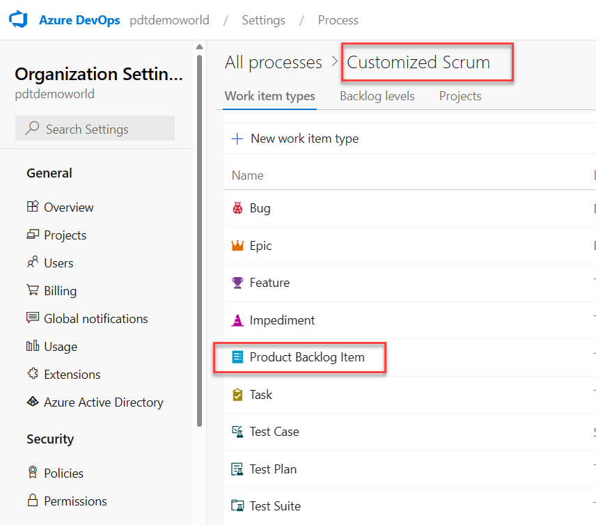
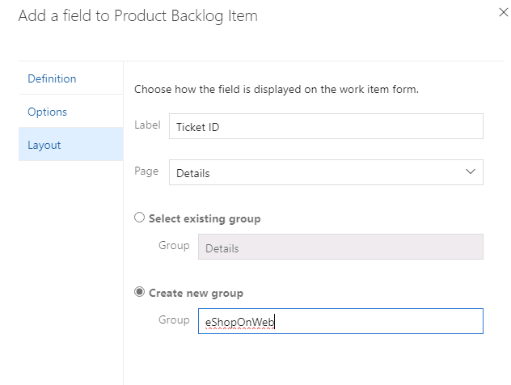

---
lab:
  title: Planification et gestion de portefeuille Agile avec Azure Boards
  module: 'Module 01: Implement development for enterprise DevOps'
---

# Planification et gestion de portefeuille Agile avec Azure Boards

# Manuel de labo de l’étudiant

## Configuration de laboratoire requise

- Ce labo nécessite **Microsoft Edge** ou un [navigateur pris en charge par Azure DevOps](https://docs.microsoft.com/azure/devops/server/compatibility?view=azure-devops#web-portal-supported-browsers).

- **Configurez une organisation Azure DevOps :** si vous ne disposez pas encore d’une organisation Azure DevOps que vous pouvez utiliser pour ce labo, créez-en une conformément aux instructions disponibles dans [Créer une organisation ou une collection de projets](https://docs.microsoft.com/azure/devops/organizations/accounts/create-organization?view=azure-devops).

## Présentation du labo

Dans ce labo, vous allez découvrir les outils et les processus de planification agile et de gestion de portefeuille d’Azure Boards et comment ils vous permettent de planifier, gérer et suivre rapidement le travail dans toute votre équipe. Vous allez explorer le backlog de produit, le backlog de sprint et les tableaux de tâches qui peuvent effectuer le suivi du flux de travail pendant une itération. Nous allons également examiner les outils améliorés dans cette version permettant une mise à l’échelle pour les équipes et les organisations plus grandes.

## Objectifs

À la fin de ce labo, vous serez en mesure d’effectuer les tâches suivantes :

- Gérer les équipes, les zones et les itérations.
- Gérer les éléments de travail.
- Gérer les sprints et la capacité.
- Personnaliser les tableaux Kanban.
- Définir les tableaux de bord.
- Personnaliser le processus d’équipe.

## Durée estimée : 60 minutes

## Instructions

### Exercice 0 : configurer les prérequis du labo

> **Remarque** : si vous avez déjà créé ce projet au cours des labos précédents, cet exercice peut être ignoré.

Dans cet exercice, vous allez configurer les prérequis pour le labo, qui se composent d’un nouveau projet Azure DevOps avec un référentiel basé sur [eShopOnWeb](https://github.com/MicrosoftLearning/eShopOnWeb).

#### Tâche 1 : (ignorer si déjà terminé) créer et configurer le projet d’équipe

Dans cette tâche, vous allez créer un projet Azure DevOps **eShopOnWeb** à utiliser par plusieurs labos.

1. Sur votre ordinateur de labo, dans une fenêtre de navigateur, ouvrez votre organisation Azure DevOps. Cliquez sur **Nouveau projet**. Nommez votre projet **eShopOnWeb**. Définissez l’option Visibilité sur **Privée**.
1. Cliquez sur **Avancé** et spécifiez **Scrum** comme **Processus d’élément de travail**.
 Cliquez sur **Créer**.

    

### Exercice 1 : gérer un projet Agile

Dans cet exercice, vous allez utiliser Azure Boards pour effectuer un certain nombre de tâches courantes de planification Agile et de gestion de portefeuille, notamment la gestion des équipes, des zones, des itérations, des éléments de travail, des sprints et de la capacité, la personnalisation des tableaux kanban, la définition des tableaux de bord et la personnalisation des processus d’équipe.

#### Tâche 1 : gérer les équipes, les zones et les itérations

Dans cette tâche, vous allez créer une équipe et configurer sa zone et ses itérations.

Chaque nouveau projet est configuré avec une équipe par défaut, dont le nom correspond à celui du projet. Vous avez la possibilité de créer des équipes supplémentaires. Chaque équipe peut avoir accès à une suite d’outils et de ressources d’équipe Agile. La possibilité de créer plusieurs équipes vous permet de trouver le juste milieu entre autonomie et collaboration au sein de l’entreprise.

1. Vérifiez que le navigateur web affiche votre organisation Azure DevOps avec le projet **eShopOnWeb** que vous avez généré dans l’exercice précédent.

    > **Remarque** : Vous pouvez accéder directement à la page du projet en accédant à l’URL <https://dev.azure.com/>`<your-Azure-DevOps-account-name>`/eShopOnWeb, où l’espace réservé `<your-Azure-DevOps-account-name>` représente le nom de votre compte.

1. Cliquez sur l’icône d’engrenage étiquetée **Paramètres du projet** située dans le coin inférieur gauche de la page pour ouvrir la page **Paramètres du projet**.

    

1. Dans la section **Général**, sélectionnez l’onglet **Teams**. Il existe déjà une équipe par défaut dans ce projet, **eShopOnWeb Team**, mais vous allez en créer une nouvelle pour ce labo. Cliquez sur **Nouvelle équipe**.

    

1. Dans le volet **Créer une équipe**, dans la zone de texte **Nom de l’équipe**, tapez **EShop-Web**, conservez les valeurs par défaut pour les autres paramètres, puis cliquez sur **Créer**.

    

1. Dans la liste des **Équipes**, sélectionnez l’équipe nouvellement créée pour afficher ses détails.

    > **Remarque** : par défaut, la nouvelle équipe ne comporte que vous en tant que membre. Vous pouvez utiliser cette vue pour gérer des fonctionnalités telles que l’appartenance à l’équipe, les notifications et les tableaux de bord.

1. Cliquez sur **Itérations et chemins de zone** en haut de la page **EShop-Web** pour commencer à définir la planification et l’étendue de l’équipe.

    

1. En haut du volet **Tableaux**, sélectionnez l’onglet **Itérations**, puis cliquez sur **+ Sélectionner des itérations**.

    

1. Sélectionnez **eShopOnWeb\Sprint 1**, puis cliquez sur **Enregistrer et fermer**. Notez que ce premier sprint s’affiche dans la liste des itérations, mais que les Dates ne sont pas encore définies.
1. Sélectionnez **Sprint 1**, puis cliquez sur les **points de suspension (...)**. Dans le menu contextuel, sélectionnez **Modifier**.

     

    > **Remarque** : définissez la date de début au premier jour de travail de la semaine dernière et comptez 3 semaines de travail complètes par sprint. Par exemple, si le premier jour de travail du sprint est le 6 mars, ce sprint va jusqu’au 24 mars. Sprint 2 commence le 27 mars, ce qui correspond à 3 semaines à partir du 6 mars.

1. Répétez l’étape précédente pour ajouter **Sprint 2** et **Sprint 3**. Nous sommes ainsi actuellement dans la 2e semaine du premier sprint.

    

1. Toujours dans le volet **Paramètres du projet / Tableaux / Configuration d’équipe**, en haut du volet, sélectionnez l’onglet **Zones**. Vous y trouverez une zone générée automatiquement avec le nom correspondant au nom de l’équipe.

    

1. Cliquez sur les points de suspension (...) en regard de l’entrée **zone par défaut** et, dans la liste déroulante, sélectionnez **Inclure les sous-zones**.

    

    > **Remarque** : le paramètre par défaut pour toutes les équipes consiste à exclure les chemins de sous-zone. Nous allons le modifier afin d’inclure les sous-zones, afin que l’équipe dispose d’une vue de tous les éléments de travail de toutes les équipes. L’équipe de gestion peut également choisir de ne pas inclure les sous-zones, ce qui supprime automatiquement les éléments de travail de leur vue dès qu’ils sont affectés à l’une des équipes.

#### Tâche 2 : gérer les éléments de travail

Dans cette tâche, vous allez découvrir les tâches courantes de gestion des éléments de travail.

Les éléments de travail jouent un rôle important dans Azure DevOps. Qu’il s’agisse de décrire le travail à effectuer, les obstacles à la mise en production, les définitions de test ou autres éléments clés, les éléments de travail constituent la colonne vertébrale des projets modernes. Dans cette tâche, vous allez vous concentrer sur l’utilisation de différents éléments de travail pour configurer le plan afin d’étendre le site eShopOnWeb avec une section de formation sur les produits. Être en charge de la réalisation d’une part conséquente de l’offre d’une entreprise a de quoi intimider, mais Azure DevOps et le processus Scrum rendent cela très accessible.

> **Remarque** : cette tâche est conçue pour illustrer diverses façons de créer différents types d’éléments de travail, ainsi que pour démontrer l’étendue des fonctionnalités disponibles sur la plateforme. Par conséquent, ces étapes ne doivent pas être considérées comme une marche à suivre rigide pour la gestion de projet. Ces fonctionnalités sont suffisamment adaptables pour répondre aux besoins de votre processus ; n’hésitez pas à explorer et expérimenter.

1. Dans le volet de navigation vertical du portail Azure DevOps, sélectionnez l’icône **Tableaux**, puis sélectionnez **Éléments de travail**.

    > **Remarque** : il existe de nombreuses façons de créer des éléments de travail dans Azure DevOps, et nous allons découvrir quelques-unes d’entre elles. Dans certains cas, il est possible de créer un élément de travail directement à partir d’un tableau de bord.

1. Dans la fenêtre **Éléments de travail**, cliquez sur **+ Nouvel élément de travail > Épopée**.

    

1. Dans la zone de texte **Saisir un titre**, tapez **Formation produit**.
1. Dans le coin supérieur gauche, sélectionnez l’entrée **Non attribué** et, dans la liste déroulante, sélectionnez votre compte d’utilisateur pour affecter le nouvel élément de travail à vous-même. Si votre nom n’apparaît pas pour commencer, commencez par le saisir, puis cliquez sur **Rechercher**.
1. En regard de l’entrée **Zone**, sélectionnez l’entrée **eShopOnWeb** et, dans la liste déroulante, sélectionnez **EShop-WEB**. Cette opération définit la **Zone** sur **eShopOnWeb\EShop-WEB**.
1. En regard de l’entrée **Itération**, sélectionnez l’entrée **eShopOnWeb** et, dans la liste déroulante, sélectionnez **Sprint 2**. Cela définit l’**Itération** sur **eShopOnWeb\Sprint 2**.
1. Cliquez sur **Enregistrer** pour finaliser vos modifications. **Ne fermez pas la fenêtre**.

    

    > **Remarque** : en temps normal, il est souhaitable de remplir autant de champs que possible, mais dans le cadre de ce labo, ces informations sont suffisantes.

    > **Remarque** : le formulaire d’élément de travail inclut tous les paramètres d’élément de travail appropriés. Il s’agit notamment des détails sur les personnes qui lui sont affectées, de son état au regard de nombreux paramètres, ainsi que de toutes les informations et l’historique concernant sa gestion, ce depuis sa création. L’un des domaines clés sur lesquels se concentrer est le **Travail associé**. Nous allons découvrir l’une des façons d’ajouter une fonctionnalité à cette épopée.

1. Dans la section **Travail associé** en bas à droite, sélectionnez l’entrée **Ajouter un lien** et, dans la liste déroulante, sélectionnez **Nouvel élément**.
1. Dans le volet **Ajouter un lien**, dans la liste déroulante **Type de lien**, sélectionnez **Enfant**. Ensuite, dans la liste déroulante **Type d’élément de travail**, sélectionnez **Fonctionnalité**, dans la zone de texte **Titre**, tapez le **tableau de bord Formation**.

    

    > **Remarque** : dans le volet **Tableau de bord de formation**, notez que l’affectation, la **Zone** et l’**Itération** possèdent déjà les mêmes valeurs que l’épopée sur laquelle la fonctionnalité est basée. En outre, la fonctionnalité est automatiquement liée à l’élément parent à partir duquel elle a été créée.

1. Cliquez sur **Ajouter un lien** pour enregistrer l’élément Enfant. Dans le panneau (Nouvelle fonctionnalité) **Tableau de bord d’entraînement**, cliquez sur **Enregistrer et fermer**.

    

1. Dans le volet de navigation verticale du portail Azure DevOps, dans la liste des éléments **Boards**, sélectionnez **Tableaux**.
1. Dans le volet **Tableaux**, sélectionnez l’entrée **Tableaux EShop-WEB**. Le tableau de l’équipe correspondante s’ouvre alors.

    

1. Dans le volet **Tableaux**, dans le coin supérieur droit, sélectionnez l’entrée **Éléments de backlog** et, dans la liste déroulante, sélectionnez **Fonctionnalités**.

    > **Remarque** : l’ajout de tâches et d’autres éléments de travail aux fonctionnalités est ainsi facilité.

1. Survolez avec le pointeur de la souris le rectangle représentant la fonctionnalité **Tableau de bord de formation**. Cela révélera les points de suspension (...) dans le coin supérieur droit.
1. Cliquez sur les points de suspension (...) et, dans la liste déroulante, sélectionnez **Ajouter un élément de backlog de produit**.

    

1. Dans la zone de texte du nouvel élément de backlog de produit, tapez **En tant que client, je souhaite afficher de nouveaux tutoriels** et appuyez sur la touche **Entrée** pour enregistrer l’entrée.

    > **Remarque** : un nouvel élément PBI (élément de backlog de produit) enfant de la fonctionnalité est alors créé, qui partage sa zone et son itération.

1. Répétez l’étape précédente pour ajouter deux PBI supplémentaires conçus pour permettre au client de voir ses tutoriels récemment consultés et de demander de nouveaux tutoriels nommés, respectivement, **En tant que client, je souhaite voir les tutoriels que j’ai récemment consultés** et **En tant que client, je souhaite demander de nouveaux tutoriels**.

    

1. Dans le volet**Tableaux**, dans le coin supérieur droit, sélectionnez l’entrée **Fonctionnalités** et, dans la liste déroulante, sélectionnez **Éléments de backlog**.

     

    > **Remarque** : les éléments de backlog ont un état qui définit leur position en fonction de leur avancement. Bien qu’il soit possible d’ouvrir et de modifier l’élément de travail à l’aide du formulaire, il est plus facile de faire glisser des cartes sur le tableau.

1. Sous l’onglet **Tableau** du volet **EShop-WEB**, faites glisser le premier élément de travail nommé **En tant que client, je souhaite afficher de nouveaux tutoriels** de l’état **Nouveau** vers l’état **Approuvé**.

    

    > **Remarque** : vous pouvez également développer les cartes d’élément de travail pour accéder facilement aux détails modifiables.

1. Survolez avec le pointeur de la souris le rectangle représentant l’élément de travail que vous avez déplacé vers l’état **Approuvé**. Un caret orienté vers le bas sera alors visible.
1. Cliquez sur le caret orienté vers le bas pour développer la carte d’élément de travail, sélectionnez l’entrée **Non attribué** et, dans la liste des comptes d’utilisateur, sélectionnez votre compte pour affecter la PBI déplacée à vous-même.
1. Sous l’onglet **Tableau** du volet **EShop-WEB**, faites glisser le deuxième élément de travail nommé **En tant que client, je souhaite voir les tutoriels que j’ai récemment consultés** de l’état **Nouveau** vers l’état **Validé**.
1. Sous l’onglet **Tableau** du volet **EShop-WEB**, faites glisser le troisième élément de travail nommé **En tant que client, je souhaite demander de nouveaux tutoriels** de l’état **Nouveau** à l’état **Terminé**.

    

    > **Remarque** : le tableau des tâches est un aperçu du backlog. Vous pouvez également utiliser la vue tabulaire.

1. Sous l’onglet **Tableau** du volet **EShop-WEB**, en haut du volet, cliquez sur **Afficher en tant que Backlog** pour afficher le formulaire tabulaire.

    

    > **Remarque** : vous pouvez cliquer sur le signe plus situé directement sous l’étiquette de l’onglet **Backlog** du volet **EShop-WEB** pour afficher les tâches imbriquées sous ces éléments de travail.

    > **Remarque** : vous pouvez cliquer sur le deuxième signe plus situé directement à gauche du premier élément de backlog pour y ajouter une nouvelle tâche.

1. Sous l’onglet **Backlog** du volet **EShop-WEB**, dans le coin supérieur gauche du volet, cliquez sur le deuxième signe plus en partant du haut, situé en regard du premier élément de travail. Le volet **NOUVELLE TÂCHE** s’affiche alors.

    

1. En haut du volet **NOUVELLE TÂCHE**, dans la zone de texte **Saisir un titre**, tapez **Ajouter une page pour les tutoriels les plus récents**.
1. Dans le volet **NOUVELLE TÂCHE**, dans la zone de texte **Travail restant**, tapez **5**.
1. Dans le volet **NOUVELLE TÂCHE**, dans la liste déroulante **Activité**, sélectionnez **Développement**.
1. Dans le volet **NOUVELLE TÂCHE**, cliquez sur **Enregistrer et fermer**.

    

1. Répétez les cinq dernières étapes pour ajouter une autre tâche nommée **Optimiser la requête de données pour les tutoriels les plus récents**. Définissez son **Travail restant** sur **3** et son **Activité** sur **Conception**. Cliquez sur **Enregistrer et fermer** une fois que vous avez terminé.

#### Tâche 3 : gérer les sprints et la capacité

Dans cette tâche, vous allez parcourir les tâches courantes de gestion des sprints et de la capacité.

Les équipes créent le backlog de sprint pendant la réunion de planification du sprint, généralement organisée le premier jour du sprint. Chaque sprint correspond à un intervalle de temps qui soutient la capacité de l’équipe à travailler à l’aide de processus et d’outils Agile. Pendant la réunion de planification, le propriétaire du produit travaille avec l’équipe pour identifier les récits ou les éléments de backlog à terminer dans le sprint.

Les réunions de planification se composent généralement de deux parties. Dans la première partie, l’équipe et le propriétaire du produit identifient les éléments de backlog que l’équipe estime pouvoir s’engager à terminer dans le sprint, en fonction de son expérience avec les sprints précédents. Ces éléments sont ajoutés au backlog de sprint. Dans la deuxième partie, l’équipe détermine comment elle développera et testera chaque élément. Ils définissent et estiment ensuite les tâches requises pour effectuer chaque élément. Enfin, l’équipe s’engage à implémenter tout ou partie des éléments en fonction de ces estimations.

Le backlog de sprint doit contenir toutes les informations dont l’équipe a besoin pour réussir le travail dans le délai imparti sans avoir à se précipiter à la fin. Avant de planifier le sprint, vous devez avoir créé, hiérarchisé et estimé le backlog et défini les sprints.

1. Dans le volet de navigation vertical du portail Azure DevOps, sélectionnez l’icône **Boards** et, dans la liste des éléments**Boards**, sélectionnez **Sprints**.
1. Sous l’onglet **Tableau des tâches** de l’affichage **Sprints**, dans la barre d’outils, sur le côté droit, sélectionnez le symbole **Options d’affichage** (directement à gauche de l’icône d’entonnoir) et, dans la liste déroulante **Options d’affichage**, sélectionnez l’entrée **Détails du travail**. Sélectionnez **Sprint 2** comme filtre.

    

    > **Remarque** : le sprint actuel a une portée assez limitée. Il existe deux tâches dont l’état est **À faire**. À ce stade, aucune des deux tâches n’a été affectée. Pour chacune, une valeur numérique est visible à droite de l’entrée **Non attribué**, qui représente une estimation du travail restant.

1. Dans la colonne **ToDo**, notez l’élément de tâche **Ajouter une page pour les tutoriels les plus récents**, cliquez sur l’entrée **Non affecté** et, dans la liste des comptes d’utilisateur, sélectionnez votre compte pour vous affecter la tâche.

1. Sélectionnez l’onglet **Capacité** de la vue **Sprints**.

    

    > **Remarque** : cette vue vous permet de définir les activités qu’un utilisateur peut entreprendre et à quel niveau de capacité.

1. Sous l’onglet **Capacité** de l’affichage **Sprints**, cliquez sur **+Ajouter un utilisateur** et sélectionnez votre compte d’utilisateur. Pour cet utilisateur, définissez le champ **Activité** sur **Développement** et, dans la zone de texte **Capacité par jour**, tapez **1**.

    > **Remarque** : cela représente 1 heure de travail de développement par jour. Notez que vous pouvez ajouter des activités supplémentaires à chaque utilisateur, dans le cas où leurs tâches ne se limitent pas au développement.

    

    > **Remarque** : Supposons que vous allez également prendre des vacances. Ce qui doit également être ajouté à la vue de capacité.

1. Sous l’onglet **Capacité** de la vue **Sprints**, directement à côté de l’entrée représentant votre compte d’utilisateur, dans la colonne **Jours de congé**, cliquez sur l’entrée **0 jour**. Un panneau dans lequel vous pouvez définir vos jours de congé s’affiche alors.
1. Dans le panneau affiché, utilisez la vue Calendrier pour définir vos vacances sur cinq jours ouvrés pendant le sprint actuel (au cours des trois prochaines semaines) et, une fois que vous avez terminé, cliquez sur **OK**.

    

1. Dans l’onglet **Capacité** de la vue **Sprints**, cliquez sur **Enregistrer**.
1. Sélectionnez l’onglet **Tableau des tâches** dans la vue **Sprints**.

    

    > **Remarque** : notez que le panneau **Détails du travail** a été mis à jour pour refléter votre bande passante disponible. Le nombre affiché dans le panneau **Détails du travail** peut être différent, mais votre capacité de sprint totale est égale au nombre de jours ouvrés restants jusqu’à la fin du sprint, car vous avez alloué 1 heure par jour. Notez cette valeur, car vous l’utiliserez dans les étapes à venir.

    > **Remarque** : une fonctionnalité pratique des tableaux est que vous pouvez facilement mettre à jour les données clés en ligne. Il est recommandé de mettre régulièrement à jour l’estimation du **Travail restant** afin de refléter le temps attendu pour effectuer chaque tâche. Supposons que vous avez examiné le travail de la page **Ajouter une page pour les tutoriels les plus récents** et que vous avez déterminé qu’il demandera plus de temps que prévu.

1. Sous l’onglet **Tableau des tâches** de la vue **Sprints**, dans la zone carrée représentant la page **Ajouter une page pour les tutoriels les plus récents**, définissez le nombre estimé d’heures sur **14** pour qu’il corresponde à votre capacité totale pour ce sprint, que vous avez identifiée à l’étape précédente.

    

    > **Remarque** : le **Développement** et vos capacités personnelles sont alors étendus automatiquement à leur maximum. Étant donné que leur taille est maintenant suffisante pour couvrir les tâches affectées, ils restent verts. Toutefois, la capacité globale de l’**Équipe** est dépassée en raison des 3 heures supplémentaires requises par la tâche **Optimiser la requête de données pour les tutoriels les plus récents**.

    > **Remarque** : une façon de résoudre ce problème de capacité consiste à déplacer la tâche vers une itération ultérieure. Il existe plusieurs façons de procéder. Vous pouvez, par exemple, ouvrir la tâche ici et la modifier dans le volet d’accès aux détails de la tâche. Une autre approche consiste à utiliser la vue **Backlog**, qui permet de la déplacer via une option de menu en ligne. À ce stade, ne déplacez pas encore la tâche.

1. Sous l’onglet **Tableau des tâches** de l’affichage **Sprints**, dans la barre d’outils, à droite, sélectionnez le symbole **Options d’affichage** (juste à gauche de l’icône d’entonnoir) et, dans la liste déroulante **Options d’affichage**, sélectionnez l’entrée **Affecté à=** .

    > **Remarque** : votre affichage est alors ajusté afin que vous puissiez passer en revue la progression des tâches par personne plutôt que par élément de backlog.

    > **Remarque** : il existe également plusieurs possibilités de personnalisations.

1. Cliquez sur l’icône **Configurer les paramètres** d’équipe (directement à droite de l’icône en forme d’entonnoir).
1. Dans le panneau **Paramètres**, sélectionnez l’onglet **Styles**, cliquez sur **+ Règle de style**, sous l’étiquette **Nom de la règle**, dans la zone de texte **Nom**, saisissez **Développement** et, dans la liste déroulante **Couleur de la carte**, sélectionnez le rectangle vert.

    > **Remarque** : toutes les cartes sont de couleur verte si elles satisfont les critères de règle définis directement ci-dessous, dans la section **Critères de règle**.

1. Dans la section **Critères de règle**, dans la liste déroulante **Champ**, sélectionnez **Activité**. Dans la liste déroulante **Opérateur**, sélectionnez **=** puis, dans la liste déroulante **Valeur**, sélectionnez **Développement**.

    

    > **Remarque** : cette opération définit toutes les cartes affectées à des activités de **Développement** en vert.

    

1. Dans le panneau **Paramètres**, sélectionnez l’onglet **Retards de traitement**.

    > **Remarque** : les entrées de cet onglet vous permettent de définir les niveaux disponibles pour la navigation. Les épopées ne sont pas incluses par défaut, mais vous pouvez le modifier.

1. Dans le panneau **Paramètres**, sélectionnez l’onglet **Jours de travail**.

    > **Remarque** : les entrées de cet onglet vous permettent de spécifier les **Jours de travail** suivis par l’équipe. Cela s’applique aux calculs de capacité et d’avancement.

1. Dans le panneau **Paramètres**, sélectionnez l’onglet **Travailler avec des bogues**.

    > **Remarque** : les entrées de cet onglet vous permettent de spécifier la façon dont les bogues sont présentés sur le tableau.

1. Dans le panneau **Paramètres**, cliquez sur **Enregistrer et fermer** pour enregistrer la règle de style.

    > **Remarque** : la tâche associée à **Développement** est désormais verte et très facile à identifier.

#### Tâche 4 : personnaliser les tableaux Kanban

Dans cette tâche, vous allez parcourir le processus de personnalisation des tableaux Kanban.

Afin d’optimiser la capacité d’une équipe à fournir en permanence des logiciels de haute qualité, Kanban met l’accent sur deux pratiques principales. La première, la visualisation du flux de travail, nécessite que vous mappiez les étapes de workflow de votre équipe et configuriez un tableau Kanban pour qu’il corresponde. La seconde, qui consiste à limiter la quantité de travail en cours, exige que vous définissiez des limites WIP (work-in-progress). Vous êtes alors prêt à suivre les progrès réalisés sur votre tableau Kanban et à surveiller les indicateurs clés pour réduire les délais ou les temps de cycle. Votre tableau kanban convertit votre backlog en panneau interactif, fournissant ainsi un flux de travail visuel. À mesure que le travail progresse de l’état de concept à sa réalisation, vous mettez à jour les éléments sur le tableau. Chaque colonne représente une étape du travail, et chaque carte représente un récit utilisateur (cartes bleues) ou un bogue (cartes rouges) à cette étape du travail. Toutefois, chaque équipe développe son propre processus au fil du temps, de sorte que la possibilité de personnaliser le tableau Kanban pour qu’il corresponde à la façon dont votre équipe travaille est essentielle pour la réussite de la livraison.

1. Dans le volet de navigation vertical du portail Azure DevOps, dans la liste des éléments **Boards**, sélectionnez **Tableaux**.
1. Dans le panneau **Tableaux**, cliquez sur l’icône d’engrenage **Configurer les paramètres du tableau** (juste à droite de l’icône d’entonnoir).

    > **Remarque** : l’équipe met l’accent sur le travail effectué avec les données, de sorte qu’une attention particulière est portée à toute tâche associée à l’accès ou au stockage de données.

1. Dans le panneau **Paramètres**, sélectionnez l’onglet **Couleurs de balise**, cliquez sur **+ Couleur de balise**. Dans la zone de texte **Balise**, tapez **données** et conservez la couleur par défaut appliquée.

    

    > **Remarque** : chaque fois qu’un élément de retard de traitement ou qu’un bogue est marqué avec **données**, cette balise est mise en surbrillance.

1. Dans **Configurer les paramètres du tableau** (engrenage) Dans le panneau **Paramètres**, sélectionnez l’onglet **Annotations**.

    > **Remarque** : vous pouvez spécifier les **annotations** que vous souhaitez inclure sur les carte pour faciliter la lecture et la navigation. Lorsqu’une annotation est activée, les éléments de travail enfants de ce type sont facilement accessibles en cliquant sur la visualisation sur chaque carte.

1. Dans le panneau **Paramètres**, sélectionnez l’onglet **Tests**.

    > **Remarque** : l’onglet **Tests** vous permet de configurer la façon dont vous souhaitez que les tests apparaissent et se comportent sur les cartes.

1. Dans le panneau **Paramètres**, cliquez sur **Enregistrer et fermer** pour enregistrer la règle de style.
1. À partir de l’onglet **Tableau** du panneau **EShop-WEB**, ouvrez l’élément de travail représentant l’élément de backlog **En tant que client, je souhaite afficher les nouveaux tutoriels**.
1. Dans l’affichage d’élément détaillé, en haut du panneau, à droite de l’entrée **0 commentaire**, cliquez sur **Ajouter une étiquette**.
1. Dans la zone de texte qui s’affiche, tapez **données** et appuyez sur la touche **Entrée**.
1. Répétez l’étape précédente pour ajouter la balise **expérience utilisateur**.
1. Enregistrez ces modifications en cliquant sur **Enregistrer et fermer**.

    

    > **Remarque** : les deux balises sont désormais visibles sur la carte, avec la balise **données** mise en surbrillance en jaune conformément à la configuration.

1. Dans le panneau **Tableaux**, cliquez sur l’icône d’engrenage **Configurer les paramètres du tableau** (juste à droite de l’icône d’entonnoir).
1. Dans le panneau **Paramètres**, sélectionnez l’onglet **Colonnes**.

    > **Remarque** : cette section vous permet d’ajouter de nouvelles étapes au workflow.

1. Cliquez sur **+ Colonne**, sous l’étiquette **Nom de colonne**, dans la zone de texte **Nom**, tapez **AQ approuvée** et dans la zone de texte **Limite TEC**, tapez **1**.

    > **Remarque** : la limite de travaux en cours de 1 indique qu’un seul élément de travail doit se trouver à ce stade à la fois. Vous devriez normalement fixer cette valeur à un niveau plus élevé, mais dans le cas présent, il n’y a que deux éléments de travail pour démontrer la fonctionnalité.

    

1. Dans le panneau **Paramètres**, sélectionnez à nouveau l’onglet **Colonnes**. Notez les points de suspension en regard de la colonne **Approuvé par l’assurance qualité** que vous avez créée. Sélectionnez deux fois **Déplacer vers la droite** afin que la colonne Approuvé par l’assurance qualité soit positionnée entre **Commité** et **Terminé**.
1. Dans le panneau **Paramètres**, cliquez sur **Enregistrer**.

1. **Actualisez** le **portail Boards**, afin que la colonne **Approuvé par l’assurance qualité** soit maintenant visible dans l’affichage de tableau Kanban.
1. Faites glisser l’élément de travail **En tant que client, je souhaite voir les tutoriels que j’ai récemment consultés** de l’étape **Validé** dans l’étape **AQ approuvée**.
1. Faites glisser l’élément de travail **En tant que client, je souhaite afficher les nouveaux tutoriels** de l’étape **Approuvé** dans l’étape **AQ approuvée**.

    

    > **Remarque** : l’étape dépasse désormais sa **limite TEC** et est colorée en rouge en signe d’avertissement.

1. Déplacez l’élément de backlog **En tant que client, je souhaite afficher les tutoriels que j’ai récemment consultés** vers **Validé**.
1. Dans le panneau **Tableaux**, cliquez sur l’icône d’engrenage **Configurer les paramètres du tableau** (juste à droite de l’icône d’entonnoir).
1. Dans le panneau **Paramètres**, revenez à l’onglet **Colonnes** et sélectionnez l’onglet **AQ approuvée**.

    > **Remarque** : il existe souvent un décalage entre le moment où le travail est déplacé dans une colonne et le moment où le travail démarre réellement. Pour corriger ce décalage et connaître l’état réel du travail en cours, vous pouvez activer les colonnes fractionnées. Lorsqu’elles sont fractionnées, chaque colonne contient deux sous-colonnes, **En cours** et **Terminé**. Les colonnes fractionnées permettent à votre équipe d’implémenter un modèle de tirage (pull). Sans colonnes fractionnées, les équipes poussent le travail vers l’avant, pour signaler qu’elles ont terminé leur phase de travail. Toutefois, le fait de l’envoyer à l’étape suivante ne signifie pas nécessairement qu’un membre de l’équipe commence immédiatement à travailler sur cet élément.

1. Sous l’onglet **AQ approuvée**, cochez la case **Fractionner la colonne en « En cours » et « Terminé »** pour créer deux colonnes distinctes.

    > **Remarque** : lorsque votre équipe met à jour l’état du travail à mesure qu’il progresse d’une étape à l’autre, il est utile qu’elle se mette d’accord sur la signification du terme **Terminé**. En s’accordant sur la **Définition de « Terminé »** pour chaque colonne Kanban, vous pouvez partager les tâches essentielles à effectuer avant de déplacer un élément dans une phase en aval.

1. Sous l’onglet **AQ approuvée**, en bas du panneau, dans la zone de texte **Définition de terminé**, tapez **Réussit \*\*tous les\*\* tests**.
1. Dans le panneau **Paramètres**, cliquez sur **Enregistrer et fermer**.

    

    > **Remarque** : l’étape **AQ approuvée** a maintenant des colonnes **En cours** et **Terminé**. Vous pouvez également cliquer sur le symbole d’information (avec la lettre **i** dans un cercle) en regard de l’en-tête de colonne pour lire la **Définition de terminé**.

    

1. Dans le panneau **Tableaux**, cliquez sur l’icône d’engrenage **Configurer les paramètres du tableau** (juste à droite de l’icône d’entonnoir).

    > **Remarque** : votre tableau Kanban prend en charge votre capacité à visualiser le flux de travail à mesure qu’il passe de nouveau à terminé. Lorsque vous ajoutez des **couloirs**, vous pouvez également visualiser l’état du travail qui prend en charge différentes classes de niveau de service. Vous pouvez créer un couloir pour représenter toute autre dimension qui soutient vos besoins de suivi.

1. Dans le panneau **Paramètres**, sélectionnez l’onglet **Couloirs**.
1. Sous l’onglet **Couloirs**, cliquez sur **+ Couloir**, directement sous l’étiquette **Nom du couloir**, dans la zone de texte **Nom**, tapez **Accélération**.
1. Dans le panneau **Paramètres**, cliquez sur **Enregistrer**.

    

1. Revenez à l’onglet **Tableau** du panneau **Tableaux**, faites glisser et déposez l’élément de travail **Validé** dans l’étape **AQ approuvée \| En cours** du couloir **Accélération** afin qu’il bénéficie de la priorité lorsque la bande passante de l’assurance qualité devient disponible.

#### Tâche 5 : personnaliser le processus d’équipe

Dans cette tâche, nous allons créer un processus personnalisé basé sur Scrum. Le processus inclut un champ d’élément de backlog conçu pour effectuer le suivi d’un ID de ticket eShopOnWeb propriétaire.

Dans Azure DevOps, vous personnalisez votre expérience de suivi du travail via un processus. Un processus définit les blocs de construction du système de suivi des éléments de travail et d’autres sous-systèmes accessibles via Azure DevOps. Chaque fois que vous créez un projet d’équipe, vous sélectionnez le processus qui contient les blocs de construction souhaités pour votre projet. Azure DevOps prend en charge deux types de processus. Les premiers processus système de base (Scrum, Agile et CMMI) sont en lecture seule. Vous ne pouvez donc pas les personnaliser. Le deuxième type, les processus hérités, sont crées en fonction des processus système de base, avec la possibilité de personnaliser leurs paramètres.

Tous les processus sont partagés au sein de la même organisation. Autrement dit, un ou plusieurs projets d’équipe peuvent référencer un seul processus. Au lieu de personnaliser un projet d’équipe unique, vous personnalisez un processus. Les modifications apportées au processus mettent automatiquement à jour tous les projets d’équipe qui font référence à ce processus. Une fois que vous avez créé un processus hérité, vous pouvez le personnaliser, créer des projets d’équipe en fonction de celui-ci et migrer des projets d’équipe existants pour le référencer. Le projet d’équipe Git ne peut pas être personnalisé tant qu’il n’a pas été migré vers un processus hérité.

1. Dans la page Azure DevOps, cliquez sur le logo **Azure DevOps** dans le coin supérieur gauche pour accéder à la page racine du compte.
1. Dans l’angle inférieur gauche de la page, cliquez sur le bouton **Paramètres de l’organisation**.
1. Dans le menu vertical **Paramètres de l’organisation**, dans la section **Tableaux**, sélectionnez **Processus**.
1. Dans le volet **Tous les processus**, en regard de l’entrée **Scrum**, sélectionnez le symbole de points de suspension (...) et dans le menu déroulant sélectionnez **Créer un processus hérité**.

    

1. Dans le panneau **Créer un processus hérité à partir de Scrum**, dans la zone de texte **Nom du processus (obligatoire)**, tapez **Scrum personnalisé** et cliquez sur **Créer un processus**.
1. Dans le volet **Tous les processus**, cliquez sur l’entrée **Scrum personnalisé**.

    > **Remarque** : vous devrez peut-être actualiser le navigateur pour afficher le nouveau processus.

1. Dans le volet **Tous les processus > Scrum personnalisé**, sélectionnez **Élément de backlog de produit**.

    

1. Dans le volet **Tous les processus > Scrum personnalisé > Élément de backlog de produit**, cliquez sur **Nouveau champ**.
1. Dans le volet **Ajouter un champ à l’élément de backlog de produit**, sous l’onglet **Définition**, dans la section **Créer un champ**, dans la zone de texte **Nom**, tapez **EShop Ticket ID**.

    

1. Dans le panneau **Ajouter un champ à l’élément de backlog de produit**, cliquez sur **Disposition**.
1. Dans le panneau **Ajouter un champ à Product Backlog Item**, sous l’onglet **Disposition**, dans la zone de texte **Étiquette**, tapez **Ticket ID** (ID de ticket), sélectionnez l’option **Créer un groupe** ; dans la zone de texte **Groupe**, tapez **eShopOnWeb**, puis cliquez sur **Ajouter un champ**.

    

    > **Remarque** : maintenant que le processus personnalisé a été configuré, nous allons passer au projet eShopOnWeb afin de l’utiliser.

1. Revenez à la racine **Tous les processus** par le biais de l’exploration à l’aide de la barre de navigation située en haut du volet **Tous les processus > Scrum personnalisé > Élément de backlog de produit**.
1. Dans le volet **Tous les processus**, sélectionnez l’entrée **Scrum**.

    

    > **Remarque** : notre projet actuel utilise **Scrum**.

1. Dans le volet **Tous les processus > Scrum**, sélectionnez l’onglet **Projets**.
1. Dans la liste des projets, dans la ligne contenant l’entrée **eShopOnWeb**, sélectionnez le symbole des points de suspension (...), puis **Modifier le processus**.
1. Dans le volet **Modifier le processus du projet**, dans la liste déroulante **Sélectionner un processus cible**, sélectionnez le processus **Scrum personnalisé**, cliquez sur **Enregistrer**, puis sur **Fermer**.

    

1. Cliquez sur le logo **Azure DevOps** dans le coin supérieur gauche pour revenir à la page racine du compte.
1. Sous l’onglet **Projets**, sélectionnez l’entrée correspondant au projet **eShopOnWeb**.
1. Dans le menu vertical situé à gauche de la page **eShopOnWeb**, sélectionnez **Tableaux** et vérifiez que le volet **Éléments de travail** s’affiche.
1. Dans la liste des éléments de travail, cliquez sur le premier élément de backlog.
1. Vérifiez que vous disposez maintenant du champ **ID de ticket** sous le groupe **eShopOnWeb**, qui a été défini pendant la personnalisation du processus. Vous pouvez le traiter comme n’importe quel autre champ de texte.

    

    > **Remarque** : une fois l’élément de travail enregistré, Azure DevOps enregistre également les nouvelles informations personnalisées afin qu’elles soient disponibles pour les requêtes et via le reste d’Azure DevOps.

### Exercice 2 (facultatif) : définir des tableaux de bord

Dans cette tâche, vous allez vous initier au processus de création de tableaux de bord et de leurs composants principaux.

Les tableaux de bord permettent aux équipes de visualiser l’état et de surveiller la progression du projet. En un clin d’œil, vous pouvez prendre des décisions éclairées sans avoir à explorer d’autres parties du site de votre projet d’équipe. La page Vue d’ensemble fournit l’accès à un tableau de bord d’équipe par défaut que vous pouvez personnaliser en ajoutant, en supprimant ou en réorganisant les vignettes. Chaque vignette correspond à un widget qui fournit l’accès à une ou plusieurs fonctionnalités ou fonctions.

1. Dans le volet de navigation vertical du portail Azure DevOps, sélectionnez l’icône **Vue d’ensemble** et dans la liste des éléments **Vue d’ensemble**, sélectionnez **Tableaux de bord**.
1. Si nécessaire, dans le volet **Tableaux de bord**, dans le coin supérieur gauche, dans la section **Équipe eShopOnWeb**, sélectionnez **Équipe eShopOnWeb - Vue d’ensemble** et passez en revue le tableau de bord existant.

    

1. Dans le volet **Tableaux de bord**, sélectionnez le menu déroulant en regard du titre **Équipe eShopOnWeb - Vue d’ensemble**, puis sélectionnez **+ Nouveau tableau de bord**.

    

1. Dans le volet **Créer un tableau de bord**, dans la zone de texte **Nom**, tapez **Formation produit**, dans la liste déroulante **Équipe**, sélectionnez l’équipe **EShop-WEB**, puis cliquez sur **Créer**.

    

1. Dans le nouveau volet du tableau de bord, cliquez sur **Ajouter un widget**.
1. Dans le panneau **Ajouter un widget**, dans la zone de texte **Rechercher**, tapez **sprint** pour rechercher les widgets existants qui se concentrent sur les sprints. Dans la liste des résultats, sélectionnez **Vue d’ensemble des sprints**, puis cliquez sur **Ajouter**.
1. Dans le rectangle représentant le widget qui vient d’être ajouté, cliquez sur l’icône de roue dentée **Paramètres** et passez en revue le volet **Configuration**.

    > **Remarque** : le niveau de personnalisation varie selon le widget.

1. Dans le volet **Configuration**, cliquez sur **Fermer** sans apporter de modifications.
1. De retour dans le volet **Ajouter un widget**, dans la zone de texte de **recherche**, tapez à nouveau **sprint** pour rechercher les widgets existants qui se concentrent sur les sprints. Dans la liste des résultats, sélectionnez **Capacité de sprint**, puis cliquez sur **Ajouter**.
1. Dans l’affichage **Tableau de bord**, en haut du volet, cliquez sur **Modification terminée**.

    

    > **Remarque** : vous pouvez maintenant passer en revue deux aspects importants de votre sprint actuel sur votre tableau de bord personnalisé.

    > **Remarque** : une autre façon de personnaliser des tableaux de bord consiste à générer des graphiques basés sur des requêtes d’élément de travail, que vous pouvez partager avec un tableau de bord.

1. Dans le volet de navigation vertical du portail Azure DevOps, sélectionnez l’icône **Tableaux** et, dans la liste des éléments **Boards**, sélectionnez **Requêtes**.
1. Dans le volet **Requêtes**, cliquez sur **+ Nouvelle requête**.
1. Dans l’onglet **Éditeur** du volet **Requêtes > Mes requêtes**, dans la liste déroulante **Valeur** de la ligne **Type d’élément de travail**, sélectionnez **Tâche**.
1. Dans l’onglet **Éditeur** du volet **Requêtes > Mes requêtes**, dans la deuxième ligne, colonne **Champ**, sélectionnez **Chemin de la zone**. Dans la liste déroulante **Valeur** correspondante, sélectionnez **eShopOnWeb\\EShop-WEB**.
1. Sélectionnez **Enregistrer la requête.**

    

1. Dans le panneau **Nouvelle requête**, dans la zone de texte **Entrer le nom**, tapez **Tâches web**. Dans la liste déroulante **Dossiers**, sélectionnez **Requêtes partagées**, puis cliquez sur **OK**.
1. Dans la vue **Requêtes>Requêtes partagées**, sélectionnez l’onglet **Graphiques**, puis cliquez sur **+ Nouveau graphique**.
1. Dans le panneau **Configurer le graphique**, dans la zone de texte **Nom**, tapez **Tâches web : par affectation**, dans la liste déroulante **Grouper par**, sélectionnez **Affecté à**, puis cliquez sur **Enregistrer le graphique** pour enregistrer les modifications.

    

    > **Remarque** : vous pouvez maintenant ajouter ce graphique à un tableau de bord.

1. Revenez à la section **Tableaux de bord** dans le menu **Vue d’ensemble**. Dans la section **EShop-Web**, sélectionnez le tableau de bord **Formation produit** que vous avez utilisé précédemment afin de l’ouvrir.

1. Cliquez sur **Modifier** dans le menu supérieur. Dans la liste **Ajouter un widget**, recherchez **Graphique**, puis sélectionnez **Graphique pour les éléments de travail**. Cliquez sur **Ajouter** pour ajouter ce widget au tableau de bord EShop-Web.

1. Cliquez sur **Configurer** (engrenage) dans **Graphique pour les éléments de travail** pour ouvrir les paramètres du widget.

1. Acceptez le titre tel quel. Sous **Requête**, sélectionnez **Requêtes partagées / Tâches web**. Conservez **Camembert** comme Type de graphique. Sous **Grouper par**, sélectionnez **Affecté à**. Conservez les valeurs par défaut d’Agrégation (nombre) et de Tri (valeur/croissant).

1. Confirmez la configuration en cliquant sur **Enregistrer**.

1. Notez que le graphique en secteurs des résultats de la requête est affiché dans le tableau de bord. **Enregistrez** les modifications en appuyant sur le bouton **Fin de l’édition** en haut.

## Révision

Dans ce labo, vous avez utilisé Azure Boards pour effectuer plusieurs tâches courantes de planification agile et de gestion de portefeuille, notamment la gestion des équipes, des zones, des itérations, des éléments de travail, des sprints et de la capacité ; la personnalisation des tableaux kanban ; la définition des tableaux de bord et la personnalisation des processus d’équipe.
