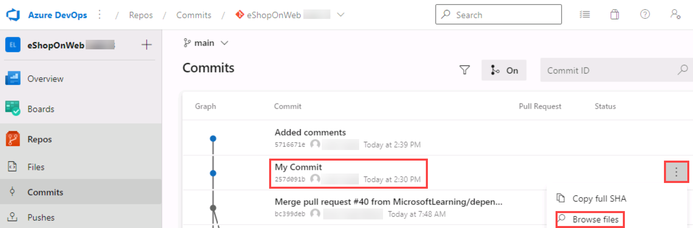

---
lab:
  title: Gestion de versions avec Git dans Azure Repos
  module: 'Module 02: Work with Azure Repos and GitHub'
---

# Gestion de versions avec Git dans Azure Repos

## Manuel de labo de l’étudiant

## Configuration de laboratoire requise

- Ce labo nécessite **Microsoft Edge** ou un [navigateur pris en charge par Azure DevOps](https://docs.microsoft.com/azure/devops/server/compatibility).

- **Configurez une organisation Azure DevOps :** si vous ne disposez pas encore d’une organisation Azure DevOps que vous pouvez utiliser pour ce labo, créez-en une conformément aux instructions disponibles dans [Créer une organisation ou une collection de projets](https://docs.microsoft.com/azure/devops/organizations/accounts/create-organization).

- Si Git 2.29.2 ou version ultérieure n’est pas installé, ouvrez votre navigateur web, accédez à la [page de téléchargement de Git pour Windows](https://gitforwindows.org/), téléchargez-le puis installez-le.
- Si Visual Studio Code n’est pas installé, ouvrez votre navigateur web, accédez à la [page de téléchargement de Visual Studio Code](https://code.visualstudio.com/), téléchargez-le puis installez-le.
- Si l’extension C# de Visual Studio n’est pas installée, ouvrez votre navigateur web, accédez à la [page de téléchargement de l’extension C#](https://marketplace.visualstudio.com/items?itemName=ms-dotnettools.csharp), puis installez-la.

## Présentation du labo

Azure DevOps prend en charge deux types de gestion de versions, Git et Team Foundation Version Control (TFVC). Voici une vue d’ensemble rapide des deux systèmes de gestion de versions :

- **Team Foundation Version Control (TFVC) :** TFVC est un système de gestion de versions centralisé. En général, les membres de l'équipe ont une seule version de chaque fichier sur leurs ordinateurs de développement. Les données d'historique sont conservées sur le serveur uniquement. Les branches sont basées sur le chemin d'accès et créées sur le serveur.

- **Git :** Git est un système de gestion de versions distribué. Les dépôts Git peuvent vivre localement (sur l’ordinateur d’un développeur). Chaque développeur dispose d’une copie du dépôt source sur son ordinateur de développement. Les développeurs peuvent valider chaque ensemble de modifications sur leur ordinateur de développement, exécuter des opérations de contrôle liées à l'historique et effectuer des comparaisons sans connexion réseau.

Git est le fournisseur de gestion de versions par défaut pour les nouveaux projets. Vous devez utiliser Git pour la gestion de versions dans vos projets, sauf si vous avez besoin de fonctionnalités de gestion de versions centralisées dans TFVC.

Dans ce labo, vous allez apprendre à établir un dépôt Git local, qui peut facilement être synchronisé avec un dépôt Git centralisé dans Azure DevOps. Vous découvrirez également la prise en charge des branchements et de la fusion Git. Vous utiliserez Visual Studio Code, mais les mêmes processus s’appliquent à l’utilisation de tout client compatible Git.

## Objectifs

À la fin de ce labo, vous serez en mesure d’accomplir les tâches suivantes :

- Cloner un dépôt existant.
- Enregistrer le travail avec des commits.
- Passer en revue l’historique des modifications.
- Utiliser des branches à l’aide de Visual Studio Code.

## Durée estimée : 60 minutes

## Instructions

### Exercice 0 : configurer les prérequis du labo

Dans cet exercice, vous configurerez les prérequis du labo, qui se composent d’un nouveau projet Azure DevOps comprenant un référentiel basé sur [eShopOnWeb](https://github.com/MicrosoftLearning/eShopOnWeb).

#### Tâche 1 : (à ignorer si vous l’avez déjà effectuée) créer et configurer le projet d’équipe

Dans le cadre de cette tâche, vous créerez un projet Azure DevOps **eShopOnWeb** qui sera utilisé dans plusieurs labos.

1. Sur votre ordinateur de labo, ouvrez votre organisation Azure DevOps dans votre navigateur. Cliquez sur **Nouveau projet**. Nommez votre projet **eShopOnWeb** et sélectionnez **Scrum** dans la liste déroulante **Processus d’élément de travail**. Cliquez sur **Créer**.

    

#### Tâche 2 : (à ignorer si vous l’avez déjà effectuée) importer un référentiel Git eShopOnWeb

Dans le cadre de cette tâche, vous importerez le référentiel Git eShopOnWeb qui sera utilisé dans plusieurs labos.

1. Sur votre ordinateur de labo, ouvrez votre organisation Azure DevOps dans votre navigateur ainsi que le projet **eShopOnWeb** que vous venez de créer. Cliquez sur **Repos > Fichiers**, puis sur **Importer**. Dans la fenêtre **Importer un référentiel Git**, collez l’URL https://github.com/MicrosoftLearning/eShopOnWeb.git, puis cliquez sur **Importer** :

    

2. Le référentiel est organisé de la manière suivante :
    - Le dossier **.ado** contient des pipelines YAML Azure DevOps.
    - Conteneur de dossiers **.devcontainer** configuré pour le développement à l’aide de conteneurs (localement dans VS Code ou GitHub Codespaces).
    - Le dossier **.azure** contient l’infrastructure Bicep&ARM en tant que modèles de code utilisés dans certains scénarios de labos.
    - **Définitions de workflow GitHub YAML du conteneur de dossiers .github**.
    - Le dossier **src** contient le site web .NET 7 utilisé dans les scénarios de labo.

#### Tâche 3 : configurer Git et Visual Studio Code

Dans le cadre de cette tâche, vous installerez puis configurerez Git et Visual Studio Code. Vous configurerez également l’assistant de gestion des informations d’identification Git de manière à stocker en toute sécurité les informations d’identification Git utilisées pour communiquer avec Azure DevOps. Si vous avez déjà implémenté ces prérequis, vous pouvez passer directement à la tâche suivante.

1. Sur l’ordinateur de labo, ouvrez **Visual Studio Code**.
2. Dans le menu principal de l’interface de Visual Studio Code, sélectionnez **Terminal \| Nouveau terminal ** pour ouvrir le volet **TERMINAL**.
3. Assurez-vous que le terminal actuel exécute **PowerShell** en vérifiant si la liste déroulante dans le coin supérieur droit du volet **TERMINAL** indique **1: powershell**

    > **Remarque** : pour passer de l’interpréteur de commandes du terminal actuel à **PowerShell**, cliquez sur la liste déroulante dans le coin supérieur droit du volet **TERMINAL** et sélectionnez **Sélectionner l’interpréteur de commandes par défaut**. En haut de la fenêtre de Visual Studio Code, sélectionnez l’interpréteur de commandes de terminal **Windows PowerShell** de votre choix, puis cliquez sur le symbole « + » à droite de la liste déroulante pour ouvrir un nouveau terminal avec l’interpréteur de commandes par défaut sélectionné.

4. Dans le volet **TERMINAL**, exécutez la commande suivante pour configurer l’assistant de gestion des informations d’identification.

    ```git
    git config --global credential.helper wincred
    ```

5. Dans le volet **TERMINAL**, exécutez les commandes ci-dessous pour configurer un nom d’utilisateur et une adresse e-mail destinés aux validations Git (remplacez les espaces réservés entre parenthèses par le nom d’utilisateur et l’adresse e-mail de votre choix en supprimant les symboles < et >) :

    ```git
    git config --global user.name "<John Doe>"
    git config --global user.email <johndoe@example.com>
    ```

### Exercice 1 : cloner un référentiel existant

Dans le cadre de cet exercice, vous utiliserez Visual Studio Code pour cloner le référentiel Git que vous avez configuré lors de l’exercice précédent.

#### Tâche 1 : cloner un référentiel existant

Dans le cadre de cette tâche, vous suivrez étape par étape le processus de clonage d’un référentiel Git à l’aide de Visual Studio Code.

1. Revenez au navigateur web qui affiche votre organisation Azure DevOps avec le projet **eShopOnWeb** que vous avez généré lors de l’exercice précédent.
2. Dans le volet de navigation vertical du Portail Azure DevOps, sélectionnez l’icône **Repos**.

3. Dans le coin supérieur droit du volet du référentiel **eShopOnWeb**, cliquez sur **Cloner**.

    

    > **Remarque** : la procédure d’obtention d’une copie locale d’un référentiel Git porte le nom de *clonage*. Tous les outils de développement standard prennent en charge cette opération et seront en mesure de se connecter à Azure Repos pour récupérer la source la plus récente en vue de l’exploiter.

4. Dans le volet **Cloner le référentiel**, assurez-vous que l’option de ligne de commande **HTTPS** est sélectionnée, puis cliquez sur le bouton **Copier dans le presse-papiers** en regard de l’URL de clonage du référentiel.

    > **Remarque** : vous pouvez utiliser cette URL avec n’importe quel outil compatible avec Git pour obtenir une copie du codebase.

5. Fermez le volet **Cloner le référentiel**.
6. Revenez à l’éditeur **Visual Studio Code** ouvert sur votre ordinateur de labo.
7. Cliquez sur l’en-tête du menu **Vue**. Dans le menu déroulant qui apparaît, cliquez sur **Palette de commandes**.

    > **Remarque** : la palette de commandes fournit un accès simple et pratique à une vaste gamme de tâches, y compris les tâches implémentées en tant qu’extensions tierces. Vous pouvez également utiliser le raccourci clavier **Ctrl+Maj+P** ou **F1**.

8. Lorsque la palette de commandes vous invite à le faire, exécutez la commande **Git: Clone**.

    

    > **Remarque** : commencez à saisir **Git** pour afficher toutes les commandes correspondantes.

9. Dans la zone de texte **Fournir une URL de référentiel ou sélectionner une source de référentiel**, collez l’URL du clone du référentiel que vous avez copié un peu plus tôt dans cette tâche, puis appuyez sur la touche **Entrée**.
10. Dans la boîte de dialogue **Sélectionner un dossier**, accédez au lecteur C:. Créez un dossier nommé **Git**, sélectionnez-le, puis cliquez sur **Sélectionner l’emplacement du référentiel**.
11. Lorsque vous y êtes invité, connectez-vous à votre compte Azure DevOps.
12. Une fois le processus de clonage terminé et lorsque vous y êtes invité dans Visual Studio Code, cliquez sur **Ouvrir** pour ouvrir le référentiel cloné.

    > **Remarque** : vous pouvez ignorer les avertissements que recevrez peut-être et qui concernent des problèmes liés au chargement du projet. La solution n’est peut-être pas un état qui convient à un build, mais vous vous concentrez sur l’utilisation de Git  il n’est donc pas nécessaire de créer le projet.

### Exercice 2 : enregistrer le travail effectué avec des validations

Dans le cadre de cet exercice, vous suivrez étape par étape plusieurs scénarios qui impliquent l’utilisation de Visual Studio Code pour indexer et valider les modifications.

Lorsque vous apportez des modifications à vos fichiers, Git enregistre ces modifications dans le référentiel local. Vous pouvez sélectionner celles que vous souhaitez valider en les indexant. Les validations sont toujours effectuées par rapport à votre référentiel Git local : la validation ne doit pas forcément être parfaite ou prête à être partagé avec d’autres personnes. Vous pouvez effectuer d’autres validations à mesure que vous travaillez et envoyer les modifications à d’autres personnes lorsqu’elles sont prêtes à être partagées.

Les validations Git se composent des éléments suivants :

- Le ou les fichiers modifiés dans la validation. Git conserve le contenu de toutes les modifications apportées aux fichiers au sein de votre référentiel dans les validations. Cette pratique garantit une fusion rapide et intelligente.
- Référence au(x) validation(s) parente(s). Git gère votre historique de code à l’aide de ces références.
- Un message décrivant la validation. Vous transmettez ce message à Git lorsque vous créez la validation. Idéalement, ce message est descriptif tout en restant concis.

#### Tâche 1 : valider les modifications

Dans le cadre de cette tâche, vous utiliserez Visual Studio Code pour valider les modifications.

1. En haut de la barre d’outils verticale de la fenêtre Visual Studio Code, sélectionnez l’onglet **EXPLORER**, puis accédez au fichier **/eShopOnWeb/src/Web/Program.cs** et sélectionnez-le. Son contenu s’affiche alors automatiquement dans le volet d’informations.
2. Ajoutez le commentaire ci-dessous sur la première ligne :

    ```csharp
    // My first change
    ```

    > **Remarque** : le contenu du commentaire importe peu, car l’objectif ici est simplement d’apporter une modification.

3. Appuyez sur **Ctrl+S** pour enregistrer les modifications.
4. Dans la fenêtre Visual Studio Code, sélectionnez l’onglet **CONTRÔLE DE CODE SOURCE** pour vérifier que Git a reconnu la dernière modification apportée au fichier se trouvant dans le clone local du référentiel Git.
5. Toujours avec l’onglet **CONTRÔLE DE CODE SOURCE** sélectionné, saisissez **Ma validation** dans la zone de texte en haut du volet comme message de validation, puis appuyez sur **Ctrl+Entrée** pour le valider en local.

    

6. Si vous êtes invité à indexer automatiquement vos modifications et à les valider directement, cliquez sur **Toujours**.

    > **Remarque** : l’**indexation** sera abordée ultérieurement dans le labo.

7. À droite de l’étiquette **principale** dans le coin inférieur gauche de la fenêtre Visual Studio Code, vous verrez l’icône **Synchroniser les modifications** qui prend la forme d’un cercle avec deux flèches verticales pointant dans deux directions opposées avec le chiffre **1** en regard de la flèche pointant vers le haut. Cliquez sur l’icône. Si l’outil vous demande si vous souhaitez poursuivre, cliquez sur **OK** pour envoyer et extraire des validations vers et depuis l’**origine/le main**.

#### Tâche 2 : vérifier les validations

Dans le cadre de cette tâche, vous utiliserez le Portail Azure DevOps pour vérifier les validations.

1. Revenez à la fenêtre du navigateur web qui affiche l’interface Azure DevOps.
2. Dans la section **Repos** du volet de navigation vertical du Portail Azure DevOps, sélectionnez **Validations**.
3. Assurez-vous que votre validation apparaît en haut de la liste.

    

#### Tâche 3 : indexer les modifications

Dans le cadre de cette tâche, vous découvrirez comment indexer des modifications à l’aide de Visual Studio Code. L’indexation des modifications vous permet d’ajouter certains fichiers de manière sélective à une validation tout en ignorant les modifications apportées à d’autres fichiers.

1. Revenez à la fenêtre **Visual Studio Code**.
2. Mettez à jour la classe **Program.cs** ouverte en apportant les modifications ci-dessous au premier commentaire et en enregistrant le fichier.

    ```csharp
        //My second change
    ```

3. Dans la fenêtre Visual Studio Code, revenez à l’onglet **EXPLORER**, puis accédez au fichier **/eShopOnWeb/src/Web/Constants.cs** et sélectionnez-le. Son contenu s’affiche alors automatiquement dans le volet d’informations.
4. Ajoutez un commentaire sur la première ligne du fichier **Constants.cs** et enregistrez le fichier.

    ```csharp
    // My third change
    ```

5. Dans la fenêtre Visual Studio Code, passez à l’onglet **CONTRÔLE DE CODE SOURCE**, survolez l’entrée **Program.cs** avec votre curseur, puis cliquez sur le symbole « + » à droite de cette entrée.

    > **Remarque** : cette opération indexe la modification vers le fichier **Program.cs** uniquement et le prépare pour la validation sans **Constants.cs**.

6. Toujours avec l’onglet **CONTRÔLE DE CODE SOURCE** sélectionné, saisissez **Commentaires ajoutés** dans la zone de texte en haut du volet comme message de validation.

    

7. Cliquez sur les points de suspension en haut de l’onglet **CONTRÔLE DE CODE SOURCE**. Dans le menu déroulant qui s’affiche, sélectionnez **Valider**, puis sélectionnez **Validation indexée** dans le menu en cascade qui apparaît.
8. Dans le coin inférieur gauche de la fenêtre Visual Studio Code, cliquez sur le bouton **Synchroniser les modifications** pour synchroniser les modifications validées avec le serveur. Si l’outil vous demande si vous souhaitez poursuivre, cliquez sur **OK** pour envoyer et extraire des validations vers et depuis l’**origine/le main**.

    > **Remarque** : puisque seule la modification indexée a été validée, l’autre modification est toujours en attente de synchronisation.

### Exercice 3 : vérifier l’historique

Dans le cadre de cet exercice, vous utiliserez le Portail Azure DevOps pour vérifier l’historique des validations.

Git s’appuie sur les informations de référence parent stockées dans chaque validation pour gérer un historique complet de votre développement. Vous pouvez facilement consulter cet historique de validation pour connaître la date et l’heure des modifications apportées aux fichiers et déterminer les différences entre les versions de votre code à l’aide du terminal ou de l’une des nombreuses extensions de Visual Studio Code disponibles. Vous pouvez aussi examiner les modifications depuis le Portail Azure DevOps.

Git utilise la fonctionnalité **Branches et Fusions** en employant des demandes de tirage (pull requests) : l’historique de validation de votre développement ne formera pas toujours une ligne chronologique droite. Lorsque vous utilisez l’historique pour comparer les versions, intéressez-vous aux modifications apportées aux fichiers entre deux validations plutôt qu’à celles effectuées entre deux moments donnés. Une modification récente d’un fichier dans la branche principale peut provenir d’une validation créée il y a deux semaines dans une branche de fonctionnalité qui a été fusionnée la veille.

#### Tâche 1 : comparer les fichiers

Dans le cadre de cette tâche, vous découvrirez l’historique des validations étape par étape à l’aide du Portail Azure DevOps.

1. Avec l’onglet **CONTRÔLE DE CODE SOURCE** de la fenêtre Visual Studio Code ouvert, sélectionnez **Constants.cs** qui représente la version non indexée du fichier.

    

    > **Remarque** : une vue de comparaison est ouverte pour vous permettre de repérer facilement les modifications effectuées. Ici, seul un commentaire est concerné.

2. Revenez à la fenêtre du navigateur web où le volet **Validations** du Portail **Azure DevOps** est ouvert pour passer en revue les branches et fusions sources. Il s’agit d’un moyen pratique de visualiser le moment et la façon dont les modifications ont été apportées à la source.
3. Faites défiler la page vers le bas jusqu’à atteindre l’entrée **Ma validation** (envoyée plus tôt dans l’exercice) et survolez-la avec votre curseur pour afficher le symbole des points de suspension à sa droite.
4. Cliquez sur les points de suspension. Dans le menu déroulant qui apparaît, sélectionnez **Parcourir les fichiers**, puis examinez les résultats.

    

    > **Remarque** : cette vue représente l’état de la source correspondant à la validation et vous permet de vérifier et de télécharger chacun des fichiers sources.

### Exercice 4 : utiliser les branches

Dans le cadre de cet exercice, vous découvrirez étape par étape les scénarios qui impliquent la gestion des branches à l’aide de Visual Studio Code et du Portail Azure DevOps.

Vous pouvez gérer votre référentiel Git Azure DevOps à partir de la vue **Branches** d’**Azure Repos** sur le Portail Azure DevOps. Vous pouvez aussi personnaliser la vue pour suivre les branches qui importent le plus pour vous afin de connaître toutes les modifications effectuées par votre équipe.

La validation des modifications apportées à une branche n’affecte pas les autres branches, et vous pouvez partager des branches avec d’autres personnes sans devoir fusionner les modifications dans le projet principal. Vous pouvez aussi créer d’autres branches afin d’isoler les modifications d’une fonctionnalité ou d’un correctif de bogue de votre branche principale et d’autres tâches. Étant donné que les branches sont légères, le basculement entre les branches est rapide et facile. Git ne crée pas plusieurs copies de votre code source lorsque vous travaillez avec des branches, mais utilise les informations d’historique stockées dans les validations pour recréer les fichiers d’une branche lorsque vous commencez à travailler dessus. Votre workflow Git doit créer et utiliser des branches pour gérer les fonctionnalités et les correctifs de bogues. Le reste du workflow Git, tel que le partage de code et l’examen du code avec des demandes de tirage, fonctionne via des branches, sans exception. Isoler les tâches dans des branches permet de modifier facilement les éléments sur lesquels vous travaillez en modifiant la branche actuellement utilisée.

#### Tâche 1 : créez une branche dans votre référentiel local

Dans le cadre de cette tâche, vous créerez une branche à l’aide de Visual Studio Code.

1. Revenez à l’éditeur **Visual Studio Code** ouvert sur votre ordinateur de labo.
2. Toujours avec l’onglet **CONTRÔLE DE CODE SOURCE** sélectionné, cliquez sur **main** dans le coin inférieur gauche de la fenêtre Visual Studio Code.
3. Dans la fenêtre contextuelle qui s’affiche, sélectionnez **+ Créer une branche à partir de…**

    

4. Dans la zone de texte **Nom de la branche**, saisissez **développement** pour spécifier la nouvelle branche, puis appuyez sur la touche **Entrée**.
5. Dans la zone de texte **Sélectionner une référence à partir de laquelle créer la branche de développement**, sélectionnez **main** comme branche de référence.

    > **Remarque** : à ce stade, vous êtes automatiquement redirigé vers la branche de **développement**.

#### Tâche 2 : supprimer une branche

Dans le cadre de cette tâche, vous utiliserez Visual Studio Code pour travailler avec une branche créée lors de la tâche précédente.

Git suit sur quelle branche vous travaillez et veille à ce que vos fichiers correspondent à la validation la plus récente sur la branche que vous examinez. Les branches vous permettent d’utiliser plusieurs versions du code source dans le même référentiel Git local en même temps. Vous pouvez utiliser Visual Studio Code pour publier, examiner et supprimer des branches.

1. Toujours avec l’onglet **CONTRÔLE DE CODE SOURCE** sélectionné, cliquez sur l’icône **Publier les modifications** dans le coin inférieur gauche de la fenêtre **Visual Studio Code** (l’icône se trouve à droite de l’étiquette de **développement** qui représente votre nouvelle branche).
2. Basculez vers la fenêtre du navigateur web où le volet **Validations** du Portail **Azure DevOps** est ouvert et sélectionnez **Branches**.
3. Sous l’onglet **Mes branches** du volet **Branches**, assurez-vous que la liste des branches inclut les branche en **développement**.
4. Survolez l’entrée de branche en **développement** avec le curseur pour afficher le symbole des points de suspension à droite.
5. Cliquez sur les points de suspension. Dans le menu contextuel qui s’affiche, sélectionnez **Supprimer la branche**, puis, lorsque vous êtes invité à confirmer votre choix, cliquez sur **Supprimer**.

    

6. Revenez à la fenêtre **Visual Studio Code**. Toujours avec l’onglet **CONTRÔLE DE CODE SOURCE** sélectionné, cliquez sur l’entrée de **développement** dans le coin inférieur gauche de la fenêtre Visual Studio Code. Les branches existantes s’affichent alors dans la partie supérieure de la fenêtre Visual Studio Code.
7. Assurez-vous que deux branches de **développement** sont maintenant répertoriées.

    > **Remarque** : la branche locale (**développement**) est répertoriée, car elle n’est pas affectée par la suppression de la branche dans le référentiel distant. Le serveur (**origine/développement**) est répertorié, car il n’a pas été élagué.

8. Dans la liste des branches, sélectionnez la branche **principale** pour la modifier.
9. Appuyez sur **Ctrl+Maj+P** pour ouvrir la **palette de commandes**.
10. Dans l’invite **Palettes de commandes**, commencez à saisir **Git: Delete** et sélectionnez **Git: Delete Branch** lorsque la commande apparaît.
11. Sélectionnez l’entrée de **développement** dans la liste des branches à supprimer.
12. Dans le coin inférieur gauche de la fenêtre Visual Studio Code, cliquez à nouveau sur l’entrée **principale**. Les branches existantes s’affichent alors dans la partie supérieure de la fenêtre Visual Studio Code.
13. Vérifiez que la branche de **développement** locale a disparu de la liste et assurez-vous que la branche d’**origine/de développement** distante s’y trouve encore.
14. Appuyez sur **Ctrl+Maj+P** pour ouvrir la **palette de commandes**.
15. Dans l’invite **Palettes de commandes**, commencez à saisir **Git: Fetch** et sélectionnez **Git: Fetch (Prune)** lorsque la commande apparaît.

    > **Remarque** : cette commande met à jour les branches d’origine dans l’instantané local et supprime les branches qui ont disparu.

    > **Remarque** : vous pouvez examinez les résultats exacts de ces tâches en cliquant sur la fenêtre **Sortie** dans la partie inférieure droite de la fenêtre Visual Studio Code. Si les journaux d’activité Git n’apparaissent pas dans la console de sortie, assurez-vous de sélectionner **Git** en tant que source.

16. Dans le coin inférieur gauche de la fenêtre Visual Studio Code, cliquez à nouveau sur l’entrée **principale**.
17. Vérifiez que la branche d’**origine/de développement** n’apparaît plus dans la liste des branches.

#### Tâche 3 : restaurer une branche

Dans le cadre de cette tâche, vous utiliserez le Portail Azure DevOps pour restaurer la branche que vous avez supprimée lors de la tâche précédente.

1. Revenez au navigateur web qui affiche l’onglet **Mes branches** du volet **Branches** du Portail Azure DevOps.
2. Dans l’onglet **Mes branches** du volet **Branches**, cliquez sur l’onglet **Toutes les branches**.
3. Dans la zone de texte **Rechercher par nom de branche** de l’onglet **Toutes les branches** du volet **Branches**, saisissez **développement**.
4. Passez en revue la section **Branches supprimées** qui contient l’entrée représentant la branche que vous venez de supprimer.
5. Dans la section **Branches supprimées**, survolez l’entrée de branche en **développement** avec le curseur pour afficher le symbole des points de suspension à droite.
6. Cliquez sur les points de suspension. Dans le menu contextuel qui s’affiche, sélectionnez **Restaurer la branche**.

    

    > **Remarque** : vous pouvez utiliser cette fonctionnalité pour restaurer une branche supprimée dont vous connaissez le nom exact.

#### Tâche 4 : stratégies de branche

Dans le cadre de cette tâche, vous utiliserez le Portail Azure DevOps pour ajouter des stratégies à la branche principale et autoriser uniquement les modifications effectuées à l’aide de demandes de tirage (pull requests) conformes aux stratégies définies. Vous souhaitez vous assurer que les modifications apportées à une branche sont examinées avant leur fusion.

Pour simplifier le processus, vous travaillerez directement dans l’éditeur de référentiel du navigateur web (qui fonctionne directement dans l’origine) et non pas avec le clone local dans VS Code (pratique recommandée dans des scénarios réels).

1. Revenez au navigateur web qui affiche l’onglet **Mes branches** du volet **Branches** du Portail Azure DevOps.
2. Dans l’onglet **Mes branches** du volet **Branches**, survolez l’entrée de branche **main** avec le curseur pour afficher le symbole des points de suspension à droite.
3. Cliquez sur les points de suspension. Dans le menu contextuel qui s’affiche, sélectionnez **Stratégies de branche**.

    

4. Dans l’onglet **main** des paramètres du référentiel, activez l’option **Exiger un nombre minimal de réviseurs**. Ajoutez **1** réviseur et cochez la case **Autoriser les demandeurs à approuver leurs propres modifications** (puisque vous êtes le seul utilisateur associé à votre projet dans le cadre du labo).
5. Dans l’onglet **main** des paramètres du référentiel, activez l’option **Rechercher les éléments de travail liés** et ne modifiez pas l’option **Obligatoire**.

    

#### Tâche 5 : tester les stratégies de branche

Dans le cadre de cette tâche, vous utiliserez le Portail Azure DevOps pour tester la stratégie et créer votre première demande de tirage (pull request).

1. Dans la section **Repos > Fichiers** du volet de navigation vertical du Portail Azure DevOps, assurez-vous que la branche **principale** est sélectionnée (liste déroulante au-dessus du contenu illustré).
2. Pour vérifier que les stratégies fonctionnent correctement, essayez de modifier la branche **principale** et de valider votre modification. Pour ce faire, accédez au fichier **/eShopOnWeb/src/Web/Program.cs** et sélectionnez-le. Son contenu s’affiche alors automatiquement dans le volet d’informations.
3. Ajoutez le commentaire ci-dessous sur la première ligne :

    ```csharp
    // Testing main branch policy
    ```

4. Cliquez sur **Valider > Valider**. Un avertissement s’affiche pour vous prévenir que les modifications apportées à la branche principale peuvent uniquement être effectuées à l’aide d’une demande de tirage (pull request).

    

5. Cliquez sur **Annuler** pour ignorer la validation.

#### Tâche 6 : traitement des demandes de tirage (pull request)

Dans le cadre de cette tâche, vous utiliserez le Portail Azure DevOps pour créer une demande de tirage (pull request) à l’aide de la branche de **développement** pour fusionner une modification dans la branche **principale** protégée. Un élément de travail Azure DevOps sera lié aux modifications pour pouvoir suivre les tâches en attente avec l’activité de code.

1. Dans la section **Boards** du volet de navigation vertical du Portail Azure DevOps, sélectionnez **Éléments de travail**.
2. Cliquez sur **+ Nouvel élément de travail > Élément de backlog de produits**. Dans le champ de titre, indiquez **Test de ma première demande de tirage (pull request)** et cliquez sur **Enregistrer**.
3. Revenez à la section **Repos > Fichiers** du volet de navigation vertical du Portail Azure DevOps et assurez-vous que la branche de **développement** est sélectionnée.
4. Accédez au fichier **/eShopOnWeb/src/Web/Program.cs** et modifiez la première ligne comme suit :

    ```csharp
    // Testing my first PR
    ```

5. Cliquez sur **Valider > Valider** (ne modifiez pas le message de validation par défaut). Cette fois, la validation fonctionne et la branche de **développement** ne comporte aucune stratégie.
6. Un message s’affiche pour vous proposer de créer une demande de tirage (pull request) (maintenant que la branche de **développement** est modifiée par rapport au **main**). Cliquez sur **Créer une demande de tirage (pull request)**.

    

7. Dans l’onglet **Nouvelle demande de tirage (pull request)**, conservez les valeurs par défaut puis cliquez sur **Créer**.
8. La demande de tirage (pull request) affiche plusieurs exigences en échec/en attente en fonction des stratégies appliquées à la branche ** principale** cible.
    - Un élément de travail doit être lié aux modifications proposées.
    - Au moins 1 utilisateur doit vérifier et approuver les modifications.

9. Dans les options à droite de l’écran, cliquez sur le bouton **+** en regard des **éléments de travail**. Liez l’élément de travail que vous venez de créer à la demande de tirage (pull request) en cliquant dessus. L’état de l’une des exigences change.

    

10. Ouvrez ensuite l’onglet **Fichiers** pour vérifier les modifications proposées. Les demandes de tirage plus complètes vous permettent de vérifier les fichiers un par un (marqués comme révisés) et de publier des commentaires concernant les lignes peu claires (survolez le numéro de la ligne avec le curseur pour publier un commentaire).
11. Revenez à l’onglet **Vue d’ensemble**. Dans le coin supérieur de l’écran, cliquez sur **Approuver**. Toutes les exigences passent au vert. Vous pouvez maintenant cliquer sur **Terminer**.
12. Dans l’onglet **Terminer la demande de tirage (pull request)**, plusieurs options sont disponibles avant de procéder à la fusion :
    - **Type de fusion** : 4 types de fusion vous sont proposés. Vous pouvez les consulter [ici](https://learn.microsoft.com/azure/devops/repos/git/complete-pull-requests?view=azure-devops&tabs=browser#complete-a-pull-request) ou regarder les animations présentées. Sélectionnez **Fusion (sans avance rapide)**.
    - **Options après l’achèvement** :
        - Cochez l’option **Terminer l’élément de travail associé…** Cela passe le PBI associé à l’état **Terminé**.

13. Cliquez sur **Terminer la fusion**

#### Tâche 7 : application d’étiquettes

L’équipe produit a décidé que la version actuelle du site devait être la version v1.1.0-beta.

1. Dans la section **Repos** du volet de navigation vertical du Portail Azure DevOps, sélectionnez **Étiquettes**.
2. Dans le volet **Étiquettes** , cliquez sur **Nouvelle étiquette**.
3. Dans la zone de texte **Nom** du volet **Créer une étiquette**, saisissez **v1.1.0-beta**. Dans la liste déroulante **Basée sur**, ne modifiez pas l’entrée **main** sélectionnée, puis saisissez **Version bêta v1.1.0** dans la zone de texte **Description**. Enfin, cliquez sur **Créer**.

    > **Remarque** : le référentiel est désormais étiqueté à cette version (la dernière validation est liée à l’étiquette). Vous pouvez étiqueter des validations pour diverses raisons ; Azure DevOps vous permet de les modifier, de les supprimer et de gérer leurs autorisations.

## Révision

Dans le cadre de ce labo, vous avez utilisé le Portail Azure DevOps pour gérer les branches et les référentiels.
