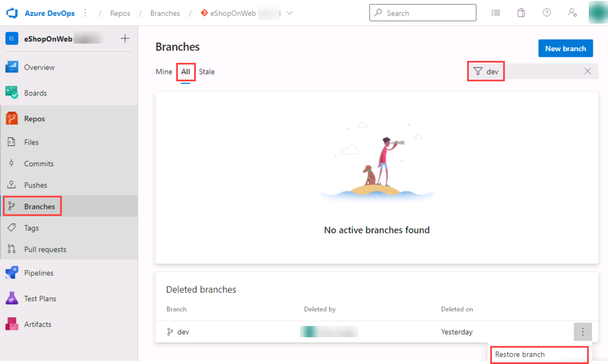
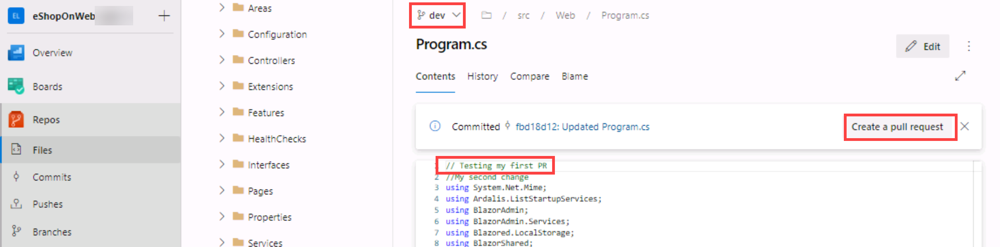

---
lab:
  title: "Gestion de versions avec Git dans Azure\_Repos"
  module: 'Module 02: Work with Azure Repos and GitHub'
---

# Gestion de versions avec Git dans Azure Repos

## Manuel de labo de l’étudiant

## Configuration de laboratoire requise

- Ce labo nécessite **Microsoft Edge** ou un [navigateur pris en charge par Azure DevOps](https://docs.microsoft.com/azure/devops/server/compatibility).

- **Configurez une organisation Azure DevOps :** si vous ne disposez pas encore d’une organisation Azure DevOps que vous pouvez utiliser pour ce labo, créez-en une conformément aux instructions disponibles dans [Créer une organisation ou une collection de projets](https://docs.microsoft.com/azure/devops/organizations/accounts/create-organization).

- Si Git 2.29.2 ou version ultérieure n’est pas installé, démarrez un navigateur web, accédez à la [page de téléchargement de Git pour Windows](https://gitforwindows.org/) et installez-le.
- Si Visual Studio Code n’est pas encore installé, à partir de la fenêtre du navigateur web, accédez à la [page de téléchargement de Visual Studio Code](https://code.visualstudio.com/), téléchargez-le et installez-le.
- Si vous n’avez pas encore installé l’extension Visual Studio C#, dans la fenêtre du navigateur web, accédez à la [page d’installation de l’extension C#](https://marketplace.visualstudio.com/items?itemName=ms-dotnettools.csharp) et installez-la.

## Présentation du labo

Azure DevOps prend en charge deux types de gestion de versions, Git et Team Foundation Version Control (TFVC). Voici une vue d’ensemble rapide des deux systèmes de gestion de versions :

- **Team Foundation Version Control (TFVC) :** TFVC est un système de gestion de versions centralisé. En général, les membres de l'équipe ont une seule version de chaque fichier sur leurs ordinateurs de développement. Les données d'historique sont conservées sur le serveur uniquement. Les branches sont basées sur le chemin d'accès et créées sur le serveur.

- **Git :** Git est un système de gestion de versions distribué. Les dépôts Git peuvent vivre localement (sur l’ordinateur d’un développeur). Chaque développeur dispose d’une copie du dépôt source sur son ordinateur de développement. Les développeurs peuvent valider chaque ensemble de modifications sur leur ordinateur de développement, exécuter des opérations de contrôle liées à l'historique et effectuer des comparaisons sans connexion réseau.

Git est le fournisseur de gestion de versions par défaut pour les nouveaux projets. Vous devez utiliser Git pour la gestion de versions dans vos projets, sauf si vous avez besoin de fonctionnalités de gestion de versions centralisées dans TFVC.

Dans ce labo, vous allez apprendre à établir un dépôt Git local, qui peut facilement être synchronisé avec un dépôt Git centralisé dans Azure DevOps. Vous découvrirez également la prise en charge des branchements et de la fusion Git. Vous utiliserez Visual Studio Code, mais les mêmes processus s’appliquent à l’utilisation de tout client compatible Git.

## Objectifs

À la fin de ce labo, vous serez en mesure d’effectuer les tâches suivantes :

- Cloner un dépôt existant.
- Enregistrer le travail avec des commits.
- Passer en revue l’historique des modifications.
- Utiliser des branches à l’aide de Visual Studio Code.

## Durée estimée : 60 minutes

## Instructions

### Exercice 0 : configurer les prérequis du labo

Dans cet exercice, vous allez configurer les prérequis pour le labo, qui se composent d’un nouveau projet Azure DevOps avec un référentiel basé sur [eShopOnWeb](https://github.com/MicrosoftLearning/eShopOnWeb).

#### Tâche 1 : (passer si terminée) créer et configurer le projet d’équipe

Dans cette tâche, vous allez créer un projet Azure DevOps **eShopOnWeb** à utiliser par plusieurs labos.

1. Sur votre ordinateur de labo, dans une fenêtre de navigateur, ouvrez votre organisation Azure DevOps. Cliquez sur **Nouveau projet**. Donnez au projet le nom **eShopOnWeb**, puis choisissez **Scrum** dans la liste déroulante **Processus d’élément de travail**. Cliquez sur **Créer**.

    

#### Tâche 2 : (passer si terminée) importer le référentiel Git eShopOnWeb

Dans cette tâche, vous allez importer le référentiel Git eShopOnWeb qui sera utilisé par plusieurs labos.

1. Sur votre ordinateur de labo, dans une fenêtre de navigateur, ouvrez votre organisation Azure DevOps et le projet **eShopOnWeb** créé précédemment. Cliquez sur **Dépôts > Fichiers**, **Importer**. Dans la fenêtre **Importer un dépôt Git**, collez l’URL https://github.com/MicrosoftLearning/eShopOnWeb.git, puis cliquez sur **Importer** :

    

2. Le référentiel est organisé de la manière suivante :
    - Le dossier **.ado** contient des pipelines YAML Azure DevOps.
    - Conteneur de dossiers **.devcontainer** configuré pour le développement à l’aide de conteneurs (localement dans VS Code ou GitHub Codespaces).
    - Le dossier **.azure** contient l’infrastructure Bicep&ARM en tant que modèles de code utilisés dans certains scénarios de labo.
    - **Définitions de workflow GitHub YAML du conteneur de dossiers .github**.
    - Le dossier **src** contient le site web .NET 7 utilisé dans les scénarios de labo.

#### Tâche 3 : configurer Git et Visual Studio Code

Dans cette tâche, vous allez installer et configurer Git et Visual Studio Code, avec notamment la configuration de l’assistance des informations d’identification Git pour stocker en toute sécurité les informations d’identification Git utilisées pour communiquer avec Azure DevOps. Si vous avez déjà implémenté ces prérequis, vous pouvez passer directement à la tâche suivante.

1. Sur l’ordinateur de labo, démarrez **Visual Studio Code**.
2. Dans l’interface Visual Studio Code, dans le menu principal, sélectionnez **Terminal \| Nouveau terminal** pour ouvrir le volet **TERMINAL**.
3. Assurez-vous que le terminal actuel exécute **PowerShell** en vérifiant si la liste déroulante en haut à droite du volet **TERMINAL** affiche **1 : powershell**.

    > **Remarque** : pour remplacer le shell de terminal par ** PowerShell**, cliquez sur la liste déroulante en haut à droite du volet **TERMINAL**, puis cliquez sur **Sélectionner le shell par défaut**. En haut de la fenêtre Visual Studio Code, sélectionnez votre shell de terminal favori **Windows PowerShell**, puis cliquez sur le signe Plus à droite de la liste déroulante pour ouvrir un nouveau terminal avec le shell par défaut sélectionné.

4. Dans le volet **TERMINAL**, exécutez la commande ci-dessous pour configurer l’assistance des informations d’identification.

    ```git
    git config --global credential.helper wincred
    ```

5. Dans le volet **TERMINAL**, exécutez les commandes suivantes pour configurer un nom d’utilisateur et un e-mail pour les commits Git (remplacez les espaces réservés dans les accolades par votre nom d’utilisateur préféré et envoyez un e-mail sans les symboles < et >) :

    ```git
    git config --global user.name "<John Doe>"
    git config --global user.email <johndoe@example.com>
    ```

### Exercice 1 : cloner un référentiel existant

Dans cet exercice, vous utilisez Visual Studio Code pour cloner le référentiel Git que vous avez provisionné dans le cadre de l’exercice précédent.

#### Tâche 1 : cloner un référentiel existant

Dans cette tâche, vous allez parcourir le processus de clonage d’un référentiel Git à l’aide de Visual Studio Code.

1. Basculez vers le navigateur web affichant votre organisation Azure DevOps avec le projet **eShopOnWeb** que vous avez généré dans l’exercice précédent.
2. Dans le volet de navigation vertical du portail Azure DevOps, sélectionnez l’icône **Référentiel**.

3. Dans le coin supérieur droit du volet du référentiel **eShopOnWeb**, cliquez sur **Cloner**.

    

    > **Remarque** : l’obtention d’une copie locale d’un référentiel Git est appelée *clonage*. Chaque outil de développement standard prend en charge cette fonctionnalité et sera en mesure de se connecter à Azure Repos pour extraire la dernière source avec laquelle travailler.

4. Dans le panneau **Cloner le référentiel**, avec l’option de ligne de commande **HTTPS** sélectionnée, cliquez sur le bouton **Copier dans le Presse-papiers** en regard de l’URL de clonage du référentiel.

    > **Remarque** : vous pouvez utiliser cette URL avec n’importe quel outil compatible Git pour obtenir une copie du codebase.

5. Fermez le panneau **Cloner le référentiel**.
6. Sur l’ordinateur du labo, basculez vers **Visual Studio Code**.
7. Cliquez sur l’en-tête du menu **Affichage** et, dans le menu déroulant, cliquez sur **Palette de commandes**.

    > **Remarque** : la palette de commandes offre un moyen simple et pratique d’accéder à un large éventail de tâches, y compris celles implémentées en tant qu’extensions tierces. Vous pouvez également utiliser le raccourci clavier **Ctrl+Maj+P** ou **F1** pour l’ouvrir.

8. À l’invite de la palette de commandes, exécutez la commande **Git : Cloner**.

    

    > **Remarque** : pour afficher toutes les commandes pertinentes, vous pouvez commencer par taper **Git**.

9. Dans la zone de texte **Fournir l’URL du référentiel ou choisir une source de référentiel**, collez l’URL du clone du référentiel que vous avez copiée précédemment dans cette tâche, puis appuyez sur la touche **Entrée**.
10. Dans la boîte de dialogue **Sélectionner un dossier**, accédez au lecteur C:, créez un dossier nommé **Git**, sélectionnez-le, puis cliquez sur **Sélectionner l’emplacement du référentiel**.
11. À l’invite, connectez-vous à votre compte Azure DevOps.
12. Une fois le processus de clonage terminé, à l’invite, dans Visual Studio Code, cliquez sur **Ouvrir** pour ouvrir le référentiel cloné.

    > **Remarque** : vous pouvez ignorer les avertissements éventuels en ce qui concerne les problèmes de chargement du projet. La solution peut ne pas convenir pour une build. Toutefois, comme nous nous concentrons sur l’utilisation de Git, il ne sera pas nécessaire de créer de build pour le projet.

### Exercice 2 : enregistrer le travail avec des commits

Dans cet exercice, vous allez parcourir plusieurs scénarios qui impliquent l’utilisation de Visual Studio Code pour indexer et valider les modifications.

Lorsque vous apportez des modifications à vos fichiers, Git les enregistre dans le référentiel local. Vous pouvez sélectionner les modifications à valider en les indexant. Les commits sont toujours effectués sur votre référentiel Git local. Vous n’avez donc pas à vous soucier de créer un commit parfait ou prêt à être partagé avec d’autres personnes. Vous pouvez continuer à créer des commits tout en travaillant, puis envoyer les modifications à d’autres personnes lorsqu’elles sont prêtes à être partagées.

Les commits Git se composent des éléments suivants :

- Le ou les fichiers modifiés dans le commit. Git conserve le contenu de toutes les modifications de fichier de votre référentiel dans les commits. La procédure est rapide et permet une fusion intelligente.
- Référence au(x) validation(s) parente(s). Git gère votre historique de code à l’aide de ces références.
- Message décrivant une validation. Vous indiquez ce message à Git lorsque vous créez la validation. Il est judicieux de garder ce message descriptif, mais concis.

#### Tâche 1 : valider les modifications

Dans cette tâche, vous allez utiliser Visual Studio Code pour valider les modifications.

1. Dans la fenêtre Visual Studio Code, en haut de la barre d’outils verticale, sélectionnez l’onglet **EXPLORER**, accédez au fichier **/eShopOnWeb/src/Web/Program.cs**, puis sélectionnez-le. Vous affichez ainsi automatiquement son contenu dans le volet d’informations.
2. Sur la première ligne, ajoutez le commentaire suivant :

    ```csharp
    // My first change
    ```

    > **Remarque** : peu importe le contenu du commentaire, l'essentiel est simplement d'effectuer une modification.

3. Appuyez sur **Ctrl+S** pour enregistrer les modifications.
4. Dans la fenêtre Visual Studio Code, sélectionnez l’onglet **CONTRÔLE DE CODE SOURCE** pour vérifier que Git a reconnu la dernière modification apportée au fichier résidant dans le clone local du dépôt Git.
5. Avec l’onglet **CONTRÔLE DE CODE SOURCE** sélectionné, en haut du volet, dans la zone de texte, tapez **My commit** comme message de validation et appuyez sur **Ctrl+Entrée** pour le valider localement.

    

6. Si vous êtes invité à effectuer une phase automatique de vos modifications et à les valider directement, cliquez sur **Always**.

    > **Remarque** : nous aborderons **la mise en lots** plus loin dans le labo.

7. Dans le coin inférieur gauche de la fenêtre Visual Studio Code, en regard de l’étiquette **primaire**, notez l’icône **Synchroniser les modifications** avec un cercle et deux flèches verticales pointant dans les directions opposées, ainsi que le numéro **1** en regard de la flèche pointant vers le haut. Cliquez sur l’icône et, si vous y êtes invité, cliquez sur **OK** pour envoyer et tirer (pull) des commits vers et depuis **origin/main**.

#### Tâche 2 : passer en revue les commits

Dans cette tâche, vous allez utiliser le portail Azure DevOps pour passer en revue les commits.

1. Passez à la fenêtre de navigateur web qui affiche l’interface Azure DevOps.
2. Dans le volet de navigation vertical du portail Azure DevOps, dans la section **Référentiels**, sélectionnez **Commits**.
3. Vérifiez que votre commit apparaît en haut de la liste.

    

#### Tâche 3 : changements indexés

Dans cette tâche, vous allez explorer l’utilisation des changements indexés à l’aide de Visual Studio Code. Les changements indexés vous permettent d’ajouter de façon sélective certains fichiers à un commit tout en transmettant les modifications apportées dans d’autres fichiers.

1. Revenez à la fenêtre **Visual Studio Code**.
2. Mettez à jour la classe **Program.cs** ouverte en modifiant le premier commentaire avec les éléments suivants, puis enregistrez le fichier.

    ```csharp
        //My second change
    ```

3. Dans la fenêtre Visual Studio Code, revenez à l’onglet **EXPLORATEUR**, accédez au fichier **/eShopOnWeb/src/Web/Constants.cs** et sélectionnez-le. Vous affichez ainsi automatiquement son contenu dans le volet d’informations.
4. Ajoutez au fichier **Constants.cs** un commentaire sur la première ligne et enregistrez le fichier.

    ```csharp
    // My third change
    ```

5. Dans la fenêtre Visual Studio Code, passez à l’onglet **CONTRÔLE DE CODE SOURCE**, pointez le pointeur de la souris sur l’entrée **Program.cs**, puis cliquez sur le signe « Plus » en regard de cette entrée.

    > **Remarque** : cette opération ne modifie que le fichier **Program.cs**, en le préparant pour le commit sans **Constants.cs**.

6. Avec l’onglet **CONTRÔLE DE CODE SOURCE** sélectionné, en haut de celui-ci, dans la zone de texte, tapez **Commentaires ajoutés** comme message de commit.

    

7. En haut de l’onglet **CONTRÔLE DE CODE SOURCE**, cliquez sur le symbole de points de suspension, dans le menu déroulant, sélectionnez **Valider** et dans le menu en cascade, sélectionnez **Commits indexés**.
8. Dans le coin inférieur gauche de la fenêtre Visual Studio Code, cliquez sur le bouton **Synchroniser les modifications** pour synchroniser les modifications validées avec le serveur et, si vous y êtes invité, cliquez sur **OK** pour envoyer et extraire des commits vers et depuis **origin/main**.

    > **Remarque** : notez que comme le seul changement indexé a été validé, l’autre modification est toujours en attente de synchronisation.

### Exercice 3 : passer en revue l’historique

Dans cet exercice, vous allez utiliser le portail Azure DevOps pour passer en revue l’historique des commits.

Git utilise les informations de référence parent stockées dans chaque commit pour gérer un historique complet de votre développement. Vous pouvez facilement consulter cet historique des commit pour savoir quand des modifications de fichier ont été apportées et déterminer les différences entre les versions de votre code à l’aide du terminal ou de l’une des nombreuses extensions Visual Studio Code disponibles. Vous pouvez également passer en revue les modifications à l’aide du portail Azure DevOps.

L’utilisation de la fonctionnalité **Branches et Fusions** de Git fonctionne par le biais de demandes de tirage (pull requests), de sorte que l’historique des commits de votre développement ne constitue pas nécessairement une ligne chronologique linéaire. Lorsque vous utilisez l’historique pour comparer les versions, pensez en termes de modifications de fichiers entre deux commits au lieu de modifications de fichier entre deux points dans le temps. Une modification récente d’un fichier dans la branche primaire peut être le fruit d’un commit créé il y a deux semaines dans une branche de fonctionnalité qui a été fusionnée hier.

#### Tâche 1 : comparer les fichiers

Dans cette tâche, vous allez parcourir l’historique des commits à l’aide du portail Azure DevOps.

1. Dans l’onglet **Contrôle de code source** de la fenêtre Visual Studio Code, sélectionnez **Constants.cs**, qui représente la version non intermédiaire du fichier.

    

    > **Remarque** : une vue de comparaison vous permet de localiser facilement les modifications que vous avez apportées. Dans ce cas, il s’agit juste d’un commentaire.

2. Basculez vers la fenêtre du navigateur web affichant le volet **Validations** du portail **Azure DevOps** pour examiner les branches sources et les fusions. Elles offrent un moyen pratique de visualiser le moment et la façon dont les modifications ont été apportées à la source.
3. Faites défiler vers le bas jusqu’à l’entrée **Mon commit** (envoyée auparavant) et placez le pointeur de la souris dessus pour faire apparaître les points de suspension à droite.
4. Cliquez sur les points de suspension et dans le menu déroulant, sélectionnez **Parcourir les fichiers**, puis examinez les résultats.

    

    > **Remarque** : cette vue représente l’état de la source correspondant au commit et vous permet de passer en revue et de télécharger chacun des fichiers sources.

### Exercice 4 : utiliser des branches

Dans cet exercice, vous allez découvrir des scénarios qui impliquent la gestion des branches à l’aide de Visual Studio Code et du portail Azure DevOps.

La gestion s’effectue dans votre dépôt Git Azure DevOps dans la vue **Branches** d’**Azure Repos** dans le portail Azure DevOps. Vous pouvez également personnaliser la vue pour suivre les branches qui vous intéressent le plus afin de rester au courant des modifications apportées par votre équipe.

Les modifications apportées à une branche n’affectent pas les autres branches et vous pouvez partager des branches avec d’autres personnes sans avoir à fusionner les modifications dans le projet principal. Vous pouvez créer de nouvelles branches pour isoler les modifications d’une fonctionnalité ou d’un correctif de bogue de votre branche principale et de vos autres travaux. Étant donné que les branches sont légères, le basculement entre les branches est rapide et facile. Git ne crée pas plusieurs copies de votre source lorsque vous travaillez avec des branches. En effet, il utilise les informations d’historique stockées dans les commits pour recréer les fichiers d’une branche lorsque vous commencez à travailler dessus. Votre workflow Git doit créer et utiliser des branches pour gérer les fonctionnalités et les correctifs de bogues. Le reste du workflow Git, comme le partage de code et la révision de code avec des demandes d’extraction, fonctionne également avec des branches. Le fait d’isoler le travail dans des branches permet de modifier très facilement ce sur quoi vous travaillez en changeant simplement la branche en cours.

#### Tâche 1 : créer une branche dans votre référentiel local

Dans cette tâche, vous allez créer une branche à l’aide de Visual Studio Code.

1. Sur l’ordinateur du labo, basculez vers **Visual Studio Code**.
2. Dans l’onglet **CONTRÔLE DE CODE SOURCE**, dans le coin inférieur gauche de la fenêtre Visual Studio Code, cliquez sur **main**.
3. Dans la fenêtre contextuelle, sélectionnez **+ Créer une branche à partir de...**.

    

4. Dans la zone de texte **Nom de la branche**, tapez **dev** pour spécifier la nouvelle branche et appuyez sur **Entrée**.
5. Dans la zone de texte **Sélectionner une référence pour créer la branche ‘dev’ à partir de**, sélectionnez **main** comme branche de référence.

    > **Remarque** : vous êtes alors automatiquement redirigé vers la branche **dev**.

#### Tâche 2 : supprimer une branche

Dans cette tâche, vous allez utiliser Visual Studio Code pour utiliser une branche créée dans la tâche précédente.

Git garde la trace de la branche sur laquelle vous travaillez et s’assure que, lorsque vous extrayez une branche, vos fichiers correspondent au commit le plus récent sur cette branche. Les branches vous permettent d’utiliser plusieurs versions du code source dans le même référentiel Git local en même temps. Vous pouvez utiliser Visual Studio Code pour publier, extraire et supprimer des branches.

1. Dans le coin inférieur gauche de la fenêtre **Visual Studio Code**, sous l’onglet **CONTRÔLE DE CODE SOURCE**, cliquez sur l’icône **Publier les modifications** (juste à droite de l’étiquette **dev** représentant la branche que vous venez de créer).
2. Basculez vers la fenêtre du navigateur web affichant le volet **Commits** du **portail Azure DevOps**, puis sélectionnez **Branches**.
3. Dans l’onglet **Mine** du volet **Branches**, vérifiez que la liste des branches comprend **dev**.
4. Placez le pointeur de la souris sur l’entrée de branche **dev** pour afficher le symbole des points de suspension sur le côté droit.
5. Cliquez sur les points de suspension et dans le menu contextuel, sélectionnez **Supprimer la branche**, puis, lorsque vous êtes invité à confirmer l’opération, cliquez sur **Supprimer**.

    

6. Revenez à la fenêtre **Visual Studio Code** et, dans l’onglet **CONTRÔLE DE CODE SOURCE**, dans le coin inférieur gauche de la fenêtre Visual Studio Code, cliquez sur l’entrée **dev**. Vous affichez ainsi les branches existantes dans la partie supérieure de la fenêtre Visual Studio Code.
7. Vérifiez qu’il existe maintenant deux branches **dev**.

    > **Remarque** : la branche locale (**dev**) s'affiche car son existence n’est pas affectée par la suppression de la branche dans le référentiel distant. Le serveur (**origin/dev**) apparaît dans la liste car il n’a pas été élagué.

8. Dans la liste des branches, sélectionnez la branche **principale** pour la vérifier.
9. Appuyez sur **Ctrl+Maj+P** pour ouvrir la **palette de commandes**.
10. À l’invite de la **Palette de commandes**, commencez à taper **Git: Delete** et sélectionnez **Git: Delete Branch** lorsqu’elle devient visible.
11. Sélectionnez l’entrée **dev** dans la liste des branches à supprimer.
12. Dans le coin inférieur gauche de la fenêtre Visual Studio Code, cliquez à nouveau sur l’entrée **principale**. Vous affichez ainsi les branches existantes dans la partie supérieure de la fenêtre Visual Studio Code.
13. Vérifiez que la branche de **développement** locale n’apparaît plus dans la liste, mais que l’**origine/le développement **distant(e) demeure.
14. Appuyez sur **Ctrl+Maj+P** pour ouvrir la **palette de commandes**.
15. À l’invite de la **palette de commandes**, commencez à taper **Git: Fetch** et sélectionner **Git: Fetch (Prune)** lorsque cette proposition s’affiche.

    > **Remarque** : cette commande met à jour les branches d’origine dans l’instantané local et supprime celles qui n’y sont plus.

    > **Remarque** : vous pouvez vérifier exactement ce que font ces tâches en sélectionnant la fenêtre **Sortie** dans la partie inférieure droite de la fenêtre Visual Studio Code. Si vous ne voyez pas les journaux Git dans la console de sortie, veillez à sélectionner **Git** comme source.

16. Dans le coin inférieur gauche de la fenêtre Visual Studio Code, cliquez à nouveau sur l’entrée **principale**.
17. Vérifiez que la branche **origine/développement** n’apparaît plus dans la liste des branches.

#### Tâche 3 : restaurer une branche

Dans cette tâche, vous allez utiliser le portail Azure DevOps pour restaurer la branche que vous avez supprimée dans la tâche précédente.

1. Accédez au navigateur web affichant l’onglet **Mine** du volet **Branches** dans le portail Azure DevOps.
2. Dans l’onglet **Mine** du volet **Branches**, sélectionnez l’onglet **Toutes**.
3. Dans l’onglet **Toutes** du volet **Branches**, dans la zone de texte **Rechercher le nom de la branche**, tapez **dev**.
4. Passez en revue la section **Branches supprimées** contenant l’entrée représentant la branche nouvellement supprimée.
5. Dans la section **Branches supprimées**, placez le pointeur de la souris sur l’entrée de branche **développement** pour afficher le symbole de points de suspension sur le côté droit.
6. Cliquez sur les points de suspension dans le menu contextuel, puis sélectionnez **Restaurer la branche**.

    

    > **Remarque** : vous pouvez utiliser cette fonctionnalité pour restaurer une branche supprimée, dans la mesure où vous connaissez son nom exact.

#### Tâche 4 : stratégies de branche

Dans cette tâche, vous allez utiliser le portail Azure DevOps pour ajouter des stratégies à la branche principale et autoriser uniquement les modifications à l’aide de demandes de tirage conformes aux stratégies définies. Vous souhaitez vous assurer que les modifications apportées à une branche sont vérifiées avant d’être fusionnées.

Par souci de simplicité, nous allons travailler directement sur l’éditeur de référentiels du navigateur web (fonctionnant directement dans l’origine), au lieu d’utiliser le clone local dans VS Code (recommandé pour les scénarios réels).

1. Basculez vers le navigateur web affichant l’onglet **Mine** du volet **Branches** dans le portail Azure DevOps.
2. Sous l’onglet **Exploiter** du volet **Branches**, pointez sur l’entrée de branche **principale** pour afficher le symbole de points de suspension sur le côté droit.
3. Cliquez sur les points de suspension, puis, dans le menu contextuel, sélectionnez **Stratégies de branche**.

    

4. Sous l’onglet **principal** des paramètres du référentiel, activez l’option **Exiger un nombre minimal de réviseurs**. Ajoutez **1** réviseur, puis activez la case **Autoriser les demandeurs à approuver leurs propres changements** (car vous êtes le seul utilisateur de votre projet pour le labo).
5. Dans l’onglet **principal** des paramètres du référentiel, activez l’option **Rechercher des éléments de travail liés** et conservez l’option **Obligatoire**.

    

#### Tâche 5 : tester la stratégie de branche

Dans cette tâche, vous allez utiliser le portail Azure DevOps pour tester la stratégie et créer votre première demande de tirage.

1. Dans le volet de navigation vertical du portail Azure DevOps, dans **Référentiels >Fichiers**, vérifiez que la branche **principale** est sélectionnée (liste déroulante ci-dessus).
2. Pour vous assurer que les stratégies fonctionnent, essayez d’apporter une modification et de la valider sur la branche **principale**. Accédez au fichier **/eShopOnWeb/src/Web/Program.cs** et sélectionnez-le. Vous affichez ainsi automatiquement son contenu dans le volet d’informations.
3. Sur la première ligne, ajoutez le commentaire suivant :

    ```csharp
    // Testing main branch policy
    ```

4. Cliquez sur **Commit > Commit**. Un avertissement s’affiche : les modifications apportées à la branche principale ne peuvent être effectuées qu’à l’aide d’une demande de tirage.

    

5. Cliquez sur **Annuler** pour ignorer le commit.

#### Tâche 6 : traitement des demandes de tirage

Dans cette tâche, vous allez utiliser le portail Azure DevOps pour créer une demande de tirage (pull request), à l’aide de la branche de **développement** pour fusionner une modification dans la branche **principale** protégée. Un élément de travail Azure DevOps sera lié aux modifications pour pouvoir suivre le travail en attente avec l’activité de code.

1. Dans le volet de navigation vertical du portail Azure DevOps, dans la section **Boards**, sélectionnez **Éléments de travail**.
2. Cliquez sur **+ Nouvel élément de travail > Élément de backlog de produit**. Dans le champ du titre, écrivez **Test de ma première demande de tirage** et cliquez sur **Enregistrer**.
3. Revenez maintenant au volet de navigation vertical du portail Azure DevOps. Dans **Référentiel >Fichiers**, vérifiez que la branche de **développement** est sélectionnée.
4. Accédez au fichier **/eShopOnWeb/src/Web/Program.cs** et apportez la modification suivante sur la première ligne :

    ```csharp
    // Testing my first PR
    ```

5. Cliquez sur **Valider > Valider** (laissez le message de validation par défaut). Cette fois, la validation fonctionne et la branche de **développement** n’a aucune stratégie.
6. Un message s’affiche et vous invite à créer une demande de tirage (car votre branche de **développement** est maintenant en avance dans les modifications, par rapport à la branche **principale**). Cliquez sur **Créer une demande de tirage**.

    

7. Sous l’onglet **Nouvelle demande de tirage (pull request)**, conservez les valeurs par défaut, puis cliquez sur **Créer**.
8. La demande de tirage affiche certaines exigences en échec/en attente, en fonction des stratégies appliquées à notre branche **principale** cible.
    - Les modifications proposées doivent avoir un élément de travail lié.
    - Au moins 1 utilisateur doit examiner et approuver les modifications.

9. Dans les options de droite, cliquez sur le bouton **+** en regard des **Éléments de travail**. Liez l’élément de travail créé précédemment à la demande de tirage en cliquant dessus. L’une des exigences change alors d’état.

    

10. Ouvrez ensuite l’onglet **Fichiers** pour passer en revue les modifications proposées. Dans une demande de tirage plus complète, vous pouvez passer en revue les fichiers un par un (marqués comme révisés) et ouvrir des commentaires pour les lignes qui ne sont pas claires (pointez la souris sur le numéro de ligne pour publier un commentaire).
11. Revenez à l’onglet **Vue d’ensemble**, puis, en haut à droite, cliquez sur **Approuver**. Toutes les exigences passent au vert. Vous pouvez maintenant cliquer sur **Terminer**.
12. Sous l’onglet **Terminer la demande de tirage**, plusieurs options sont disponibles avant d’effectuer la fusion :
    - **Type de fusion** : 4 types de fusion sont proposés. Vous pouvez les consulter [ici](https://learn.microsoft.com/azure/devops/repos/git/complete-pull-requests?view=azure-devops&tabs=browser#complete-a-pull-request) ou dans les animations proposées. Sélectionnez **Fusion (sans avance rapide)**.
    - **Options disponibles après l’opération de fusion** :
        - Cochez **Terminer l’élément de travail associé...** pour que le PBI associé passe à l’état **Terminé**.

13. Cliquez sur **Terminer la fusion**.

#### Tâche 7 : appliquer des balises

L’équipe produit a décidé que la version actuelle du site doit être publiée sous la forme v1.1.0-beta.

1. Dans le volet de navigation vertical du portail Azure DevOps, dans la section **Référentiels**, sélectionnez **Balises**.
2. Dans le volet **Balises**, cliquez sur **Nouvelle balise**.
3. Dans le panneau **Créer une balise**, dans la zone de texte **Nom**, tapez **v1.1.0-beta**. Dans la liste déroulante **Basé sur**, laissez l’entrée **primaire** sélectionnée. Dans la zone de texte **Description**, tapez **Version bêta v1.1.0**, puis cliquez sur **Créer**.

    > **Remarque** : vous avez maintenant balisé le référentiel à cette version (le dernier commit est lié à la balise). Vous pouvez baliser des commits à de nombreuses fins et Azure DevOps offre la possibilité de les modifier et de les supprimer, ainsi que de gérer leurs autorisations.

### Exercice 5 : Supprimer des stratégies de branche

Lorsque vous parcourez les différents labos de cours dans l’ordre dans lequel ils sont présentés, la stratégie de branche configurée pendant ce labo bloquera les exercices dans les laboratoires ultérieurs. Par conséquent, nous souhaitons que vous supprimiez les stratégies de branche configurées.

1. Dans la vue Projet Azure DevOps **EShopOnWeb**, accédez à **Référentiels** et sélectionnez **Branches**. Sélectionnez l’onglet **M’appartenant** du volet **Branches**.
2. Sous l’onglet **M’appartenant** du volet **Branches **, placez le pointeur de la souris sur l’entrée de branche **principale** pour afficher le symbole de sélection (...) sur le côté droit.
3. Cliquez sur les points de suspension, puis, dans le menu contextuel, sélectionnez **Stratégies de branche**.

    

4. Sous l’onglet **principal** des paramètres du référentiel, désactivez l’option **Demander un nombre minimal de réviseurs**.
5. Sous l’onglet **principal** des paramètres du référentiel, désactivez l’option **Rechercher les éléments de travail liés**.

    

6. Vous avez maintenant désactivé/supprimé les stratégies de branche pour la branche principale.
    

## Révision

Dans ce labo, vous avez utilisé le portail Azure DevOps pour gérer les branches et les référentiels.
