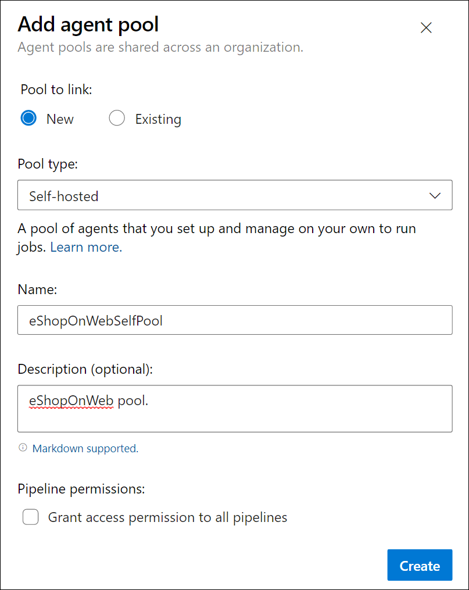
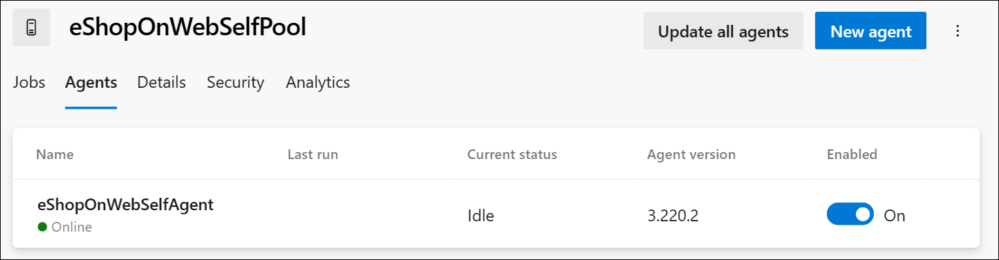

---
lab:
  title: Configurer des pools d’agents et comprendre les styles de pipeline
  module: 'Module 02: Implement CI with Azure Pipelines and GitHub Actions'
---

# Configurer des pools d’agents et comprendre les styles de pipeline

## Configuration de laboratoire requise

- Ce labo nécessite **Microsoft Edge** ou un [navigateur pris en charge par Azure DevOps](https://docs.microsoft.com/azure/devops/server/compatibility).

- **Configurez une organisation Azure DevOps :** si vous ne disposez pas encore d’une organisation Azure DevOps que vous pouvez utiliser pour ce labo, créez-en une conformément aux instructions disponibles dans [Créer une organisation ou une collection de projets](https://docs.microsoft.com/azure/devops/organizations/accounts/create-organization).

- Page de téléchargement de [Git pour Windows](https://gitforwindows.org/). L’application sera installée dans le cadre des prérequis de ce labo.

- [Visual Studio Code](https://code.visualstudio.com/). L’application sera installée dans le cadre des prérequis de ce labo.

## Présentation du labo

Les pipelines basés sur YAML vous permettent d’implémenter entièrement CI/CD en tant que code, où les définitions de pipeline résident dans le même dépôt que le code qui fait partie de votre projet Azure DevOps. Les pipelines YAML prennent en charge un large éventail de fonctionnalités qui font partie des pipelines classiques, par exemple, les demandes de tirage, les révisions de code, l’historique, les branches et les modèles.

Quel que soit le style de pipeline choisi, pour générer votre code ou déployer votre solution avec Azure Pipelines, vous avez besoin d’un agent. Un agent héberge des ressources de calcul qui exécutent un travail à la fois. Les travaux peuvent être exécutés directement sur la machine hôte de l’agent ou dans un conteneur. Vous avez la possibilité d’exécuter vos travaux avec des agents hébergés par Microsoft, qui sont gérés pour vous, ou vous pouvez implémenter un agent autohébergé que vous configurez et gérez vous-même.

Dans ce labo, vous allez découvrir comment implémenter et utiliser des agents auto-hébergés avec des pipelines YAML.

## Objectifs

À la fin de ce labo, vous serez en mesure d’effectuer les tâches suivantes :

- Implémentez des pipelines YAML.
- Implémentez des agents autohébergés.

## Durée estimée : 30 minutes

## Instructions

### Exercice 0 : (ignorez-le si vous l’avez déjà effectué) configurer les prérequis du labo

Dans cet exercice, vous allez configurer les prérequis pour le labo, qui se composent d’un nouveau projet Azure DevOps avec un référentiel basé sur [eShopOnWeb](https://github.com/MicrosoftLearning/eShopOnWeb).

#### Tâche 1 : (passer si terminée) créer et configurer le projet d’équipe

Dans cette tâche, vous allez créer un projet Azure DevOps **eShopOnWeb** à utiliser par plusieurs labos.

1. Sur votre ordinateur de labo, dans une fenêtre de navigateur, ouvrez votre organisation Azure DevOps. Cliquez sur **Nouveau projet**. Attribuez au projet le nom **eShopOnWeb** et conservez les valeurs par défaut des autres champs. Cliquez sur **Créer**.

#### Tâche 2 : (passer si terminée) importer le référentiel Git eShopOnWeb

Dans cette tâche, vous allez importer le référentiel Git eShopOnWeb qui sera utilisé par plusieurs labos.

1. Sur votre ordinateur de labo, dans une fenêtre de navigateur, ouvrez votre organisation Azure DevOps et le projet **eShopOnWeb** créé précédemment. Cliquez sur **Repos > Fichiers**, **Importer un référentiel**. Cliquez sur **Importer**. Dans la fenêtre **Importer un référentiel Git**, collez l’URL <https://github.com/MicrosoftLearning/eShopOnWeb.git>, puis cliquez sur **Importer** :

1. Le référentiel est organisé de la manière suivante :
    - Le dossier **.ado** contient des pipelines YAML Azure DevOps.
    - Conteneur de dossiers **.devcontainer** configuré pour le développement à l’aide de conteneurs (localement dans VS Code ou GitHub Codespaces).
    - Le dossier **infra** contient l’infrastructure Bicep & ARM en tant que modèles de code utilisés dans certains scénarios de labo.
    - Le dossier **.github** contient les définitions de workflow GitHub YAML.
    - Le dossier **src** contient le site web .NET 8 utilisé dans les scénarios de labo.

#### Tâche 3 : (à ignorer si vous l’avez déjà effectuée) définir la branche principale en tant que branche par défaut

1. Accédez à **Repos > Branches**.
1. Pointez sur la branche **principale**, puis cliquez sur les points de suspension à droite de la colonne.
1. Cliquez sur **Définir comme branche par défaut**.

### Exercice 1 : Créer des agents et configurer des pools d’agents

Dans cet exercice, vous allez créer une machine virtuelle Azure et l’utiliser pour créer un agent et configurer des pools d’agents.

#### Tâche 1 : Créer une machine virtuelle Azure et s’y connecter

1. Dans votre navigateur, ouvrez le portail Azure sur `https://portal.azure.com`. Si vous y êtes invité, connectez-vous avec un compte qui a le rôle Propriétaire dans votre abonnement Azure.

1. Dans la zone **Rechercher des ressources, des services et des documents (G+/)**, saisissez **`Virtual Machines`** et sélectionnez l’élément dans la liste déroulante.

1. Cliquez sur le bouton **Créer**.

1. Sélectionnez la **machine virtuelle Azure avec une configuration prédéfinie**.

    

1. Sélectionnez **Dev/Test** comme environnement de charge de travail et **usage général** comme type de charge de travail.

1. Sélectionnez le bouton **Continuer à créer une machine virtuelle**. Sous l’onglet **Informations de base**, effectuez les actions suivantes et sélectionnez **Gestion** :

   | Setting | Action |
   | -- | -- |
   | Liste déroulante  **Abonnement** | Sélectionnez votre abonnement Azure. |
   | Section **Groupe de ressources** | Créez un groupe de ressources nommé **rg-eshoponweb-agentpool**. |
   | Zone de texte **Nom de la machine virtuelle**  | Entrez le nom de votre préférence, par exemple **`eshoponweb-vm`**. |
   | Liste déroulante **Région** | Vous pouvez choisir la région [Azure](https://azure.microsoft.com/explore/global-infrastructure/geographies) la plus proche de vous. Par exemple, « westeurope », « eastasia » ou « eastus », etc. |
   | Liste déroulante **Options de disponibilité** | Sélectionnez **Aucune redondance d’infrastructure requise**. |
   | Liste déroulante **Type de sécurité** | Sélectionnez avec l’option **Lancement fiable de machines virtuelles**. |
   | Liste déroulante **Image** | Sélectionnez l’image **Windows Server 2022 Datacenter : Édition Azure - x64 Gen2**. |
   | Liste déroulante **Taille** | Sélectionnez la taille **Standard** la moins chère à des fins de test. |
   | Zone de texte **Nom d’utilisateur** | Entrez le nom d’utilisateur de votre préférence. |
   | Zone de texte **Mot de passe**. | Entrez le mot de passe de votre préférence. |
   | Section **Ports d’entrée publics** | Sélectionnez **Autoriser les ports sélectionnés**. |
   | Liste déroulante **Sélectionner les ports entrants** | Sélectionnez **RDP (3389)**. |

1. Sous l’onglet **Gestion**, dans la section **Identité**, cochez la case **Activer l’identité managée affectée par le système**, puis sélectionnez **Vérifier + créer** :

1. Sous l’onglet **Review + create (Vérifier + créer)** , sélectionnez **Créer**.

   > **Remarque** : Attendez la fin du processus de provisionnement. Ce processus prend environ 2 minutes.

1. Dans le portail Azure, accédez à la page affichant la configuration de la machine virtuelle Azure nouvellement créée.

1. Sur la page de machine virtuelle Azure, sélectionnez **Se connecter**. Dans le menu déroulant, sélectionnez **Se connecter**, puis **Télécharger le fichier RDP**.

1. Utilisez le fichier RDP téléchargé pour établir une session Bureau à distance sur le système d’exploitation en cours d’exécution sur la machine virtuelle Azure.

#### Tâche 2 : Créer un pool d’agents

1. Dans la session Bureau à distance sur la machine virtuelle Azure, démarrez le navigateur web Microsoft Edge.

1. Dans le navigateur web, accédez au portail Azure DevOps sur `https://aex.dev.azure.com` et connectez-vous pour accéder à votre organisation.

   > **Remarque** : s’il s’agit de votre première accès au portail Azure DevOps, vous devrez peut-être créer votre profil.

1. Ouvrez le projet **eShopOnWeb**, puis sélectionnez **Paramètres du projet** dans le menu inférieur gauche.

1. Dans **Pipelines > Pools d’agents**, sélectionnez le bouton **Ajouter un pool**.

1. Choisissez le type de pool **auto-hébergé**.

1. Donnez un nom au pool d’agents, tel que **eShopOnWebSelfPool**, et ajoutez une description facultative.

1. Laissez l’option **Accorder une autorisation d’accès à tous les pipelines** décochée.

   

   > **Remarque** : il n’est pas recommandé d’accorder une autorisation d’accès à tous les pipelines pour les environnements de production. Elle est utilisée uniquement dans ce labo pour simplifier la configuration du pipeline.

1. Sélectionnez le bouton **Créer** pour créer le pool d’agents.

#### Tâche 3 : Télécharger et extraire les fichiers d’installation de l’agent

1. Dans le portail Azure DevOps, sélectionnez le pool d’agents qui vient d’être créé, puis sélectionnez l’onglet **Agents**.

1. Sélectionnez le bouton **Nouvel agent**, puis le bouton **Télécharger** à partir de **Télécharger l’agent** dans la nouvelle fenêtre contextuelle.

   > **Remarque** : suivez les instructions d’installation pour installer l’agent.

1. Démarrez une session PowerShell et exécutez les commandes suivantes pour créer un dossier nommé **agent**.

   ```powershell
   mkdir agent ; cd agent        
   ```

   > **Remarque** : vérifiez que vous êtes dans le dossier dans lequel vous souhaitez installer l’agent, par exemple, C:\agent.

1. Exécutez la commande suivante pour extraire le contenu des fichiers du programme d’installation de l’agent que vous avez téléchargés :

   ```powershell
   Add-Type -AssemblyName System.IO.Compression.FileSystem ; [System.IO.Compression.ZipFile]::ExtractToDirectory("$HOME\Downloads\vsts-agent-win-x64-3.245.0.zip", "$PWD")
   ```

   > **Remarque** : si vous avez téléchargé l’agent dans un autre emplacement (ou si la version téléchargée est différente), ajustez la commande ci-dessus en conséquence.

#### Tâche 4 : Créer un jeton PAT

> **Remarque** : avant de configurer l’agent, vous devez créer un jeton PAT (sauf si vous en avez déjà un). Pour créer un jeton PAT, suivez les étapes ci-dessous :

1. Dans la session Bureau à distance sur la machine virtuelle Azure, ouvrez une autre fenêtre de navigateur, accédez au portail Azure DevOps à l’adresse `https://aex.dev.azure.com`, puis accédez à votre organisation et à votre projet.

1. Sélectionnez **Paramètres utilisateur** dans le menu supérieur droit (tout de suite à gauche de l’icône d’avatar de votre utilisateur).

1. Sélectionnez l’élément de menu **Jetons d’accès personnels**.

   

1. Sélectionnez le bouton **Nouveau jeton**.

1. Donnez un nom au jeton, tel que **eShopOnWebToken**.

1. Sélectionnez l’organisation Azure DevOps pour vous permettre d’utiliser le jeton.

1. Définissez la date d’expiration du jeton (utilisée uniquement pour configurer l’agent).

1. Sélectionnez l’étendue définie personnalisée.

1. Sélectionnez cette option pour afficher toutes les étendues.

1. Sélectionnez l’étendue **Pools d’agents (Lecture et gestion)**.

1. Sélectionnez le bouton **Créer** pour créer le jeton.

1. Copiez la valeur du jeton et enregistrez-la en lieu sûr (vous ne pourrez pas la voir à nouveau. Vous ne pouvez régénérer que le jeton).

   

   > [!IMPORTANT]
   > Utilisez l’option de privilège minimum, **Pools d’agents (lire, gérer)**, uniquement pour la configuration de l’agent. Veillez également à définir la date d’expiration la plus courte pour le jeton si c’est son seul objectif. Vous pouvez créer un autre jeton avec les mêmes privilèges si vous devez configurer l’agent une nouvelle fois.

#### Tâche 5 : Configurer l’agent

1. Dans la session Bureau à distance sur la machine virtuelle Azure, revenez à la fenêtre PowerShell. Si nécessaire, remplacez le répertoire actif par celui dans lequel vous avez extrait les fichiers d’installation de l’agent précédemment dans cet exercice.

1. Pour configurer votre agent pour qu’il s’exécute sans assistance, appelez la commande suivante :

   ```powershell
   .\config.cmd
   ```

   > **Remarque** : si vous souhaitez exécuter l’agent de manière interactive, utilisez `.\run.cmd` à la place.

1. Pour configurer l’agent, effectuez les actions suivantes lorsque vous y êtes invité :

   - Entrez l’URL de l’organisation Azure DevOps (**URL du serveur**) au format `https://aex.dev.azure.com`{nom de votre organisation}.
   - Acceptez le type d’authentification par défaut (**`PAT`**).
   - Entrez la valeur du jeton PAT que vous avez créé à l’étape précédente.
   - Entrez le nom du pool d’agents **`eShopOnWebSelfPool`** que vous avez créé précédemment dans cet exercice.
   - Entrez le nom de l'agent **`eShopOnWebSelfAgent`**.
   - Acceptez le dossier de travail de l’agent par défaut (_work).
   - Entrez **Y** pour configurer l’agent pour qu’il s’exécute en tant que service.
   - Entrez **Y** pour activer SERVICE_SID_TYPE_UNRESTRICTED pour le service de l’agent.
   - Entrez **`NT AUTHORITY\SYSTEM`** pour définir le contexte de sécurité du service.

   > [!IMPORTANT]
   > En général, vous devez suivre le principe du privilège minimum lors de la configuration du contexte de sécurité du service.

   - Acceptez l’option par défaut (**N**) pour autoriser le service à démarrer immédiatement après la fin de la configuration.

   

   > **Remarque** : le processus de configuration de l’agent prend quelques minutes. Une fois celui-ci terminé, un message s’affiche pour indiquer que l’agent est en cours d’exécution en tant que service.

   > [!IMPORTANT] Si vous voyez un message d’erreur indiquant que l’agent n’est pas en cours d’exécution, vous devrez peut-être démarrer le service manuellement. Pour le démarrer manuellement, ouvrez l’applet **Services** dans le Panneau de configuration Windows, recherchez le service nommé **Azure DevOps Agent (eShopOnWebSelfAgent)** et démarrez-le.

   > [!IMPORTANT] Si le démarrage de votre agent échoue, vous devrez peut-être choisir un autre dossier pour le répertoire de travail de l’agent. Pour ce faire, exécutez à nouveau le script de configuration de l’agent et choisissez un autre dossier.

1. Vérifiez l’état de l’agent en basculant vers le navigateur web affichant le portail Azure DevOps, en accédant au pool d’agents et en cliquant sur l’onglet **Agents**. Vous devriez voir le nouvel agent dans la liste.

   

   > **Remarque** : pour plus d’informations sur les agents Windows, consultez : [Agents Windows auto-hébergés](https://learn.microsoft.com/azure/devops/pipelines/agents/windows-agent).

   > [!IMPORTANT]
   > Pour que l’agent puisse créer et déployer des ressources Azure à partir des pipelines Azure DevOps (que vous allez passer en revue dans les labos à venir), vous devez installer Azure CLI dans le système d’exploitation de la machine virtuelle Azure qui héberge l’agent.

1. Démarrez un navigateur web et accédez à la page [Installer Azure CLI sur Windows](https://learn.microsoft.com/en-us/cli/azure/install-azure-cli-windows?tabs=azure-cli&pivots=msi#install-or-update).

1. Téléchargez et installez Azure CLI.

1. (Facultatif) Si vous le souhaitez, exécutez la commande PowerShell suivante pour installer Azure CLI :

   ```powershell
   $ProgressPreference = 'SilentlyContinue'; Invoke-WebRequest -Uri https://aka.ms/installazurecliwindows -OutFile .\AzureCLI.msi; Start-Process msiexec.exe -Wait -ArgumentList '/I AzureCLI.msi /quiet'; Remove-Item .\AzureCLI.msi
   ```

   > **Remarque** : si vous utilisez une autre version d’Azure CLI, vous devrez peut-être ajuster la commande ci-dessus en conséquence.

1. Dans le navigateur web, accédez à la page du programme d’installation du SDK Microsoft .NET 8.0 à l’adresse `https://dotnet.microsoft.com/en-us/download/dotnet/thank-you/sdk-8.0.403-windows-x64-installer`.

   > [!IMPORTANT]
   > Vous devez installer le kit de développement logiciel (SDK) .NET 8.0 (ou version ultérieure) sur la machine virtuelle Azure qui héberge l’agent. Cela est nécessaire pour générer l’application eShopOnWeb dans les laboratoires suivants. Tous les autres outils ou kits de développement logiciel requis pour la création de l’application doivent également être installés sur la machine virtuelle Azure.

1. Téléchargez et installez le kit de développement logiciel (SDK) Microsoft .NET 8.0.

### Exercice 2 : créer des pipelines Azure basées sur YAML

Dans cet exercice, vous allez créer un pipeline de build de cycle de vie d’application à l’aide d’un modèle basé sur YAML.

#### Tâche 1 : créer un pipeline YAML Azure DevOps

Dans cette tâche, vous allez créer un pipeline YAML pour le projet **eShopOnWeb**.

1. Dans le navigateur web qui affiche le portail Azure DevOps avec le projet **eShopOnWeb** ouvert, dans le volet de navigation vertical situé à gauche, cliquez sur **Pipelines**.
1. Cliquez sur le bouton **Créer un pipeline** si aucun autre pipeline n’a encore été créé ou sur **Nouveau pipeline** pour créer un pipeline supplémentaire.

1. Dans le volet **Où se trouve votre code ?**, cliquez sur **Azure Repos Git**.
1. Dans le volet **Sélectionner un référentiel**, cliquez sur **eShopOnWeb**.
1. Dans le volet **Configurer votre pipeline**, cliquez sur **Fichier YAML Azure Pipelines existant**.
1. Dans le volet **Sélectionner un fichier YAML existant**, sélectionnez **principal** pour la branche et **/.ado/eshoponweb-ci-pr.yml** pour le chemin d’accès.
1. Cliquez sur **Continuer**.
1. Dans le volet **Passer en revue le fichier YAML de votre pipeline**, passez en revue l’exemple de pipeline. Il s’agit d’un pipeline de build d’application .NET plutôt direct, qui effectue les opérations suivantes :

   - Une étape unique : Build
   - Un seul travail : Build
   - 4 tâches dans le travail de build :
   - Dotnet Restore
   - Dotnet Build
   - Dotnet Test
   - Dotnet Publish

1. Dans le volet **Passer en revue le fichier YAML de votre pipeline**, cliquez sur le symbole caret pointant vers le bas en regard du bouton **Exécuter**, puis sur **Enregistrer**.

    > **Remarque** : nous allons uniquement créer la définition du pipeline pour l’instant, sans exécuter ce dernier. Vous allez d’abord configurer un pool d’agents Azure DevOps et exécuter le pipeline dans un exercice ultérieur.

#### Tâche 2 : mettre à jour le pipeline YAML avec le pool d’agents auto-hébergés

1. Dans le portail Azure DevOps, accédez au projet **eShopOnWeb**, puis sélectionnez **Pipelines** dans le menu de gauche.
1. Cliquez sur le bouton **Modifier** du pipeline que vous avez créé lors de la tâche précédente.
1. Dans le volet de modification d’**eShopOnWeb**, dans le pipeline YAML existant, remplacez la ligne 13, qui indique **vmImage: ubuntu-latest** et qui désigne le pool d’agents cible, par le contenu suivant, qui désigne le nouveau pool d’agents auto-hébergés :

    ```yaml
    pool: 
      name: eShopOnWebSelfPool
      demands: Agent.Name -equals eShopOnWebSelfAgent
    ```

    > **AVERTISSEMENT** : Soyez prudent avec le copier-coller, vérifiez que vous avez le même retrait que celui illustré ci-dessus.

    

1. Dans le volet de modification **eShopOnWeb**, dans le coin supérieur droit du volet, cliquez sur **Enregistrer et exécuter**. Ensuite, cliquez sur **Enregistrer**.
1. Dans le volet de modification d’**eShopOnWeb**, dans le coin supérieur droit du volet, cliquez sur **Exécuter le pipeline**.

    > **Remarque** : le pipeline s’exécute sur le pool d’agents auto-hébergés que vous avez créé lors de l’exercice précédent.
1. Ouvrez l’exécution du pipeline et surveillez le processus jusqu’à ce qu’il soit terminé.

    > **Remarque** : si vous recevez une invite d’autorisation, cliquez sur **Autoriser** pour autoriser l’exécution du pipeline.

1. Une fois l’exécution du pipeline terminée, examinez la sortie et vérifiez que le pipeline s’est exécuté correctement.

## Révision

Dans ce labo, vous allez découvrir comment implémenter et utiliser des agents auto-hébergés avec des pipelines YAML.
