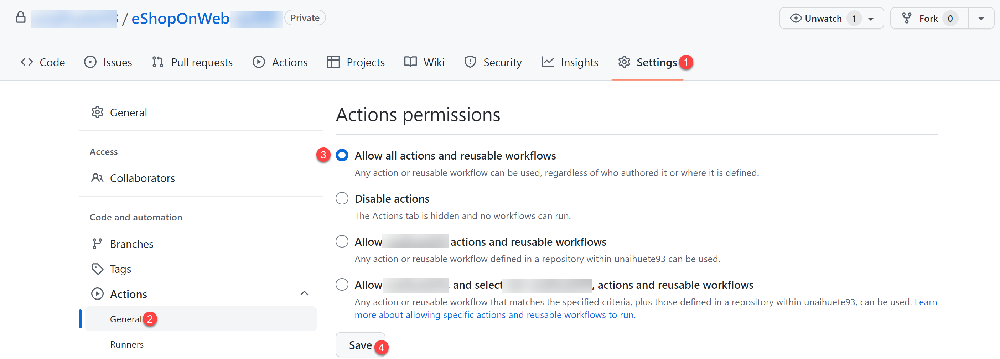
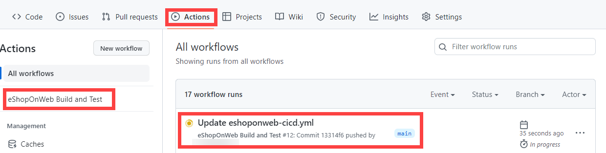

---
lab:
  title: Implémenter GitHub Actions pour CI/CD
  module: 'Module 02: Implement CI with Azure Pipelines and GitHub Actions'
---

# Implémenter GitHub Actions pour CI/CD

## Configuration de laboratoire requise

- Ce labo nécessite **Microsoft Edge** ou un [navigateur pris en charge par Azure DevOps](https://docs.microsoft.com/azure/devops/server/compatibility).

- Identifier un abonnement Azure existant ou en créer un.

- Vérifiez que vous disposez d'un compte Microsoft ou d'un compte Microsoft Entra avec le rôle Contributeur ou Propriétaire dans l'abonnement Azure. Pour plus d’informations, consultez [Répertorier les attributions de rôle Azure à l’aide du portail Azure](https://docs.microsoft.com/azure/role-based-access-control/role-assignments-list-portal) et [Afficher et attribuer des rôles d’administrateur dans Azure Active Directory](https://docs.microsoft.com/azure/active-directory/roles/manage-roles-portal).

- **Si vous n’avez pas encore de compte GitHub** utilisable pour ce labo, suivez les instructions disponibles dans [Inscription à un nouveau compte GitHub](https://github.com/join) pour en créer un.

## Présentation du labo

Dans ce labo, vous allez découvrir comment implémenter un workflow GitHub Actions qui déploie une application web Azure.

## Objectifs

À la fin de ce labo, vous serez en mesure d’effectuer les tâches suivantes :

- Implémenter un flux de travail GitHub Actions pour CI/CD.
- Expliquer les caractéristiques de base des workflows GitHub Actions.

## Durée estimée : 40 minutes

## Instructions

### Exercice 1 : importer eShopOnWeb dans votre référentiel GitHub

Dans cet exercice, vous allez importer le code de référentiel [eShopOnWeb](https://github.com/MicrosoftLearning/eShopOnWeb) existant dans votre propre référentiel privé GitHub.

Le référentiel est organisé de la manière suivante :
- Le dossier **.ado** contient des pipelines YAML Azure DevOps.
- Conteneur de dossiers **.devcontainer** configuré pour le développement à l’aide de conteneurs (localement dans VS Code ou GitHub Codespaces).
- Le dossier **infra** contient l’infrastructure Bicep&ARM sous forme de modèles de code utilisés dans certains scénarios de labo.
- **Définitions de workflow GitHub YAML du conteneur de dossiers .github**.
- Le dossier **src** contient le site web .NET 8 utilisé dans les scénarios de labo.

#### Tâche 1 : créer un référentiel public dans GitHub et importer eShopOnWeb

Dans cette tâche, vous allez créer un référentiel GitHub public vide et importer le référentiel [eShopOnWeb](https://github.com/MicrosoftLearning/eShopOnWeb) existant.

1. À partir de l’ordinateur de labo, démarrez un navigateur web, accédez au [site web GitHub](https://github.com/), connectez-vous à l’aide de votre compte, puis cliquez sur **Nouveau** pour créer un référentiel.

    

1. Dans la page **Créer un référentiel**, cliquez sur le lien **Importer un référentiel** (sous le titre de la page).

    > **Remarque **: vous pouvez également ouvrir le site web d’import directement à l’adresse <https://github.com/new/import>.

1. Dans la page **Importer votre projet dans GitHub** :

    | Champ | Valeur |
    | --- | --- |
    | L’URL de votre référentiel source| <https://github.com/MicrosoftLearning/eShopOnWeb> |
    | Propriétaire | Alias de votre compte |
    | Nom du dépôt | eShopOnWeb |
    | Confidentialité | **Public** |

1. Cliquez sur **Commencer l’importation** et attendez que votre référentiel soit prêt.

1. Dans la page du dépôt, accédez à **Paramètres**, cliquez sur **Actions > Général** et choisissez l’option **Autoriser toutes les actions et tous les workflows réutilisables**. Cliquez sur **Save**(Enregistrer).

    

### Exercice 2 : configurer votre référentiel GitHub et l’accès à Azure

Dans cet exercice, vous allez créer un principal de service Azure pour autoriser GitHub à accéder à votre abonnement Azure à partir de GitHub Actions. Vous allez également configurer le workflow GitHub qui génèrera, testera et déploiera votre site web sur Azure.

#### Tâche 1 : créer un principal de service Azure et l’enregistrer en tant que secret GitHub

Dans cette tâche, vous allez créer le principal de service Azure utilisé par GitHub pour déployer les ressources souhaitées. En guise d’alternative, vous pouvez également utiliser [OpenID Connect dans Azure](https://docs.github.com/actions/deployment/security-hardening-your-deployments/configuring-openid-connect-in-azure), comme mécanisme d’authentification sans secret.

1. Sur votre ordinateur de labo, ouvrez le portail Azure (<https://portal.azure.com/>) dans une fenêtre de navigateur.
1. Dans le portail, recherchez les **Groupes de ressources** et cliquez dessus.
1. Cliquez sur **+ Créer** pour créer un groupe de ressources pour l’exercice.
1. Sous l’onglet **Créer un groupe de ressources**, attribuez le nom suivant à votre groupe de ressources : **rg-eshoponweb-NAME** (remplacez NAME par un alias unique). Cliquez sur **Vérifier + Créer > Créer**.
1. Dans le portail Azure, ouvrez **Cloud Shell** (à côté de la barre de recherche).

    > **Remarque** : si le portail Azure vous demande de créer un stockage, vous pouvez choisir l’option **Aucun compte de stockage requis**, sélectionnez votre abonnement et cliquer sur le bouton **Appliquer**

1. Vérifiez que le terminal s’exécute en mode **Bash** et exécutez la commande suivante, en remplaçant **SUBSCRIPTION-ID** et **RESOURCE-GROUP** par vos propres identificateurs (les deux sont disponibles dans la page **Vue d’ensemble** du groupe de ressources) :

    `az ad sp create-for-rbac --name GH-Action-eshoponweb --role contributor --scopes /subscriptions/SUBSCRIPTION-ID/resourceGroups/RESOURCE-GROUP --sdk-auth`

    > **Remarque** : assurez-vous de saisir ou de coller ces éléments sous la forme d’une seule ligne.

    > **Remarque** : cette commande crée un principal de service avec un accès Contributeur au groupe de ressources créé précédemment. De cette façon, nous nous assurons que GitHub Actions aura uniquement les autorisations nécessaires pour interagir exclusivement avec ce groupe de ressources (et non avec le reste de l’abonnement)

1. La commande génère un objet JSON que vous utiliserez ultérieurement comme secret GitHub pour le workflow. Copiez le JSON. Le JSON contient les identificateurs utilisés pour s’authentifier auprès d’Azure dans le nom d’une identité Microsoft Entra (principal de service).

    ```JSON
        {
            "clientId": "<GUID>",
            "clientSecret": "<GUID>",
            "subscriptionId": "<GUID>",
            "tenantId": "<GUID>",
            (...)
        }
    ```

1. (Ignorer si inscription déjà effectuée) Vous devez également exécuter la commande suivante pour inscrire le fournisseur de ressources au **Azure App Service** que vous allez déployer ultérieurement :

   ```bash
   az provider register --namespace Microsoft.Web
   ```

1. Dans une fenêtre de navigateur, revenez à votre référentiel GitHub **eShopOnWeb**.
1. Dans la page du référentiel, accédez à **Paramètres**, cliquez sur **Secrets et variables > Actions**. Cliquez sur **Nouveau secret de référentiel**.
    - Nom : **`AZURE_CREDENTIALS`**
    - Secret : **collez l’objet JSON précédemment copié ** (GitHub peut conserver plusieurs secrets sous le même nom, utilisés par l’action [azure/login](https://github.com/Azure/login))

1. Cliquez sur **Ajouter un secret**. À présent, GitHub Actions pourra référencer le principal de service à l’aide du secret du référentiel.

#### Tâche 2 : modifier et exécuter le workflow GitHub

Dans cette tâche, vous allez modifier le workflow GitHub donné et l’exécuter pour déployer la solution dans votre propre abonnement.

1. Dans une fenêtre de navigateur, revenez à votre référentiel GitHub **eShopOnWeb**.
1. Sur la page du référentiel, accédez au **code** et ouvrez le fichier suivant : **eShopOnWeb/.github/workflows/eshoponweb-cicd.yml**. Ce workflow définit le processus CI/CD pour le code de site web .NET 8 donné.
1. Supprimez les commentaires de la section **active** (supprimez « # »). Le workflow se déclenche avec chaque envoi (push) vers la branche principale et offre également un déclencheur manuel (« workflow_dispatch »).
1. Dans la section  **env**, apportez les modifications suivantes :
    - Remplacez **NAME** dans la variable **RESOURCE-GROUP**. Il doit s’agir du même groupe de ressources que vous avez créé dans les étapes précédentes.
    - (Facultatif) Vous pouvez sélectionner votre [région Azure](https://azure.microsoft.com/explore/global-infrastructure/geographies) la plus proche pour **LOCATION**. Par exemple, « westeurope », « eastasia » ou « eastus », etc.
    - Remplacez **YOUR-SUBS-ID** dans **SUBSCRIPTION-ID**.
    - Remplacez **NAME** dans **WEBAPP-NAME** par un alias unique. Il sera utilisé pour créer un site web global unique à l’aide d’Azure App Service.
1. Lisez attentivement la description du flux de travail, les commentaires sont fournis pour vous aider à la compréhension.

1. Cliquez sur **Valider les modifications...** en haut à droite et **Valider les modifications** en conservant les valeurs par défaut (modification de la branche primaire). Le flux de travail est exécuté automatiquement.

#### Tâche 3 : passer en revue l’exécution du flux de travail GitHub

Dans cette tâche, vous allez passer en revue l’exécution du flux de travail GitHub :

1. Dans une fenêtre de navigateur, revenez à votre référentiel GitHub **eShopOnWeb**.
1. Dans la page du référentiel, accédez à **Actions**, vous verrez la configuration du flux de travail avant l’exécution. Cliquez dessus.

    

1. Attendez la fin de l’exécution du workflow. Dans le **Résumé**, vous pouvez voir les deux travaux de workflow, l’état et les artefacts conservés à partir de l’exécution. Vous pouvez cliquer dans chaque travail pour passer en revue les journaux.

    

1. Dans une fenêtre de navigateur, retournez au portail Azure (<https://portal.azure.com/>). Ouvrez le groupe de ressources créé précédemment. Vous verrez que GitHub Actions, à l’aide d’un modèle bicep, a créé un Plan Azure App Service + App Service. Vous pouvez voir le site web publié en ouvrant App Service et en cliquant sur **Parcourir**.

    

#### (Facultatif) Tâche 4 : ajouter une approbation manuelle avant le déploiement à l’aide d’Environnements GitHub

Dans cette tâche, vous allez utiliser des environnements GitHub pour demander une approbation manuelle avant d’exécuter les actions définies sur le travail de déploiement de votre workflow.

1. Dans la page du référentiel, accédez à **Code** et ouvrez le fichier suivant : **eShopOnWeb/.github/workflows/eshoponweb-cicd.yml**.
1. Dans la section du travail **deploy**, vous trouverez une référence à un **environnement** appelé **Development**. Les [environnements](https://docs.github.com/en/actions/deployment/targeting-different-environments/using-environments-for-deployment) utilisés par GitHub ajoutent des règles de protection (et des secrets) pour vos cibles.

1. Dans la page du référentiel, accédez à **Paramètres**, ouvrez **Environnements**, puis cliquez sur **Nouvel environnement**.
1. Attribuez-lui le nom **`Development`**, puis cliquez sur **Configurer l’environnement**.

    > **Remarque** : si un environnement appelé **Développement** existe déjà dans la liste **Environnements**, ouvrez sa configuration en cliquant sur le nom de l’environnement.  

1. Dans l’onglet **Configurer le développement**, cochez l’option **Réviseurs requis** et votre compte GitHub en tant que réviseur. Cliquez sur **Enregistrer les règles de protection**.
1. À présent, testez la règle de protection. Dans la page du référentiel, accédez à **Actions**, cliquez sur le workflow **eShopOnWeb Build and Test**, puis sur **Exécuter le workflow > Exécuter le workflow** pour exécuter manuellement.

    

1. Cliquez sur l’exécution démarrée du workflow et attendez que le travail **buildandtest** se termine. Une demande de révision s’affiche lorsque le travail de **déploiement** est atteint.

1. Cliquez sur **Réviser les déploiements**, cochez **Développement**, puis cliquez sur **Approuver et déployer**.

    

1. Le workflow suit l’exécution du travail de **déploiement** et se termine.

> [!IMPORTANT]
> N’oubliez pas de supprimer les ressources créées dans le portail Azure pour éviter les frais inutiles.

## Révision

Dans ce labo, vous avez implémenté un workflow GitHub Actions qui déploie une application web Azure.
