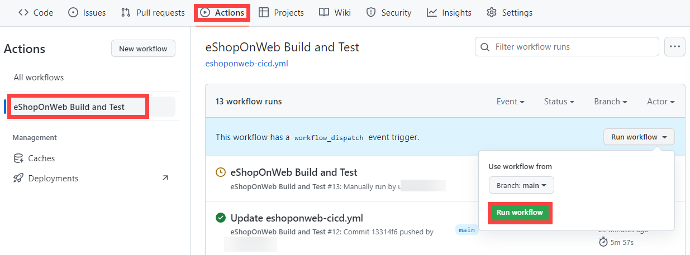

---
lab:
  title: Mettre en œuvre GitHub Actions pour CI/CD
  module: 'Module 03: Implement CI with Azure Pipelines and GitHub Actions'
---

# Mettre en œuvre GitHub Actions pour CI/CD

## Manuel de labo de l’étudiant

## Configuration de laboratoire requise

- Ce labo nécessite **Microsoft Edge** ou un [navigateur pris en charge par Azure DevOps](https://docs.microsoft.com/azure/devops/server/compatibility).

- Identifier un abonnement Azure existant ou en créer un.

- Vérifiez que vous disposez d'un compte Microsoft ou d'un compte Microsoft Entra avec le rôle Contributeur ou Propriétaire dans l'abonnement Azure. Pour plus d’informations, consultez [Répertorier les attributions de rôle Azure à l’aide du portail Azure](https://docs.microsoft.com/azure/role-based-access-control/role-assignments-list-portal) et [Afficher et attribuer des rôles d’administrateur dans Azure Active Directory](https://docs.microsoft.com/azure/active-directory/roles/manage-roles-portal).

- **Si vous n’avez pas encore de compte GitHub** utilisable dans le cadre de ce labo, suivez les instructions disponibles dans [Créer un nouveau compte GitHub](https://github.com/join) pour en créer un.

## Présentation du labo

Dans ce labo, vous allez découvrir comment mettre en œuvre un workflow GitHub Actions qui déploie une application web Azure.

## Objectifs

À la fin de ce labo, vous serez en mesure d’accomplir les tâches suivantes :

- Implémenter un flux de travail GitHub Actions pour CI/CD.
- Expliquer les caractéristiques de base des workflows GitHub Actions.

## Durée estimée : 40 minutes

## Instructions

### Exercice 0 : importer eShopOnWeb dans votre référentiel GitHub

Dans le cadre de cet exercice, vous importerez le code de référentiel [eShopOnWeb](https://github.com/MicrosoftLearning/eShopOnWeb) existant dans votre propre référentiel privé GitHub.

Le référentiel est organisé de la manière suivante :
    - Le dossier **.ado** contient des pipelines YAML Azure DevOps.
    - Conteneur de dossiers **.devcontainer** configuré pour le développement à l’aide de conteneurs (localement dans VS Code ou GitHub Codespaces).
    - Le dossier **.azure** contient l’infrastructure Bicep&ARM en tant que modèles de code utilisés dans certains scénarios de labos.
    - **Définitions de workflow GitHub YAML du conteneur de dossiers .github**.
    - Le dossier **src** contient le site web .NET 7 utilisé dans les scénarios de labo.

#### Tâche 1 : créer un référentiel public dans GitHub et importer eShopOnWeb

Dans le cadre de cette tâche, vous créerez un référentiel GitHub public vide et importer le référentiel [eShopOnWeb](https://github.com/MicrosoftLearning/eShopOnWeb) existant.

1. Lancez un navigateur web sur l’ordinateur de labo, accédez au [site web GitHub](https://github.com/), connectez-vous à l’aide de votre compte et cliquez sur **Nouveau** pour créer un référentiel.

    

2. Sur la page **Créer un référentiel**, cliquez sur le lien **Importer un référentiel** (sous le titre de la page).

    > REMARQUE : vous pouvez également accéder directement au site web d’importation à l’adresse https://github.com/new/import.

3. Sur la page **Importer votre projet dans GitHub** :

    | Champ | Valeur |
    | --- | --- |
    | Votre ancienne URL de clonage du référentiel| https://github.com/MicrosoftLearning/eShopOnWeb |
    | Propriétaire | Alias de votre compte |
    | Nom du dépôt | eShopOnWeb |
    | Confidentialité | **Public** |

4. Cliquez sur **Commencer l’importation** et attendez que votre référentiel soit prêt.

5. Sur la page du référentiel, accédez aux **Paramètres**, cliquez sur **Actions > Général** et sélectionnez l’option **Autoriser toutes les actions et tous les workflows réutilisables**. Cliquez sur **Save**(Enregistrer).

    

### Exercice 1 : configurer votre référentiel GitHub et l’accès à Azure

Dans le cadre de cet exercice, vous créerez un principal de service Azure pour autoriser GitHub à accéder à votre abonnement Azure à partir de GitHub Actions. Vous configurerez également le workflow GitHub qui génère, teste et déploie votre site web sur Azure.

#### Tâche 1 : créer un principal de service Azure et l’enregistrer en tant que secret GitHub

Dans le cadre de cette tâche, vous créerez le principal de service Azure utilisé par GitHub pour déployer les ressources souhaitées. Vous pouvez également utiliser [OpenID Connect dans Azure](https://docs.github.com/actions/deployment/security-hardening-your-deployments/configuring-openid-connect-in-azure) comme mécanisme d’authentification sans secret.

1. Sur votre ordinateur de labo, ouvrez le Portail Azure (https://portal.azure.com/)) dans votre navigateur.
2. Sur le portail, cliquez sur **Groupes de ressources**.
3. Cliquez sur **+ Créer** pour créer un groupe de ressources dans le cadre de cet exercice.
4. Dans l’onglet **Créer un groupe de ressources**, nommez votre groupe de ressources comme suit : **rg-az400-eshoponweb-NAME** (remplacez NAME par un alias unique). Cliquez sur **Vérifier + Créer > Créer**.
5. Dans le Portail Azure, ouvrez **Cloud Shell** (près de la barre de recherche).

    > REMARQUE : si vous ouvrez Cloud Shell pour la première fois, vous devez configurer le [stockage persistant](https://learn.microsoft.com/azure/cloud-shell/persisting-shell-storage).

6. Assurez-vous que le terminal s’exécute en mode **Bash** et exécutez la commande suivante en remplaçant **SUBSCRIPTION-ID** et **RESOURCE-GROUP** par vos propres identificateurs (tous deux sont consultables sur la page **Vue d’ensemble** du groupe de ressources) :

    `az ad sp create-for-rbac --name GH-Action-eshoponweb --role contributor --scopes /subscriptions/SUBSCRIPTION-ID/resourceGroups/RESOURCE-GROUP --sdk-auth`

    > REMARQUE : veillez à saisir ou coller ces informations sur une seule ligne.
    > REMARQUE : cette commande créera un principal de service avec un accès de niveau Contributeur au groupe de ressources que vous venez de créer. Cela permet de garantir que GitHub Actions disposera des autorisations nécessaires pour interagir avec ce groupe de ressources uniquement, et pas plus (et non pas le reste de l’abonnement).

7. La commande générera un objet JSON que vous utiliserez ultérieurement en tant que secret GitHub pour le workflow. Copiez le JSON. Le JSON contient les identificateurs utilisés dans le cadre de l’authentification auprès d’Azure au nom d’une identité Microsoft Entra (principal de service).

    ```JSON
        {
            "clientId": "<GUID>",
            "clientSecret": "<GUID>",
            "subscriptionId": "<GUID>",
            "tenantId": "<GUID>",
            (...)
        }
    ```
8. Vous devez également exécuter la commande suivante pour enregistrer le fournisseur de ressources pour l’**Azure App Service** que vous déploierez ultérieurement :
   ```bash
   az provider register --namespace Microsoft.Web
   ``` 
10. Dans une fenêtre de navigateur, revenez à votre référentiel GitHub **eShopOnWeb**.
11. Sur la page du référentiel, ouvrez les **Paramètres** et cliquez sur **Secrets et variables > Actions**. Cliquez sur **Nouveau secret de référentiel**
    - Nom : **AZURE_CREDENTIALS**
    - Secret : **collez l’objet JSON précédemment copié** (GitHub peut conserver plusieurs secrets sous le même nom utilisés par l’action [azure/ouverture de session](https://github.com/Azure/login)).

12. Cliquez sur **Ajouter un secret**. GitHub Actions sera à présent en mesure de référencer le principal de service à l’aide du secret de référentiel.

#### Tâche 2 : modifier et exécuter le workflow GitHub

Dans le cadre de cette tâche, vous modifierez le workflow GitHub donné et l’exécuterez pour déployer la solution dans votre propre abonnement.

1. Dans une fenêtre de navigateur, revenez à votre référentiel GitHub **eShopOnWeb**.
2. Sur la page du référentiel, accédez au **code** et ouvrez le fichier suivant : **eShopOnWeb/.github/workflows/eshoponweb-cicd.yml**. Ce workflow définit le processus CI/CD pour le code de site web .NET 7 donné.
3. Supprimez les commentaires de la section **active** (supprimez « # »). Le workflow se déclenche à chaque transmission de type push vers la branche principale. Il est également possible de le déclencher manuellement (« workflow_dispatch »).
4. Dans la section **env**, apportez les modifications suivantes :
    - Remplacez **NAME** dans la variable **RESOURCE-GROUP**. Il doit s’agir du groupe de ressources que vous avez créé lors des étapes précédentes.
    - (Facultatif) Vous pouvez choisir votre [région Azure](https://azure.microsoft.com/explore/global-infrastructure/geographies) la plus proche pour **LOCATION**. Par exemple, « eastus », « eastasia », « westus », etc.
    - Remplacez **YOUR-SUBS-ID** dans **SUBSCRIPTION-ID**.
    - Remplacez **NAME** dans **WEBAPP-NAME** par un alias unique. Il sera utilisé pour créer un site web globalement unique à l’aide d’Azure App Service.
5. Lisez attentivement le workflow : les commentaires sont là pour vous aider à tout comprendre.

6. Cliquez sur **Démarrer la validation** et **validez les modifications** sans changer les valeurs par défaut (modification de la branche principale). Le workflow s’exécutera automatiquement.

#### Tâche 3 : passer en revue l’exécution du workflow GitHub

Dans le cadre de cette tâche, vous passerez en revue l’exécution du workflow GitHub :

1. Dans une fenêtre de navigateur, revenez à votre référentiel GitHub **eShopOnWeb**.
2. Sur la page du référentiel, accédez aux **actions** : vous y verrez la configuration du workflow avant son exécution. Cliquez dessus.

    

3. Attendez la fin de l’exécution du workflow. Le **résumé** affiche les deux travaux de workflow, l’état et les artefacts conservés suite à l’exécution. Vous pouvez cliquer sur chaque travail pour examiner les journaux d’activité.

    

4. Dans une fenêtre de navigateur, rouvrez le Portail Azure (https://portal.azure.com/)). Ouvrez le groupe de ressources que vous venez de créer. Vous verrez que l’action GitHub a créé un plan Azure App Service + App Service à l’aide d’un modèle Bicep. Vous pouvez voir le site web publié qui ouvre App Service et cliquer sur **Parcourir**.

    

#### (FACULTATIF) Tâche 4 : ajouter une approbation manuelle avant le déploiement à l’aide d’environnements GitHub

Dans le cadre de cette tâche, vous utiliserez des environnements GitHub pour demander une approbation manuelle avant d’exécuter les actions définies sur le travail de déploiement de votre workflow.

1. Sur la page du référentiel, accédez au **code** et ouvrez le fichier suivant : **eShopOnWeb/.github/workflows/eshoponweb-cicd.yml**.
2. Dans la section **déployer** du travail, vous trouverez une référence à un **environnement** appelé **Développement**. Les [environnements](https://docs.github.com/en/actions/deployment/targeting-different-environments/using-environments-for-deployment) qu’utilise GitHub ajoutent des règles de protection (et des secrets) pour vos cibles.

3. Sur la page du référentiel, accédez aux **paramètres**. Ouvrez **Environnements**, puis cliquez sur **Nouvel environnement**.
4. Nommez-le **Développement**, puis cliquez sur **Configurer l’environnement**.

    > REMARQUE : si un environnement appelé **Développement** existe déjà dans la liste des **environnements**, ouvrez sa configuration en cliquant sur son nom.  
    
5. Sous l’onglet **Configurer le développement**, cochez l’option **Réviseurs requis** et sélectionnez votre compte GitHub en tant que réviseur. Cliquez sur **Enregistrer les règles de protection**.
6. Testez à présent la règle de protection. Sur la page du référentiel, accédez aux **actions**. Cliquez sur le workflow **Génération et test d’eShopOnWeb**, puis sélectionnez **Exécuter le workflow > Exécuter le workflow** pour l’exécuter manuellement.

    

7. Cliquez sur l’exécution démarrée du workflow et attendez la fin du travail **buildandtest**. Une demande de vérification s’affiche lorsque le workflow est prêt pour le travail de **déploiement**.

8. Cliquez sur **Vérifier les déploiements**, cochez la case **Développement**, puis cliquez sur **Approuver et déployer**.

    

9. Le workflow suit l’exécution et l’achèvement du travail de **déploiement**.

### Exercice 2 : Supprimer les ressources du labo Azure.

Dans le cadre de cet exercice, vous utiliserez Azure Cloud Shell pour supprimer les ressources Azure provisionnées dans ce labo pour éliminer les frais superflus.

1. Dans le Portail Azure, ouvrez la session shell **Bash** dans le volet **Cloud Shell**.
2. Listez tous les groupes de ressources créés dans les labos de ce module en exécutant la commande suivante :

    ```sh
    az group list --query "[?starts_with(name,'rg-az400-eshoponweb')].name" --output tsv
    ```

3. Supprimez tous les groupes de ressources que vous avez créés dans les labos de ce module en exécutant la commande suivante :

    ```sh
    az group list --query "[?starts_with(name,'rg-az400-eshoponweb')].[name]" --output tsv | xargs -L1 bash -c 'az group delete --name $0 --no-wait --yes'
    ```

    >**Remarque** : La commande s’exécute de façon asynchrone (comme déterminé par le paramètre --no-wait). Par conséquent, vous serez en mesure d’exécuter une autre commande Azure CLI immédiatement après au cours de la même session Bash, mais la suppression réelle du groupe de ressources prendra quelques minutes.

## Révision

Dans ce labo, vous avez mis en œuvre un workflow GitHub Actions qui déploie une application web Azure.
