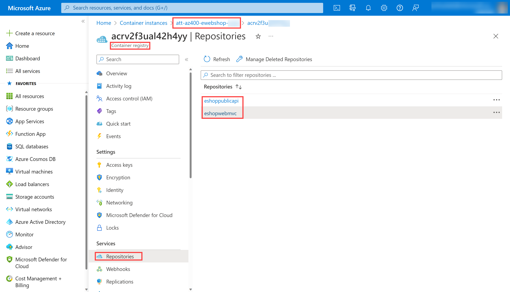

---
lab:
  title: Intégration d’Azure Key Vault à Azure DevOps
  module: 'Module 05: Implement a secure continuous deployment using Azure Pipelines'
---

# Intégration d’Azure Key Vault à Azure DevOps

## Manuel de labo de l’étudiant

## Configuration de laboratoire requise

- Ce labo nécessite **Microsoft Edge** ou un [navigateur pris en charge par Azure DevOps](https://learn.microsoft.com/azure/devops/server/compatibility).

- **Configurez une organisation Azure DevOps :** si vous ne disposez pas encore d’une organisation Azure DevOps que vous pouvez utiliser pour ce labo, créez-en une conformément aux instructions disponibles dans [Créer une organisation ou une collection de projets](https://learn.microsoft.com/azure/devops/organizations/accounts/create-organization).
- Identifier un abonnement Azure existant ou en créer un.

## Présentation du labo

Azure Key Vault fournit un stockage et une gestion sécurisés des données sensibles telles que les clés, les mots de passe et les certificats. Azure Key Vault inclut la prise en charge des modules de sécurité matériels et une gamme d’algorithmes de chiffrement et de longueurs de clés. L’utilisation d’Azure Key Vault peut réduire le risque de divulgation de données sensibles par le biais du code source, ce qui constitue une erreur courante faite par les développeurs. L’accès à Azure Key Vault nécessite une authentification et une autorisation appropriées, prenant en charge des autorisations précises d'accès à son contenu.

Dans ce labo, vous allez voir comment intégrer Azure Key Vault à Azure Pipelines en effectuant les étapes suivantes :

- Créer un coffre Azure Key Vault pour stocker un mot de passe ACR en tant que secret
- Créer un principal de service Azure pour fournir l’accès aux secrets du coffre Azure Key Vault
- Configurer des autorisations pour autoriser le principal de service à lire le secret
- Configurer le pipeline pour récupérer le mot de passe à partir du coffre Azure Key Vault et le transmettre aux tâches suivantes

## Objectifs

À la fin de ce labo, vous serez en mesure d’effectuer les tâches suivantes :

- Créez un principal de service Microsoft Entra.
- Créez un coffre de clés Azure.

## Durée estimée : 40 minutes

## Instructions

### Exercice 0 : configurer les prérequis du labo

Dans cet exercice, vous allez configurer les prérequis pour le labo, qui se composent d’un nouveau projet Azure DevOps avec un référentiel basé sur [eShopOnWeb](https://github.com/MicrosoftLearning/eShopOnWeb).

#### Tâche 1 : (passer si terminée) créer et configurer le projet d’équipe

Dans cette tâche, vous allez créer un projet Azure DevOps **eShopOnWeb** à utiliser par plusieurs labos.

1. Sur votre ordinateur de labo, dans une fenêtre de navigateur, ouvrez votre organisation Azure DevOps. Cliquez sur **Nouveau projet**. Attribuez au projet le nom **eShopOnWeb** et conservez les valeurs par défaut des autres champs. Cliquez sur **Créer**.

    

#### Tâche 2 : (passer si terminée) importer le référentiel Git eShopOnWeb

Dans cette tâche, vous allez importer le référentiel Git eShopOnWeb qui sera utilisé par plusieurs labos.

1. Sur votre ordinateur de labo, dans une fenêtre de navigateur, ouvrez votre organisation Azure DevOps et le projet **eShopOnWeb** créé précédemment. Cliquez sur **Dépôts > Fichiers**, **Importer**. Dans la fenêtre **Importer un dépôt Git**, collez l’URL https://github.com/MicrosoftLearning/eShopOnWeb.git, puis cliquez sur **Importer** :

    

1. Le référentiel est organisé de la manière suivante :
    - Le dossier **.ado** contient des pipelines YAML Azure DevOps.
    - Conteneur de dossiers **.devcontainer** configuré pour le développement à l’aide de conteneurs (localement dans VS Code ou GitHub Codespaces).
    - Le dossier **infra** contient l’infrastructure Bicep&ARM sous forme de modèles de code utilisés dans certains scénarios de labo.
    - **Définitions de workflow GitHub YAML du conteneur de dossiers .github**.
    - Le dossier **src** contient le site web .NET 8 utilisé dans les scénarios de labo.

### Exercice 1 : Configurer le pipeline CI pour créer un conteneur eShopOnWeb

Configurez le pipeline YAML CI pour :

- Créer un Registre de conteneurs Azure pour conserver les images de conteneurs
- Utilisation de Docker Compose pour générer et envoyer (push) des images de conteneurs **eshoppublicapi** et **eshopwebmvc** . Seul le conteneur **eshopwebmvc** sera déployé.

#### Tâche 1 : (ignorer si terminé) créer un principal de service

Dans cette tâche, vous allez créer un principal de service à l’aide d’Azure CLI, ce qui permettra à Azure DevOps de :

- Déployer des ressources sur un abonnement Azure
- Disposer d’un accès en lecture sur les secrets du coffre de clés créés ultérieurement.

> **Remarque** : si vous disposez déjà d’un principal de service, vous pouvez passer directement à la tâche suivante.

Vous aurez besoin d’un principal de service pour déployer des ressources Azure depuis Azure Pipelines. Étant donné que nous allons récupérer des secrets dans un pipeline, nous devons accorder l’autorisation au service lors de la création du coffre de clés Azure.

Un principal de service est créé automatiquement par Azure Pipelines, lorsque vous vous connectez à un abonnement Azure depuis une définition de pipeline ou lorsque vous créez une nouvelle connexion de service depuis la page des paramètres du projet (option automatique). Vous pouvez également créer manuellement le principal de service à partir du portail ou à l’aide d’Azure CLI, et le réutiliser dans d’autres projets.

1. Sur l’ordinateur de labo, démarrez un navigateur web, accédez au [**portail Azure**](https://portal.azure.com) et connectez-vous avec le compte d’utilisateur qui a le rôle Propriétaire dans l’abonnement Azure que vous utiliserez dans ce labo et le rôle Administrateur général dans le locataire Microsoft Entra associé à cet abonnement.
1. Dans le portail Azure, ouvrez le volet **Cloud Shell** situé directement à droite de la zone de texte de recherche en haut de la page.
1. Si vous êtes invité à sélectionner **Bash** ou **PowerShell**, sélectionnez **Bash**.

   >**Remarque** : si c’est la première fois que vous démarrez **Cloud Shell** et que vous voyez le message **Vous n’avez aucun stockage monté**, sélectionnez l’abonnement que vous utilisez dans ce labo, puis sélectionnez **Créer un stockage**.

1. À partir de l’invite **Bash**, dans le volet **Cloud Shell**, exécutez les commandes suivantes pour récupérer les valeurs de l’ID d’abonnement Azure et des attributs de nom d’abonnement :

    ```bash
    az account show --query id --output tsv
    az account show --query name --output tsv
    ```

    > **Remarque** : copiez les deux valeurs dans un fichier texte. Vous en aurez besoin plus tard dans ce labo.

1. À partir de l’invite **Bash**, dans le volet **Cloud Shell**, exécutez la commande suivante pour créer un principal de service (remplacez **myServicePrincipalName**par une chaîne unique de caractères composés de lettres et de chiffres) et **mySubscriptionID** par votre ID d’abonnement Azure :

    ```bash
    az ad sp create-for-rbac --name myServicePrincipalName \
                         --role contributor \
                         --scopes /subscriptions/mySubscriptionID
    ```

    > **Remarque** : la commande génère une sortie JSON. Copiez la sortie dans un fichier texte. Vous en aurez besoin plus tard dans ce labo.

1. Ensuite, sur l’ordinateur de labo, démarrez un navigateur web et accédez au projet Azure DevOps **eShopOnWeb**. Cliquez sur **Paramètres du projet > Connexions de service (sous Pipelines)**, puis sur **Nouvelle connexion de service**.

    

    > **Remarque** : S’il n’existe aucune connexion de service précédemment créée sur la page, le bouton de création de connexion de service se trouve au centre de la page et a l’étiquette **Créer une connexion de service**

1. Dans le panneau **Nouvelle connexion de service**, sélectionnez **Azure Resource Manager**, puis **Suivant** (vous devrez peut-être faire défiler la page vers le bas).

1. Choisissez ensuite **Principal de service (manuel)**, puis cliquez sur **Suivant**.

1. Renseignez les champs vides à l’aide des informations collectées lors des étapes précédentes :
    - ID et nom de l’abonnement.
    - ID du principal de service (appId), clé du principal de service (password) et ID du locataire (tenant).
    - Dans le champ **Nom de connexion de service**, tapez **azure subs**. Ce nom est référencé dans les pipelines YAML lorsque vous avez besoin d’une connexion de service Azure DevOps pour communiquer avec votre abonnement Azure.

    

1. Cliquez sur **Vérifier et enregistrer**.

#### Tâche 2 : configurer et exécuter un pipeline CI

Dans cette tâche, vous allez importer une définition de pipeline YAML CI existante, la modifier et l’exécuter. Vous allez ainsi créer une instance Azure Container Registry (ACR) et génèrer/publier les images conteneur eShopOnWeb.

1. Sur l’ordinateur de labo, démarrez un navigateur web, puis accédez au projet Azure DevOps **eShopOnWeb**. Accédez à **Pipelines > Pipelines**, puis cliquez sur **Créer un pipeline** (ou sur **Nouveau pipeline**).

1. Dans la fenêtre **Où se trouve votre code ?**, sélectionnez **Azure Repos Git (YAML)**, puis sélectionnez le référentiel **eShopOnWeb**.

1. Dans la section **Configurer**, choisissez **Fichier YAML Azure Pipelines existant**. Sélectionnez la branche : **principale**, indiquez le chemin d’accès suivant **/.ado/eshoponweb-ci-dockercompose.yml**, puis cliquez sur **Continuer**.

    

1. Dans la définition de pipeline YAML, personnalisez le nom du groupe de ressources en remplaçant **NAME** dans **AZ400-EWebShop-NAME** par une valeur unique et remplacez **YOUR-SUBSCRIPTION-ID** par votre propre ID d’abonnement Azure.

1. Cliquez sur **Enregistrer et exécuter**, puis attendez que l’exécution du pipeline se termine.

    > **Important** :si le message « Ce pipeline a besoin d’une autorisation d’accès aux ressources pour que cette exécution puisse se poursuivre jusqu’à Docker Compose vers ACI » s’affiche, cliquez sur Afficher, Autoriser et Autoriser à nouveau. Cette opération est nécessaire pour permettre au pipeline de créer la ressource.

    > **Remarque** : la génération peut prendre plusieurs minutes. La définition de build est composée des tâches suivantes :
    - **AzureResourceManagerTemplateDeployment** utilise **bicep** pour déployer une instance Azure Container Registry.
    - La tâche **PowerShell** utilise la sortie bicep (serveur de connexion acr) et crée une variable de pipeline.
    - La tâche **DockerCompose** génère et envoie (push) les images conteneur pour eShopOnWeb vers Azure Container Registry.

1. Votre pipeline est nommé en fonction du nom du projet. **Renommons**-le pour mieux l’identifier. Accédez à **Pipelines > Pipelines**, puis cliquez sur le pipeline qui vient d’être créé. Cliquez sur les points de suspension puis sur l’option **Renommer/Supprimer**. Nommez le pipeline **eshoponweb-ci-dockercompose**, puis cliquez sur **Enregistrer**.

1. Une fois l’exécution terminée, sur le portail Azure, ouvrez le groupe de ressources précédemment défini. Vous devriez y trouver une instance Azure Container Registry (ACR) avec les images conteneur **eshoppublicapi** et **eshopwebmvc** créées. Vous utiliserez **eshopwebmvc** uniquement lors de la phase de déploiement.

    

1. Cliquez sur **Clés d’accès**, activez l’**utilisateur administrateur** si ce n’est pas déjà fait, puis copiez la valeur du **mot de passe**. Elle sera utilisée dans la tâche suivante, car nous la conserverons comme secret dans Azure Key Vault.

    

#### Tâche 2 : créer une instance Azure Key Vault

Dans cette tâche, vous allez créer un coffre Azure Key Vault à l’aide du portail Azure.

Pour ce scénario de labo, nous allons utiliser une instance de conteneur Azure (ACI) qui extrait et exécute une image conteneur stockée dans Azure Container Registry (ACR). Nous avons l’intention de stocker le mot de passe de l’instance ACR en tant que secret dans le coffre de clés.

1. Dans le portail Azure, dans la zone de texte **Rechercher des ressources, des services et des documents**, tapez **Coffre de clés**, puis appuyez sur la touche **Entrée**.
1. Dans le panneau **Coffre de clés**, cliquez sur **Créer > Coffre de clés**.
1. Sous l’onglet **Informations de base** du panneau **Créer un coffre de clés**, spécifiez les paramètres suivants, puis cliquez sur **Suivant** :

    | Paramètre | Valeur |
    | --- | --- |
    | Abonnement | le nom de l’abonnement Azure que vous utilisez dans ce labo |
    | Groupe de ressources | Nom d’un nouveau groupe de ressources **AZ400-EWebShop-NAME** |
    | Nom du coffre de clés | Nom valide unique, comme **ewebshop-kv-NAME** (remplacer NAME) |
    | Région | Région Azure proche de l’emplacement de votre environnement de labo |
    | Niveau tarifaire | **Standard** |
    | Jours de conservation des coffres supprimés | **7** |
    | Protection contre le vidage | **Désactiver la protection de purge** |

1. Sous l’onglet **Configuration de l’accès** du panneau **Créer un coffre de clés**, sélectionnez **Stratégie d’accès au coffre**, puis dans la section **Stratégies d’accès**, cliquez sur **+ Créer** pour configurer une nouvelle stratégie.

    > **Remarque** : vous devez sécuriser l’accès à vos coffres de clés en autorisant uniquement les applications et utilisateurs autorisés. Pour accéder aux données du coffre, vous devez fournir des autorisations de lecture (Get/List) au principal de service créé précédemment que vous utiliserez pour l’authentification dans le pipeline.

    1. Dans le panneau **Autorisations**, sous **Autorisations du secret**, activez les autorisations **Get** et **List**. Cliquez sur **Suivant**.
    2. Dans le panneau **Principal**, recherchez le **principal de service créé précédemment** en utilisant l’ID ou le nom donné, puis sélectionnez-le dans la liste. Cliquez sur **Suivant**, **Suivant**, **Créer** (stratégie d’accès).
    3. Dans le panneau **Vérifier + créer**, cliquez sur **Créer**.

1. Dans le panneau **Créer un coffre de clés**, cliquez sur **Vérifier + créer  > Créer**.

    > **Remarque** : attendez que l’instance Azure Key Vault soit approvisionnée. Cela devrait prendre moins d’une minute.

1. Dans le panneau **Votre déploiement a été effectué**, cliquez sur **Accéder à la ressource**.
1. Dans le panneau Azure Key Vault (ewebshop-kv-NAME), dans le menu vertical situé à gauche du panneau, dans la section **Objets**, cliquez sur **Secrets**.
1. Dans le panneau **Secrets**, cliquez sur **Générer/Importer**.
1. Dans le panneau **Créer un secret**, spécifiez les paramètres suivants, puis cliquez sur **Créer** (en laissant les autres paramètres avec leur valeur par défaut) :

    | Paramètre | Valeur |
    | --- | --- |
    | Options de chargement | **Manuel** |
    | Nom | **acr-secret** |
    | Valeur | Mot de passe d’accès ACR copié dans la tâche précédente |

#### Tâche 3 : créer un groupe de variables connecté à Azure Key Vault

Dans cette tâche, vous allez créer un groupe de variables dans Azure DevOps qui récupère le secret de mot de passe ACR à partir de Key Vault à l’aide de la connexion de service (principal de service).

1. Sur votre ordinateur de labe, démarrez un navigateur web, puis accédez au projet Azure DevOps **eShopOnWeb**.

1. Dans le volet de navigation vertical du portail Azure DevOps, sélectionnez **Pipelines > Bibliothèque**. Cliquez sur **+ Groupe de variables**.

1. Dans le panneau **Nouveau groupe de variables**, spécifiez les paramètres suivants :

    | Paramètre | Valeur |
    | --- | --- |
    | Nom du groupe de variables | **eshopweb-vg** |
    | Lier des secrets à partir d’un coffre de clés Azure Key Vault | **enable** |
    | Abonnement Azure | **Connexion de service Azure disponible > Azure subs** |
    | Nom du coffre de clés | Nom de votre coffre de clés|

1. Sous **Variables**, cliquez sur **+ Ajouter**, puis sélectionnez le secret **acr-secret**. Cliquez sur **OK**.
1. Cliquez sur **Save**(Enregistrer).

    

#### Tâche 4 : configurer un pipeline CD pour déployer un conteneur dans Azure Container Instance (ACI)

Dans cette tâche, vous allez importer un pipeline CD, le personnaliser et l’exécuter pour déployer l’image conteneur créée auparavant dans Azure Container Instance.

1. Sur l’ordinateur de labo, démarrez un navigateur web, puis accédez au projet Azure DevOps **eShopOnWeb**. Accédez à **Pipelines > Pipelines**, puis cliquez sur **Nouveau pipeline**.

1. Dans la fenêtre **Où se trouve votre code ?**, sélectionnez **Azure Repos Git (YAML)**, puis sélectionnez le référentiel **eShopOnWeb**.

1. Dans la section **Configurer**, choisissez **Fichier YAML Azure Pipelines existant**. Sélectionnez la branche : **principale**, indiquez le chemin d’accès suivant **/.ado/eshoponweb-cd-aci.yml**, puis cliquez sur **Continuer**.

1. Dans la définition de pipeline YAML, personnalisez :

    - **YOUR-SUBSCRIPTION-ID** en fonction de votre ID d’abonnement Azure.
    - **az400eshop-NAME** remplacez NAME pour le rendre globalement unique.
    - **YOUR-ACR.azurecr.io** et **ACR-USERNAME** en fonction de votre serveur de connexion ACR (ils ont tous les deux besoin du nom ACR, que vous pouvez consulter dans ACR > Clés d’accès).
    - **AZ400-EWebShop-NAME** en fonction du nom du groupe de ressources défini auparavant dans le labo.

1. Cliquez sur **Enregistrer et exécuter**.
1. Ouvrez le pipeline et attendez que son exécution se termine.

    > **Important** :si le message « Ce pipeline a besoin d’une autorisation d’accès aux ressources pour que cette exécution puisse se poursuivre jusqu’à Docker Compose vers ACI » s’affiche, cliquez sur Afficher, Autoriser et Autoriser à nouveau. Cette opération est nécessaire pour permettre au pipeline de créer la ressource.

    > **Remarque** : le déploiement peut prendre quelques minutes. La définition CD se compose des tâches suivantes :
    - La tâche **Ressources** prépare la définition pour qu’elle se déclenche automatiquement en fonction de l’achèvement du pipeline CI. Cette opération télécharge également le référentiel pour le fichier bicep.
    - La tâche **Variables (pour l’étape de déploiement)** se connecte au groupe de variables pour utiliser le secret Azure Key Vault **acr-secret**.
    - La tâche **AzureResourceManagerTemplateDeployment** déploie Azure Container Instance (ACI) à l’aide du modèle bicep et fournit les paramètres de connexion ACR pour permettre à ACI de télécharger l’image conteneur créée précédemment à partir d’Azure Container Registry (ACR).

1. Votre pipeline est nommé en fonction du nom du projet. **Renommons**-le pour mieux l’identifier. Accédez à **Pipelines > Pipelines**, puis cliquez sur le pipeline qui vient d’être créé. Cliquez sur les points de suspension, puis sur l’option **Renommer/Supprimer**. Nommez-le **eshoponweb-cd-aci**, puis cliquez sur **Enregistrer**.

### Exercice 2 : supprimer les ressources du labo Azure

Dans cet exercice, vous allez supprimer les ressources Azure approvisionnées dans ce labo pour éviter des frais inattendus.

>**Remarque** : N’oubliez pas de supprimer toutes les nouvelles ressources Azure que vous n’utilisez plus. La suppression des ressources inutilisées vous évitera d’encourir des frais inattendus.

#### Tâche 1 : supprimer les ressources du labo Azure

Dans cette tâche, vous allez utiliser Azure Cloud Shell pour supprimer les ressources Azure approvisionnées dans ce labo pour éviter des frais inutiles.

1. Dans le portail Azure, ouvrez le groupe de ressources créé, puis cliquez sur **Supprimer le groupe de ressources**.

## Révision

Dans ce labo, vous avez intégré Azure Key Vault à un pipeline Azure DevOps en effectuant les étapes suivantes :

- Vous avez créé un principal de service Azure pour fournir l’accès à un secret Azure Key Vault et authentifier le déploiement sur Azure à partir d’Azure DevOps.
- Vous avez exécuté deux pipelines YAML importés à partir d’un référentiel Git.
- Vous avez configuré un pipeline pour récupérer le mot de passe d’Azure Key Vault à l’aide d’un groupe de variables et l’utiliser dans des tâches ultérieures.
