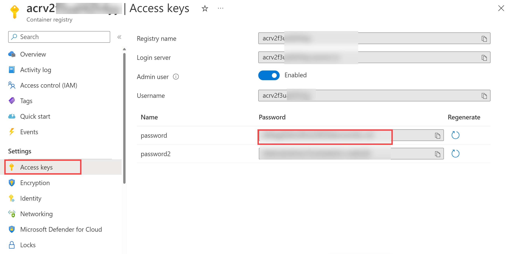

---
lab:
  title: Intégration d’Azure Key Vault à Azure DevOps
  module: 'Module 05: Implement a secure continuous deployment using Azure Pipelines'
---

# Intégration d’Azure Key Vault à Azure DevOps

## Manuel de labo de l’étudiant

## Configuration de laboratoire requise

- Ce labo nécessite **Microsoft Edge** ou un [navigateur pris en charge par Azure DevOps](https://learn.microsoft.com/azure/devops/server/compatibility).

- **Configurez une organisation Azure DevOps :** si vous ne disposez pas encore d’une organisation Azure DevOps que vous pouvez utiliser pour ce labo, créez-en une conformément aux instructions disponibles dans [Créer une organisation ou une collection de projets](https://learn.microsoft.com/azure/devops/organizations/accounts/create-organization).

- Identifier un abonnement Azure existant ou en créer un.

## Présentation du labo

Azure Key Vault fournit un stockage et une gestion sécurisés des données sensibles telles que les clés, les mots de passe et les certificats. Azure Key Vault inclut la prise en charge des modules de sécurité matériels et toute une gamme d’algorithmes de chiffrement et de longueurs de clés. L’utilisation d’Azure Key Vault peut réduire le risque de divulgation de données sensibles par le biais du code source, qui est une erreur courante commise par les développeurs. L’accès à Azure Key Vault nécessite une authentification et une autorisation adéquates qui prennent en charge des autorisations précises par rapport à son contenu.

Dans ce labo, vous allez voir comment intégrer Azure Key Vault à un Azure Pipelines en effectuant les étapes suivantes :

- Créer un Azure Key Vault pour stocker un mot de passe ACR en tant que secret.
- Créer un principal de service Azure pour fournir l’accès aux secrets stockés dans Azure Key Vault.
- Configurer des autorisations pour autoriser le principal de service à lire le secret
- Configurer le pipeline pour récupérer le mot de passe à partir d’Azure Key Vault et le transmettre aux tâches suivantes.

## Objectifs

À la fin de ce labo, vous serez en mesure d’accomplir les tâches suivantes :

- Créez un principal de service Microsoft Entra.
- Créez un coffre de clés Azure.

## Durée estimée : 40 minutes

## Instructions

### Exercice 0 : configurer les prérequis du labo

Dans cet exercice, vous configurerez les prérequis du labo, qui se composent d’un nouveau projet Azure DevOps comprenant un référentiel basé sur [eShopOnWeb](https://github.com/MicrosoftLearning/eShopOnWeb).

#### Tâche 1 : (à ignorer si vous l’avez déjà effectuée) créer et configurer le projet d’équipe

Dans le cadre de cette tâche, vous créerez un projet Azure DevOps **eShopOnWeb** qui sera utilisé dans plusieurs labos.

1. Sur votre ordinateur de labo, ouvrez votre organisation Azure DevOps dans votre navigateur. Cliquez sur **Nouveau projet**. Nommez votre projet **eShopOnWeb** et ne modifiez pas les autres champs par défaut. Cliquez sur **Créer**.

    

#### Tâche 2 : (à ignorer si vous l’avez déjà effectuée) importer un référentiel Git eShopOnWeb

Dans le cadre de cette tâche, vous importerez le référentiel Git eShopOnWeb qui sera utilisé dans plusieurs labos.

1. Sur votre ordinateur de labo, ouvrez votre organisation Azure DevOps dans votre navigateur ainsi que le projet **eShopOnWeb** que vous venez de créer. Cliquez sur **Repos > Fichiers**, puis sur **Importer**. Dans la fenêtre **Importer un référentiel Git**, collez l’URL https://github.com/MicrosoftLearning/eShopOnWeb.git, puis cliquez sur **Importer** :

    

2. Le référentiel est organisé de la manière suivante :
    - Le dossier **.ado** contient des pipelines YAML Azure DevOps.
    - Conteneur de dossiers **.devcontainer** configuré pour le développement à l’aide de conteneurs (localement dans VS Code ou GitHub Codespaces).
    - Le dossier **.azure** contient l’infrastructure Bicep&ARM en tant que modèles de code utilisés dans certains scénarios de labos.
    - **Définitions de workflow GitHub YAML du conteneur de dossiers .github**.
    - Le dossier **src** contient le site web .NET 7 utilisé dans les scénarios de labo.

### Exercice 1 : Configurer le pipeline CI pour créer un conteneur eShopOnWeb

Configurer le pipeline YAML CI pour les opérations suivantes :

- Création d'un Azure Container Registry pour conserver les images des conteneurs
- Utilisation de Docker Compose pour générer et envoyer des images conteneur **eshoppublicapi** et **eshopwebmvc**. Seul le conteneur **eshopwebmvc** sera déployé.

#### Tâche 1 : (à ignorer si vous l’avez déjà effectuée) créer un principal de service

Dans cette tâche, vous allez créer un principal de service à l’aide d’Azure CLI, ce qui permettra à Azure DevOps d’effectuer les actions suivantes :

- Déployer des ressources sur votre abonnement Azure.
- Disposez d’un accès en lecture sur les secrets Key Vault créés ultérieurement.

> **Remarque** : vous pouvez passer directement à la tâche suivante si vous possédez déjà un principal de service.

Vous aurez besoin d’un principal de service pour déployer des ressources Azure à partir d’Azure Pipelines. Étant donné que vous récupérerez des secrets dans un pipeline, vous devez octroyer l’autorisation au service lorsque vous créerez l’Azure Key Vault.

Un principal de service est créé automatiquement par Azure Pipelines lorsque vous vous connectez à un abonnement Azure à partir d’une définition de pipeline ou lorsque vous créez une connexion de service à partir de la page des paramètres du projet (option automatique). Vous pouvez également créer manuellement le principal de service à partir du portail ou à l’aide d’Azure CLI et le réutiliser dans les projets.

1. Sur l’ordinateur de labo, démarrez un navigateur web, accédez au [**Portail Azure**](https://portal.azure.com) et connectez-vous avec le compte d’utilisateur qui a le rôle de Propriétaire dans l’abonnement Azure que vous utiliserez dans ce labo et qui a le rôle d’Administrateur général dans le locataire Microsoft Entra associé à cet abonnement.
2. Dans le Portail Azure, cliquez sur l’icône **Cloud Shell** située directement à droite de la zone de texte de recherche en haut de la page.
3. Si vous êtes invité à sélectionner **Bash** ou **PowerShell**, sélectionnez **Bash**.

   >**Remarque** : si c’est la première fois que vous démarrez **Cloud Shell** et que vous voyez le message **Vous n’avez aucun stockage monté**, sélectionnez l’abonnement que vous utilisez dans ce labo, puis sélectionnez **Créer un stockage**.

4. À partir de l’invite **Bash**, dans le volet **Cloud Shell**, exécutez les commandes suivantes pour récupérer les valeurs de l’ID d’abonnement Azure et des attributs de nom d’abonnement :

    ```bash
    az account show --query id --output tsv
    az account show --query name --output tsv
    ```

    > **Remarque** : copiez les deux valeurs dans un fichier texte. Vous en aurez besoin plus tard dans ce labo.

5. À partir de l’invite **Bash**, dans le volet **Cloud Shell**, exécutez la commande suivante pour créer un principal de service (remplacez **myServicePrincipalName** par n’importe quelle chaîne unique de caractères composés de lettres et de chiffres) et **mySubscriptionID** par votre Azure subscriptionId :

    ```bash
    az ad sp create-for-rbac --name myServicePrincipalName \
                         --role contributor \
                         --scopes /subscriptions/mySubscriptionID
    ```

    > **Remarque** : la commande générera une sortie JSON. Copiez la sortie dans un fichier texte. Vous en aurez besoin plus tard dans ce labo.

6. Sur l’ordinateur du labo, démarrez ensuite un navigateur web et accédez au projet Azure DevOps **eShopOnWeb**. Cliquez sur **Paramètres du projet > Connexions de services (sous Pipelines)**, puis sélectionnez **Nouvelle connexion de services**.

    

7. Dans le volet **Nouvelle connexion de service**, sélectionnez **Azure Resource Manager**, puis **Suivant** (il peut être nécessaire de faire défiler l’écran vers le bas).

8. Ensuite, sélectionnez **Principal de service (manuel)** puis sélectionnez **Suivant**.

9. Remplissez les champs vides à l’aide des informations collectées lors des étapes précédentes :
    - ID et nom de l’abonnement.
    - ID du principal de service (appId), clé du principal de service (mot de passe) et ID de locataire (locataire).
    - Dans **Nom de la connexion de service** tapez **azure subs**. Ce nom est référencé dans les pipelines YAML lorsque vous avez besoin d’une connexion de service Azure DevOps pour communiquer avec votre abonnement Azure.

    

10. Cliquez sur **Vérifier et enregistrer**.

#### Tâche 2 : configurer et exécuter un pipeline CI

Dans cette tâche, vous allez importer une définition de pipeline YAML CI existante, la modifier et l’exécuter. Cela va créer un Azure Container Registry (ACR) et générer/publier les images conteneur eShopOnWeb.

1. Sur l’ordinateur du labo, démarrez un navigateur web et accédez au projet Azure DevOps **eShopOnWeb**. Accédez à **Pipelines > Pipelines**, puis cliquez sur **Créer un pipeline** (ou **Nouveau pipeline**).

2. Dans la fenêtre **Où se trouve votre code ?**, sélectionnez **Azure Repos Git (YAML)** et sélectionnez le **référentiel eShopOnWeb**.

3. Sous la section **Configurer**, choisissez **Fichier YAML Azure Pipelines existant**. Indiquez le chemin d’accès suivant : **/.ado/eshoponweb-ci-dockercompose.yml**, puis cliquez sur **Continuer**.

    

4. Dans la définition du pipeline YAML, personnalisez votre nom de groupe de ressources en remplaçant **NAME** dans **AZ400-EWebShop-NAME** et remplacez **YOUR-SUBSCRIPTION-ID** par votre propre Azure subscriptionId.

5. Cliquez sur **Enregistrer et exécuter**, puis attendez que le pipeline s’exécute correctement.

    > **Remarque** : le build peut prendre quelques minutes. La définition du build se compose des tâches suivantes :
    - **AzureResourceManagerTemplateDeployment** utilise **bicep** pour déployer un Azure Container Registry.
    - La tâche **PowerShell** prend la sortie bicep (serveur de connexion acr) et crée une variable de pipeline.
    - La tâche **DockerCompose** génère et envoie (push) les images conteneur pour eShopOnWeb vers Azure Container Registry.

6. Votre pipeline choisira un nom en fonction du nom du projet. **Renommez-le** pour identifier le pipeline plus facilement. Accédez à **Pipelines > Pipelines** et sélectionnez le pipeline que vous venez de créer. Sélectionnez les trois points, puis cliquez sur l’option **Renommer/Déplacer**. Nommez-le **eshoponweb-ci-dockercompose**, puis cliquez sur **Enregistrer**.

7. Une fois l’exécution terminée, revenez au Portail Azure, puis ouvrez le groupe de ressources que vous avez déjà défini : vous y retrouverez un Azure Container Registry (ACR) contenant les images conteneur **eshoppublicapi** et **eshopwebmvc** créées. Vous utiliserez uniquement **eshopwebmvc** dans l’étape de déploiement.

    

8. Cliquez sur **Clés d’accès** puis copiez la valeur du **mot de passe**. Elle sera utilisée dans la tâche suivante et vous la conserverez comme secret dans Azure Key Vault.

    

#### Tâche 2: Créer un Azure Key Vault

Dans cette tâche, vous allez créer un Azure Key Vault à l’aide du Portail Azure.

Pour ce scénario de laboratoire, vous aurez une instance de conteneur Azure (ACI) qui extrait et exécute une image conteneur stockée dans Azure Container Registry (ACR). Nous avons l’intention de stocker le mot de passe de l’ACR en tant que secret dans le coffre de clés.

1. Dans le Portail Azure, dans la zone de texte **Rechercher des ressources, des services et des documents**, tapez **Key Vault**, puis appuyez sur la touche **Entrée**.
2. Dans le volet **Coffre de clés**, sélectionnez **Créer > Coffre de clés**.
3. Sous l’onglet **De base** du volet **Créer un coffre de clés**, spécifiez les paramètres suivants, puis cliquez sur **Suivant** :

    | Paramètre | Valeur |
    | --- | --- |
    | Abonnement | le nom de l’abonnement Azure que vous utilisez dans ce labo |
    | Groupe de ressources | le nom d’un nouveau groupe de ressources **AZ400-EWebShop-NAME** |
    | Nom du coffre de clés | n’importe quel nom valide unique, comme **ewebshop-kv-NAME** (remplacer NAME) |
    | Région | région Azure proche de l’emplacement de votre environnement de labo |
    | Niveau tarifaire | **Standard** |
    | Jours de conservation des coffres supprimés | **7** |
    | Protection contre le vidage | **Activer la protection contre le vidage** |

4. Dans l’onglet **Configuration des accès** du volet **Créer un coffre de clés**, sélectionnez **Stratégie d’accès au coffre**. Dans la section **Stratégies d’accès**, cliquez ensuite sur **+ Créer** pour configurer une nouvelle stratégie.

    > **Remarque** : vous devez sécuriser l’accès à vos coffres de clés en autorisant uniquement les applications et utilisateurs autorisés. Pour accéder aux données à partir du coffre, vous devez fournir des autorisations de lecture (Obtenir/Répertorier) au principal de service créé précédemment que vous utiliserez pour l’authentification dans le pipeline. 

    1. Dans le volet **Autorisations**, sous **Autorisations liées aux secrets**, cochez les autorisations **Obtenir** et **Répertorier**. Cliquez sur **Suivant**.
    2. Dans le volet **Principal**, recherchez le **principal de service que vous venez de créer** à l’aide de l’ID ou du nom donné, puis sélectionnez-le dans la liste. Cliquez sur **Suivant**, une nouvelle fois sur **Suivant**, puis sur **Créer** (stratégie d’accès).
    3. Dans le volet **Vérifier + créer**, cliquez sur **Créer.**.

5. De retour dans le volet **Créer un coffre de clés**, sélectionnez **Vérifier + Créer > Créer**.

    > **Remarque** : attendez que l’Azure Key Vault soit configuré. Cela devrait prendre moins d’une minute.

6. Dans le volet **Votre déploiement a été effectué**, cliquez sur **Accéder à la ressource**.
7. Dans le menu vertical situé à gauche du volet Azure Key Vault, (ewebshop-kv-NAME), cliquez sur **Secrets** dans la section **Objets**.
8. Dans le volet **Secrets**, cliquez sur ** Générer/Importer**.
9. Dans le volet **Créer un secret**, spécifiez les paramètres suivants et cliquez sur **Créer** (en laissant les autres éléments avec leurs valeurs par défaut) :

    | Paramètre | Valeur |
    | --- | --- |
    | Options de chargement | **Manuel** |
    | Nom | **acr-secret** |
    | Valeur | Mot de passe d’accès ACR copié dans la tâche précédente |

#### Tâche 3 : Créer un groupe de variables connecté à Azure Key Vault

Dans cette tâche, vous allez créer un groupe de variables dans Azure DevOps qui récupère le secret de mot de passe ACR à partir de Key Vault à l’aide de la connexion de service (principal de service).

1. Sur votre ordinateur de labo, démarrez un navigateur web et accédez au projet Azure DevOps **eShopOnWeb**.

2. Dans le volet de navigation vertical du Portail Azure DevOps, sélectionnez **Pipelines > Bibliothèque**. Cliquez sur **+ Groupes de variables**.

3. Dans le volet **Nouveau groupe de variables**, spécifiez les paramètres suivants :

    | Paramètre | Valeur |
    | --- | --- |
    | Nom du groupe de variables | **eshopweb-vg** |
    | Lier des secrets à partir d’un Azure Key Vault | **enable** |
    | Abonnement Azure | **Connexion au service Azure disponible > Azure subs** |
    | Nom du coffre de clés | Nom de votre coffre de clés|

4. Sous **Variables**, cliquez sur **+ Ajouter** et sélectionnez le secret **acr-secret**. Cliquez sur **OK**.
5. Cliquez sur **Save**(Enregistrer).

    

#### Tâche 4 : configurer le pipeline CD pour déployer un conteneur dans Azure Container Instances (ACI)

Dans cette tâche, vous allez importer un pipeline CD, le personnaliser et l’exécuter pour déployer l’image conteneur créée auparavant dans Azure Container Instances.

1. Sur l’ordinateur du labo, démarrez un navigateur web et accédez au projet Azure DevOps **eShopOnWeb**. Accédez à **Pipelines > Pipelines** et cliquez sur **Nouveau pipeline**.

2. Dans la fenêtre **Où se trouve votre code ?**, sélectionnez **Azure Repos Git (YAML)** et sélectionnez le **référentiel eShopOnWeb**.

3. Sous la section **Configurer**, choisissez **Fichier YAML Azure Pipelines existant**. Indiquez le chemin d’accès suivant : **/.ado/eshoponweb-cd-aci.yml**, puis cliquez sur **Continuer**.

4. Dans la définition du pipeline YAML, personnalisez les éléments suivants :

    - **YOUR-SUBSCRIPTION-ID** par votre ID d’abonnement Azure ;
    - **az400eshop-NAME** et remplacer NAME pour le rendre globalement unique.
    - **YOUR-ACR.azurecr.io** et **ACR-USERNAME** avec votre serveur de connexion ACR (ils ont tous les deux besoin du nom ACR, que vous pouvez consulter sur ACR > Clés d’accès).
    - **AZ400-EWebShop-NAME** avec le nom du groupe de ressources défini plus tôt dans le labo.

5. Cliquez sur **Enregistrer et exécuter**.
6. Ouvrez le pipeline et attendez qu’il s’exécute correctement.

    > **Important** : si vous voyez le message « Ce pipeline a besoin d’une autorisation pour accéder aux ressources avant que cette exécution puisse continuer à utiliser Docker Compose vers ACI », cliquez sur Afficher, Autoriser et à nouveau Autoriser. Cette opération est nécessaire pour permettre au pipeline de créer la ressource.

    > **Remarque** : le déploiement peut prendre quelques minutes. La définition CD se compose des tâches suivantes :
    - **Ressources** : il est prêt à se déclencher automatiquement en fonction de l’achèvement du pipeline CI. Il télécharge également le référentiel pour le fichier bicep.
    - **Variables (pour la phase de déploiement)** se connecte au groupe de variables pour consommer le secret Azure Key Vault **acr-secret**.
    - **AzureResourceManagerTemplateDeployment** déploie l’Azure Container Instance (ACI) à l’aide du modèle bicep et fournit les paramètres de connexion ACR pour permettre à ACI de télécharger l’image de conteneur créée précédemment à partir d’Azure Container Registry (ACR).

7. Votre pipeline choisira un nom en fonction du nom du projet. **Renommez-le** pour identifier le pipeline plus facilement. Accédez à **Pipelines > Pipelines** et sélectionnez le pipeline que vous venez de créer. Cliquez sur les trois points, puis sélectionnez l’option **Renommer/Déplacer**. Nommez-le **eshoponweb-cd-aci**, puis cliquez sur **Enregistrer**.

### Exercice 2 : Supprimer les ressources du labo Azure.

Dans le cadre de cet exercice, vous supprimerez les ressources Azure provisionnées dans ce labo pour éliminer les frais inattendus.

>**Remarque** : N’oubliez pas de supprimer toutes les nouvelles ressources Azure que vous n’utilisez plus. La suppression des ressources inutilisées vous évitera d’encourir des frais inattendus.

#### Tâche 1 : supprimer les ressources du labo Azure

Dans le cadre de cette tâche, vous utiliserez Azure Cloud Shell pour supprimer les ressources Azure provisionnées dans ce labo afin d’éliminer les frais superflus.

1. Dans le Portail Azure, ouvrez le groupe de ressources créé, puis cliquez sur **Supprimer le groupe de ressources**.

## Révision

Dans ce labo, vous avez intégré Azure Key Vault avec un pipeline Azure DevOps en effectuant les étapes suivantes :

- Créer un principal de service Azure pour fournir l’accès à un secret d’Azure Key Vault et authentifier le déploiement Azure à partir d’Azure DevOps.
- Exécuter deux pipelines YAML importés à partir d’un référentiel Git.
- Configurer le pipeline pour récupérer le mot de passe à partir d’Azure Key Vault à l’aide du groupe de variables, puis l’utiliser dans d’autres tâches.
