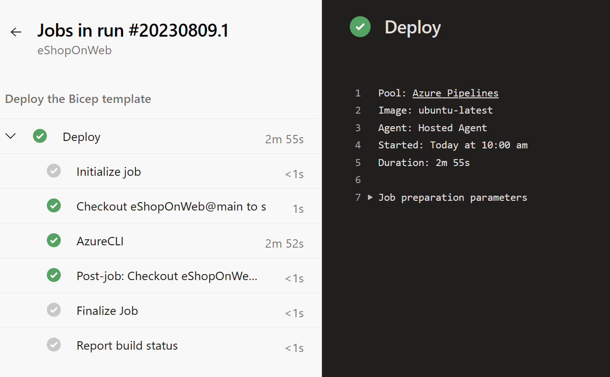

---
lab:
  title: Déploiements à l’aide de modèles Azure Bicep
  module: 'Module 05: Manage infrastructure as code using Azure and DSC'
---

# Déploiements à l’aide de modèles Azure Bicep

## Configuration de laboratoire requise

- Ce labo nécessite **Microsoft Edge** ou un [navigateur pris en charge par Azure DevOps](https://docs.microsoft.com/azure/devops/server/compatibility).

- **Configurez une organisation Azure DevOps :** si vous ne disposez pas encore d’une organisation Azure DevOps que vous pouvez utiliser pour ce labo, créez-en une conformément aux instructions disponibles dans [Créer une organisation ou une collection de projets](https://docs.microsoft.com/azure/devops/organizations/accounts/create-organization).

- Identifier un abonnement Azure existant ou en créer un.

- Vérifiez que vous disposez d’un compte Microsoft ou d’un compte Microsoft Entra avec le rôle Propriétaire dans l’abonnement Azure et le rôle Administrateur général dans le locataire Microsoft Entra associé à l’abonnement Azure. Pour plus d’informations, consultez [Répertorier les attributions de rôle Azure à l’aide du portail Azure](https://docs.microsoft.com/azure/role-based-access-control/role-assignments-list-portal) et [Afficher et attribuer des rôles d’administrateur dans Azure Active Directory](https://docs.microsoft.com/azure/active-directory/roles/manage-roles-portal).

## Présentation du labo

Dans ce labo, vous allez créer un modèle Azure Bicep et le modulariser en utilisant le concept de modules d’Azure Bicep. Vous allez ensuite modifier le modèle de déploiement principal pour utiliser le module, puis déployer toutes les ressources sur Azure.

## Objectifs

À la fin de ce labo, vous serez en mesure d’effectuer les tâches suivants :

- Comprendre la structure d’un modèle Azure Bicep.
- Créer un module Bicep réutilisable.
- Modifier le modèle principal pour utiliser le module.
- Déployer toutes les ressources sur Azure à l’aide de pipelines YAML Azure.

## Durée estimée : 45 minutes

## Instructions

### Exercice 0 : (ignorez-le si vous l’avez déjà effectué) configurer les prérequis du labo

Dans cet exercice, vous allez configurer les prérequis pour le labo, qui se composent d’un nouveau projet Azure DevOps avec un référentiel basé sur [eShopOnWeb](https://github.com/MicrosoftLearning/eShopOnWeb).

#### Tâche 1 : (passer si terminée) créer et configurer le projet d’équipe

Dans cette tâche, vous allez créer un projet Azure DevOps **eShopOnWeb** à utiliser par plusieurs labos.

1. Sur votre ordinateur de labo, dans une fenêtre de navigateur, ouvrez votre organisation Azure DevOps. Cliquez sur **Nouveau projet**. Attribuez au projet le nom **eShopOnWeb** et conservez les valeurs par défaut des autres champs. Cliquez sur **Créer**.

    

#### Tâche 2 : (passer si terminée) importer le référentiel Git eShopOnWeb

Dans cette tâche, vous allez importer le référentiel Git eShopOnWeb qui sera utilisé par plusieurs labos.

1. Sur votre ordinateur de labo, dans une fenêtre de navigateur, ouvrez votre organisation Azure DevOps et le projet **eShopOnWeb** créé précédemment. Cliquez sur **Repos > Fichiers**, **Importer un référentiel**. Cliquez sur **Importer**. Dans la fenêtre **Importer un dépôt Git**, collez l’URL <https://github.com/MicrosoftLearning/eShopOnWeb.git>, puis cliquez sur **Importer** :

    

1. Le référentiel est organisé de la manière suivante :
    - Le dossier **.ado** contient des pipelines YAML Azure DevOps.
    - Conteneur de dossiers **.devcontainer** configuré pour le développement à l’aide de conteneurs (localement dans VS Code ou GitHub Codespaces).
    - Le dossier **infra** contient l’infrastructure Bicep&ARM sous forme de modèles de code utilisés dans certains scénarios de labo.
    - **Définitions de workflow GitHub YAML du conteneur de dossiers .github**.
    - Le dossier **src** contient le site web .NET 8 utilisé dans les scénarios de labo.

#### Tâche 3 : (à ignorer si vous l’avez déjà effectuée) définir la branche principale en tant que branche par défaut

1. Accédez à **Repos > Branches**.
1. Pointez sur la branche **principale**, puis cliquez sur les points de suspension à droite de la colonne.
1. Cliquez sur **Définir comme branche par défaut**.

### Exercice 1 : comprendre un modèle Azure Bicep et le simplifier à l’aide d’un module réutilisable

Dans ce labo, vous allez passer en revue un modèle Azure Bicep et le simplifier à l’aide d’un module réutilisable.

#### Tâche 1 : créer un modèle Azure Bicep

Dans cette tâche, vous allez utiliser Visual Studio Code pour créer un modèle Azure Bicep.

1. Dans l’onglet de navigateur dans lequel votre projet Azure DevOps est ouvert, accédez à **Référentiels** et à **Fichiers**. Ouvrez le dossier `infra` et recherchez le fichier `simple-windows-vm.bicep`.

   

1. Passez en revue le modèle pour mieux comprendre sa structure. Il existe certains paramètres avec des types, des valeurs par défaut et une validation, certaines variables, et quelques ressources avec ces types :

   - Microsoft.Storage/storageAccounts
   - Microsoft.Network/publicIPAddresses
   - Microsoft.Network/virtualNetworks
   - Microsoft.Network/networkInterfaces
   - Microsoft.Compute/virtualMachines

1. Faites attention à la simplicité des définitions de ressources et à la possibilité de référencer implicitement des noms symboliques au lieu d’être explicite `dependsOn` dans le modèle.

#### Tâche 2 : créer un module Bicep pour les ressources de stockage

Dans cette tâche, vous allez créer un module de modèle **storage.bicep** qui créera un compte de stockage uniquement et que le modèle principal importera. Le module de modèle de stockage doit transmettre une valeur au modèle principal, **main.bicep**. Cette valeur sera définie dans l’élément de sortie du module de modèle de stockage.

1. Tout d’abord, nous devons supprimer la ressource de stockage de notre modèle principal. Dans l’angle supérieur droit de la fenêtre de votre navigateur, cliquez sur le bouton **Modifier** :

   

1. Supprimez maintenant la ressource de stockage  :

   ```bicep
   resource storageAccount 'Microsoft.Storage/storageAccounts@2022-05-01' = {
     name: storageAccountName
     location: location
     sku: {
       name: 'Standard_LRS'
     }
     kind: 'Storage'
   }
   ```

1. Modifier la valeur par défaut du paramètre `publicIPAllocationMethod` en remplaçant `Dynamic` par `Static` à la ligne 20

1. Modifier la valeur par défaut du paramètre `publicIpSku` en remplaçant `Basic` par `Standard` à la ligne 27

1. Validez le fichier ; toutefois, nous n’en avons pas encore fini avec lui.

   

1. Placez ensuite votre souris sur le dossier `Infra` et cliquez sur l’icône des points de suspension, puis sélectionnez **Nouveau** et **Fichier**. Pour le nom, entrez **`storage.bicep`**, puis cliquez sur **Créer**.

   

1. Copiez maintenant l’extrait de code suivant dans le fichier et validez vos modifications :

   ```bicep
   @description('Location for all resources.')
   param location string = resourceGroup().location

   @description('Name for the storage account.')
   param storageAccountName string

   resource storageAccount 'Microsoft.Storage/storageAccounts@2022-05-01' = {
     name: storageAccountName
     location: location
     sku: {
       name: 'Standard_LRS'
     }
     kind: 'Storage'
   }

   output storageURI string = storageAccount.properties.primaryEndpoints.blob
   ```

#### Tâche 3 : Modifier le modèle simple-windows-vm pour utiliser le module de modèle

Dans cette tâche, vous allez modifier le modèle `simple-windows-vm.bicep` pour qu’il référence le module de modèle que vous avez créé lors de la tâche précédente.

1. Revenez au fichier `simple-windows-vm.bicep`, puis cliquez de nouveau sur le bouton **Modifier**.

1. Ensuite, ajoutez le code suivant après les variables :

   ```bicep
   module storageModule './storage.bicep' = {
     name: 'linkedTemplate'
     params: {
       location: location
       storageAccountName: storageAccountName
     }
   }
   ```

1. Nous devons également modifier la référence à l’URI d’objet blob du compte de stockage dans notre ressource de machine virtuelle pour utiliser la sortie du module à la place. Recherchez la ressource de machine virtuelle et remplacez le contenu de la section diagnosticsProfile par les éléments suivants :

   ```bicep
   diagnosticsProfile: {
     bootDiagnostics: {
       enabled: true
       storageUri: storageModule.outputs.storageURI
     }
   }
   ```

1. Les informations suivantes sont demandées dans le modèle principal :

   - Un module dans le modèle principal est utilisé pour créer le lien vers un autre modèle.
   - Le module porte un nom symbolique, `storageModule`. Ce nom est utilisé pour configurer les dépendances.
   - Vous pouvez uniquement utiliser le mode de déploiement **Incrémentiel** lors de l’emploi de modules de modèles.
   - Un chemin relatif est utilisé pour votre module de modèle.
   - Utilisez des paramètres pour transmettre des valeurs du modèle principal aux modules de modèles.

1. Validez le modèle.

### Exercice 2 : déployer les modèles sur Azure en utilisant des pipelines YAML

Dans ce labo, vous allez utiliser un pipeline YAML Azure DevOps pour déployer votre modèle dans votre environnement Azure.

#### Tâche 1 : déployer des ressources sur Azure à l’aide de pipelines YAML

1. Revenez au volet **Pipelines** du hub **Pipelines**.
1. Dans la fenêtre **Créer votre premier pipeline**, cliquez sur **Créer un pipeline**.

    > **Remarque** : nous allons utiliser l’Assistant pour créer une définition de pipeline YAML basée sur notre projet.

1. Dans le volet **Où se trouve votre code ?**, cliquez sur l’option **Azure Repos Git (YAML)**.
1. Dans le volet **Sélectionner un référentiel**, cliquez sur **eShopOnWeb**.
1. Dans le volet **Configurer votre pipeline**, faites défiler la page vers le bas, puis sélectionnez **Fichier YAML Azure Pipelines existant**.
1. Dans le panneau **Sélectionner un fichier YAML existant**, spécifiez les paramètres suivants :
   - Branche : **main**
   - Chemin : **.ado/eshoponweb-cd-windows-cm.yml**
1. Cliquez sur **Continuer** pour enregistrer les paramètres.
1. Dans la section des variables, choisissez un nom pour votre groupe de ressources, définissez l’emplacement souhaité et remplacez la valeur de la connexion de service par l’une de vos connexions de service existantes que vous avez créées précédemment.
1. Dans le coin supérieur droit, cliquez sur le bouton **Enregistrer et exécuter**. Lorsque la boîte de dialogue de validation s’affiche, cliquez sur **Enregistrer et réexécuter**.

   

1. Attendez que le déploiement se termine, puis consultez les résultats.
   

   > **Remarque** : N’oubliez pas d’autoriser le pipeline à utiliser la connexion de service créée précédemment.

   > [!IMPORTANT]
   > N’oubliez pas de supprimer les ressources créées dans le portail Azure pour éviter les frais inutiles.

## Révision

Dans ce labo, vous avez appris à créer un modèle Azure Bicep, à le modulariser à l’aide d’un module de modèle, à modifier le modèle de déploiement principal pour utiliser le module et les dépendances mises à jour, et enfin à déployer les modèles sur Azure via des pipelines YAML.
