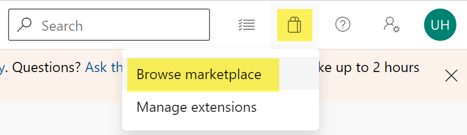
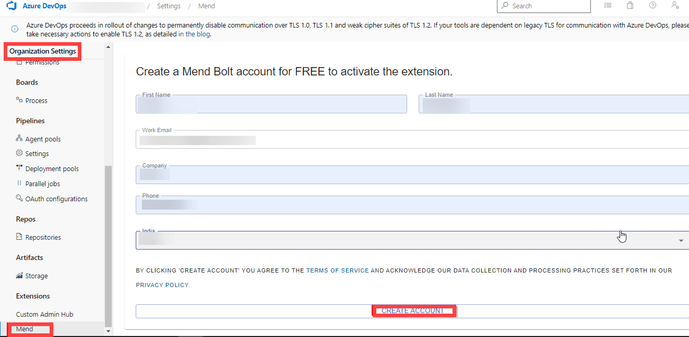
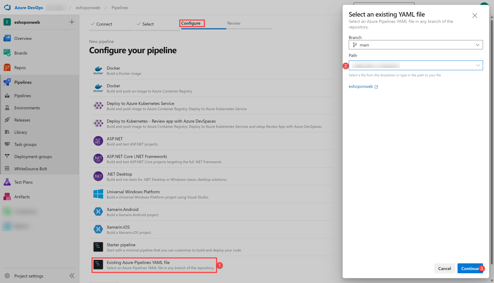

---
lab:
  title: Implémenter la sécurité et la conformité dans un pipeline Azure DevOps
  module: 'Module 07: Implement security and validate code bases for compliance'
---

# Implémenter la sécurité et la conformité dans un pipeline Azure DevOps

## Manuel de labo de l’étudiant

## Configuration de laboratoire requise

- Ce labo nécessite **Microsoft Edge** ou un [navigateur pris en charge par Azure DevOps](https://learn.microsoft.com/azure/devops/server/compatibility).

- **Configurez une organisation Azure DevOps :** si vous ne disposez pas encore d’une organisation Azure DevOps que vous pouvez utiliser pour ce labo, créez-en une conformément aux instructions disponibles dans [Créer une organisation ou une collection de projets](https://learn.microsoft.com/azure/devops/organizations/accounts/create-organization).

## Présentation du labo

Dans ce labo, vous allez utiliser **Mend Bolt (anciennement WhiteSource)** pour détecter automatiquement les composants open source vulnérables, les bibliothèques obsolètes et les problèmes de conformité des licences dans votre code. Vous allez utiliser WebGoat, une application web intentionnellement non sécurisée gérée par OWASP et conçue pour illustrer les problèmes courants de sécurité des applications web.

[Mend](https://www.mend.io/) est le leader de la gestion continue de la sécurité et de la conformité des logiciels open source. WhiteSource s’intègre à votre processus de génération, quels que soient votre langage de programmation, vos outils de génération ou vos environnements de développement. Il fonctionne automatiquement, en continu et en mode silencieux en arrière-plan. Il vérifie la sécurité, la gestion des licences et la qualité de vos composants open source par rapport à la base de données WhiteSource complète et constamment mise à jour des référentiels open source.

Mend fournit Mend Bolt, une solution de sécurité et de gestion légère et open source développée spécifiquement pour l’intégration à Azure DevOps et Azure DevOps Server. Mend Bolt fonctionne par projet et ne propose pas de fonctionnalités d’alerte en temps réel, ce qui nécessite une **plateforme complète**, généralement recommandée pour les équipes de développement de grande taille qui souhaitent automatiser la gestion des ressources open source tout au long du cycle de vie du développement de logiciels (des référentiels aux phases post-déploiement) et l’appliquer à l’ensemble des projets et produits.

L’intégration d’Azure DevOps avec Mend Bolt vous permet d’effectuer les tâches suivantes :

- Détecter et corriger les composants open source vulnérables.
- Générer des rapports d’inventaire complets open source par projet ou par build.
- Appliquer la conformité de licence open source, notamment les licences des dépendances.
- Identifier les bibliothèques open source obsolètes avec des recommandations de mise à jour.

## Objectifs

À la fin de ce labo, vous serez en mesure d’effectuer les tâches suivantes :

- Activer Mend Bolt.
- Exécuter un pipeline de build et passer en revue le rapport de sécurité et de conformité Mend.

## Durée estimée : 45 minutes

## Instructions

### Exercice 0 : configurer les prérequis du labo

Dans cet exercice, vous allez configurer les prérequis pour le labo, qui se composent d’un nouveau projet Azure DevOps avec un référentiel basé sur [eShopOnWeb](https://github.com/MicrosoftLearning/eShopOnWeb).

#### Tâche 1 : (passer si terminée) créer et configurer le projet d’équipe

Dans cette tâche, vous allez créer un projet Azure DevOps **eShopOnWeb** à utiliser par plusieurs labos.

1. Sur votre ordinateur de labo, dans une fenêtre de navigateur, ouvrez votre organisation Azure DevOps. Cliquez sur **Nouveau projet**. Attribuez au projet le nom **eShopOnWeb** et conservez les valeurs par défaut des autres champs. Cliquez sur **Créer**.

    

#### Tâche 2 : (passer si terminée) importer le référentiel Git eShopOnWeb

Dans cette tâche, vous allez importer le référentiel Git eShopOnWeb qui sera utilisé par plusieurs labos.

1. Sur votre ordinateur de labo, dans une fenêtre de navigateur, ouvrez votre organisation Azure DevOps et le projet **eShopOnWeb** créé précédemment. Cliquez sur **Dépôts > Fichiers**, **Importer**. Dans la fenêtre **Importer un dépôt Git**, collez l’URL <https://github.com/MicrosoftLearning/eShopOnWeb.git>, puis cliquez sur **Importer** :

    

1. Le référentiel est organisé de la manière suivante :
    - Le dossier **.ado** contient des pipelines YAML Azure DevOps.
    - Conteneur de dossiers **.devcontainer** configuré pour le développement à l’aide de conteneurs (localement dans VS Code ou GitHub Codespaces).
    - Le dossier **infra** contient l’infrastructure Bicep&ARM sous forme de modèles de code utilisés dans certains scénarios de labo.
    - **Définitions de workflow GitHub YAML du conteneur de dossiers .github**.
    - Le dossier **src** contient le site web .NET 8 utilisé dans les scénarios de labo.

### Exercice 1 : mettre en œuvre la sécurité et la conformité dans un pipeline Azure DevOps à l’aide de Mend Bolt

Dans cet exercice, utilisez Mend Bolt pour analyser le code du projet pour détecter les failles de sécurité et les problèmes de conformité des licences, et afficher le rapport résultant.

#### Tâche 1 : activer l’extension Mend Bolt

Dans cette tâche, vous allez activer WhiteSource Bolt dans le nouveau projet Azure Devops généré.

1. Sur votre ordinateur de labo, dans la fenêtre du navigateur web affichant le portail Azure DevOps avec le projet **eShopOnWeb** ouvert, cliquez sur l’icône de la Place de marché > **Parcourir Marketplace**.

    

1. Sur la Place de marché, recherchez **Mend Bolt (formerly WhiteSource)** et ouvrez-le. Mend Bolt est la version gratuite de l’outil précédemment appelé WhiteSource, qui analyse tous vos projets et détecte les composants open source, leur licence et leurs vulnérabilités connues.

    > Avertissement : veillez à sélectionner l’option Mend **Bolt** (la version **gratuite**) !

1. Sur la page **Mend Bolt (formerly WhiteSource)**, cliquez sur **Get if for free** (Obtenir gratuitement).

    

1. Sur la page suivante, sélectionnez l’organisation Azure DevOps souhaitée, puis procédez à l’**installation**. **Passez à l’organisation** une fois l’installation terminée.

1. Dans Azure DevOps, accédez à **Paramètres de l’organisation**, puis, sous **Extensions**, sélectionnez **Mend**. Fournissez votre adresse e-mail professionnelle (**votre compte personnel de labo**, par exemple, en utilisant <AZ400learner@outlook.com> au lieu de <student@microsoft.com>), le nom de  la société et d’autres détails, puis cliquez sur le bouton **Créer un compte** pour commencer à utiliser la version gratuite.

    

#### Tâche 2 : créer et déclencher une build

Dans cette tâche, vous allez créer et déclencher un pipeline de build CI dans le projet Azure DevOps. Vous allez utiliser l’extension **Mend Bolt** pour identifier les composants OSS vulnérables présents dans ce code.

1. Sur votre ordinateur de labo, à partir du projet Azure DevOps **eShopOnWeb**, dans la barre de menus verticale à gauche, accédez à la section **Pipelines > Pipelines**, cliquez sur **Créer un pipeline** (ou sur **Nouveau pipeline**).

1. Dans la fenêtre **Où se trouve votre code ?**, sélectionnez **Azure Repos Git (YAML)**, puis sélectionnez le référentiel **eShopOnWeb**.

1. Dans la section **Configurer**, choisissez **Fichier YAML Azure Pipelines existant**. Sélectionnez la branche : **principale**, indiquez le chemin d’accès suivant **/.ado/eshoponweb-ci-mend.yml**, puis cliquez sur **Continuer**.

    

1. Passez en revue le pipeline, puis cliquez sur **Exécuter**. Cette opération prend quelques minutes.
    > **Remarque** : la génération peut prendre plusieurs minutes. La définition de build est composée des tâches suivantes :
    - Tâche **DotnetCLI** pour restaurer, générer, tester et publier le projet dotnet.
    - Tâche **Whitesource** (conserve toujours l’ancien nom) pour exécuter l’analyse de l’outil Mend des bibliothèques OSS.
    - **Publish Artifacts**. Les agents exécutant ce pipeline chargent le projet web publié.

1. Pendant l’exécution du pipeline, **renommez**-le pour l’identifier plus facilement (car le projet peut être utilisé pour plusieurs labos). Accédez à la section **Pipelines/Pipelines** dans le projet Azure DevOps, cliquez sur le nom du pipeline en cours d’exécution (il obtient un nom par défaut), puis recherchez l’option **Renommer/Déplacer** sur l’icône de points de suspension. Renommez-le **eshoponweb-ci-mend**, puis cliquez sur **Enregistrer**.

    

1. Une fois l’exécution du pipeline terminée, vous pouvez passer en revue les résultats. Ouvrez la dernière exécution du pipeline **eshoponweb-ci-mend**. L’onglet Résumé affiche les journaux de l’exécution, ainsi que des détails connexes tels que la version du référentiel utilisée (validation), le type de déclencheur, les artefacts publiés, la couverture des tests, etc.

1. Sous l’onglet **Mend Bolt**, vous pouvez consulter l’analyse de sécurité OSS. Elle affiche les détails sur l’inventaire utilisé, les vulnérabilités trouvées (et comment les résoudre) et un rapport intéressant sur les licences associées à la bibliothèque. Consultez le rapport en prenant votre temps.

    

## Révision

Dans ce labo, vous avez utilisé **Mend Bolt avec Azure DevOps** pour détecter automatiquement les composants open source vulnérables, les bibliothèques obsolètes et les problèmes de conformité des licences dans votre code.
