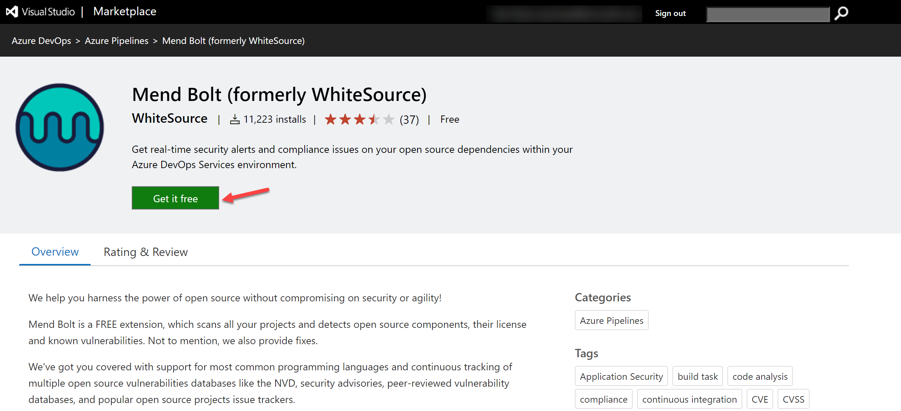

---
lab:
  title: Mettre en œuvre la sécurité et la conformité dans un pipeline Azure DevOps
  module: 'Module 07: Implement security and validate code bases for compliance'
---

# Mettre en œuvre la sécurité et la conformité dans un pipeline Azure DevOps

## Manuel de labo de l’étudiant

## Configuration de laboratoire requise

- Ce labo nécessite **Microsoft Edge** ou un [navigateur pris en charge par Azure DevOps](https://learn.microsoft.com/azure/devops/server/compatibility).

- **Configurez une organisation Azure DevOps :** si vous ne disposez pas encore d’une organisation Azure DevOps que vous pouvez utiliser pour ce labo, créez-en une conformément aux instructions disponibles dans [Créer une organisation ou une collection de projets](https://learn.microsoft.com/azure/devops/organizations/accounts/create-organization).

## Présentation du labo

Dans le cadre ce labo, vous utiliserez **Mend Bolt (anciennement WhiteSource)** pour détecter automatiquement les composants open source vulnérables, les bibliothèques obsolètes et les problèmes de conformité des licences dans votre code. Vous tirerez parti de WebGoat, une application web intentionnellement non sécurisée gérée par OWASP et conçue pour illustrer les problèmes courants de sécurité des applications web.

[Mend](https://www.mend.io/) est le leader de la gestion continue de la sécurité et de la conformité des logiciels open source. WhiteSource s’intègre à votre processus de génération, quels que soient votre langage de programmation, vos outils de génération ou vos environnements de développement. Il fonctionne automatiquement, en continu et en mode silencieux en arrière-plan pour vérifier la sécurité, les licences et la qualité de vos composants open source par rapport à la base de données WhiteSource complète et constamment mise à jour des référentiels open source.

Mend fournit Mend Bolt, une solution de sécurité et de gestion légère et open source développée spécifiquement pour l’intégration à Azure DevOps et Azure DevOps Server. Remarque : Mend Bolt travaille par projet et ne comprend pas de fonctionnalité d’alerte en temps réel. Cette fonctionnalité exige la **plateforme complète** qui est généralement recommandée aux équipes de développement de grande taille qui souhaitent automatiser leur gestion des ressources open source tout au long du cycle de vie du développement logiciels (des référentiels aux étapes post-déploiement) et dans l’ensemble des projets et produits.

L’intégration d’Azure DevOps avec Mend Bolt vous permet d’effectuer les tâches suivantes :

- Détecter et corriger les composants open source vulnérables.
- Générer des rapports d’inventaire complets open source par projet ou par build.
- Appliquer la conformité de licence open source, notamment les licences des dépendances.
- Identifier les bibliothèques open source obsolètes avec des recommandations de mise à jour.

## Objectifs

À la fin de ce labo, vous serez en mesure d’accomplir les tâches suivantes :

- Activer Mend Bolt.
- Exécuter un pipeline de build et passer en revue le rapport de sécurité et de conformité Mend.

## Durée estimée : 45 minutes

## Instructions

### Exercice 0 : configurer les prérequis du labo

Dans cet exercice, vous configurerez les prérequis du labo, qui se composent d’un nouveau projet Azure DevOps comprenant un référentiel basé sur [eShopOnWeb](https://github.com/MicrosoftLearning/eShopOnWeb).

#### Tâche 1 : (à ignorer si vous l’avez déjà effectuée) créer et configurer le projet d’équipe

Dans le cadre de cette tâche, vous créerez un projet Azure DevOps **eShopOnWeb** qui sera utilisé dans plusieurs labos.

1. Sur votre ordinateur de labo, ouvrez votre organisation Azure DevOps dans votre navigateur. Cliquez sur **Nouveau projet**. Nommez votre projet **eShopOnWeb** et ne modifiez pas les autres champs par défaut. Cliquez sur **Créer**.

    

#### Tâche 2 : (à ignorer si vous l’avez déjà effectuée) importer un référentiel Git eShopOnWeb

Dans le cadre de cette tâche, vous importerez le référentiel Git eShopOnWeb qui sera utilisé dans plusieurs labos.

1. Sur votre ordinateur de labo, ouvrez votre organisation Azure DevOps dans votre navigateur ainsi que le projet **eShopOnWeb** que vous venez de créer. Cliquez sur **Repos > Fichiers**, puis sur **Importer**. Dans la fenêtre **Importer un référentiel Git**, collez l’URL https://github.com/MicrosoftLearning/eShopOnWeb.git, puis cliquez sur **Importer** :

    

2. Le référentiel est organisé de la manière suivante :
    - Le dossier **.ado** contient des pipelines YAML Azure DevOps.
    - Conteneur de dossiers **.devcontainer** configuré pour le développement à l’aide de conteneurs (localement dans VS Code ou GitHub Codespaces).
    - Le dossier **.azure** contient l’infrastructure Bicep&ARM en tant que modèles de code utilisés dans certains scénarios de labos.
    - **Définitions de workflow GitHub YAML du conteneur de dossiers .github**.
    - Le dossier **src** contient le site web .NET 7 utilisé dans les scénarios de labo.

### Exercice 1 : mettre en œuvre la sécurité et la conformité dans un pipeline Azure DevOps à l’aide de Mend Bolt

Dans cet exercice, vous tirerez parti de Mend Bolt pour analyser le code du projet à la recherche de vulnérabilités de sécurité et de problèmes de conformité des licences, puis vous afficherez le rapport qui en résulte.

#### Tâche 1 : activer l’extension Mend Bolt

Dans le cadre de cette tâche, vous activerez WhiteSource Bolt dans le projet Azure Devops que vous venez de générer.

1. Sur votre ordinateur de labo, dans la fenêtre du navigateur web qui affiche le Portail Azure DevOps avec le projet **eShopOnWeb** ouvert, cliquez sur l’icône de la place de marché >**Parcourir la Place de marché**.

    

2. Sur la Place de marché, recherchez **Mend Bolt (anciennement WhiteSource)** et ouvrez-le. Mend Bolt est la version gratuite de l’outil auparavant appelé WhiteSource, qui analyse tous vos projets et détecte les composants open source, leur licence et leurs vulnérabilités connues.

    > Avertissement : veillez à sélectionner l’option Mend **Bolt** (**gratuite**).

3. Sur la page de **Mend Bolt (anciennement WhiteSource)**, cliquez sur **Obtenir gratuitement**.

    

4. Sur la page suivante, sélectionnez l’organisation Azure DevOps de votre choix, puis cliquez sur **Installer**. **Accédez à l’organisation** une fois Mend Bolt installé.

5. Dans votre Azure DevOps, accédez aux **paramètres de l’organisation** et sélectionnez **Mend** sous **Extensions**. Indiquez votre adresse e-mail professionnelle (**votre compte personnel de labo**, par exemple, en renseignant AZ400learner@outlook.com au lieu de student@microsoft.com), le nom de l’entreprise et d’autres renseignements, puis cliquez sur le bouton **Créer un compte** pour commencer à utiliser la version gratuite.

    

#### Tâche 2 : créer et déclencher une build

Dans le cadre de cette tâche, vous créerez et déclencherez un pipeline de build CI dans le projet Azure DevOps. Vous utiliserez l’extension **Mend Bolt** pour identifier les composants OSS vulnérables présents dans ce code.

1. Sur votre ordinateur de labo, revenez au projet Azure DevOps **eShopOnWeb**. Dans la barre de menus verticale à gauche de l’écran, accédez à la section **Pipelines > Pipelines** et cliquez sur **Créer un pipeline** (ou **Nouveau pipeline**).

2. Dans la fenêtre **Où se trouve votre code ?**, sélectionnez **Azure Repos Git (YAML)** et sélectionnez le **référentiel eShopOnWeb**.

3. Sous la section **Configurer**, choisissez **Fichier YAML Azure Pipelines existant**. Indiquez le chemin d’accès suivant : **/.ado/eshoponweb-ci-mend.yml**, puis cliquez sur **Continuer**.

    

4. Vérifiez le pipeline, puis cliquez sur **Exécuter**. Cette opération ne prendra que quelques minutes.
    > **Remarque** : le build peut prendre quelques minutes. La définition du build se compose des tâches suivantes :
    - Tâche **DotnetCLI** pour la restauration, la génération, le test et la publication du projet dotnet.
    - Tâche **Whitesource** (porte encore l’ancien nom) pour analyser les bibliothèques OSS à l’aide de l’outil Mend.
    - **Publier les artefacts** : les agents qui exécutent ce pipeline chargeront le projet web publié.

5. Pendant l’exécution du pipeline, **renommez-le** pour l’identifier plus facilement (le projet peut en effet être utilisé dans le cadre de plusieurs labos). Accédez à la section **Pipelines/Pipelines** du projet Azure DevOps, puis cliquez sur le nom du pipeline en cours d’exécution (il recevra un nom par défaut) et recherchez l’option **Renommer/Déplacer** après avoir cliqué sur l’icône des points de suspension. Renommez-le **eshoponweb-ci-mend**, puis cliquez sur **Enregistrer**.

    

6. Une fois l’exécution du pipeline terminée, vous pouvez examiner les résultats. Ouvrez la dernière exécution du pipeline **eshoponweb-ci-mend**. L’onglet Résumé affiche les journaux d’activité de l’exécution, ainsi que des détails connexes tels que la version (la validation) du référentiel utilisée, le type de déclencheur, les artefacts publiés, les tests pris en charge, etc.

7. Vous retrouverez l’analyse de sécurité OSS dans l’onglet **Mend Bolt**. Vous y verrez des détails sur l’inventaire utilisé, les vulnérabilités détectées (ainsi que des moyens de les résoudre) et un rapport intéressant sur les licences associées à la bibliothèque. Prenez le temps de passer en revue le rapport.

    

## Révision

Dans ce labo, vous allez utiliser **Mend Bolt avec Azure DevOps** pour détecter automatiquement les composants open source vulnérables, les bibliothèques obsolètes et les problèmes de conformité des licences dans votre code.
