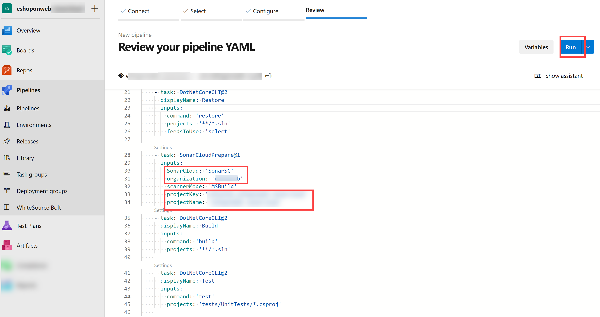
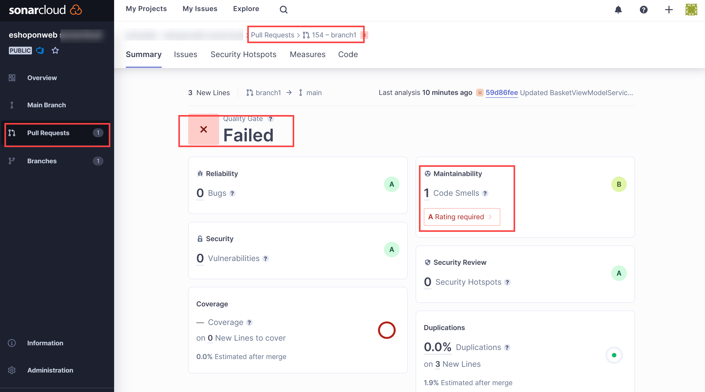

---
lab:
  title: "Gestion de la dette technique avec SonarCloud et Azure\_DevOps"
  module: 'Module 07: Implement security and validate code bases for compliance'
---

# Gestion de la dette technique avec SonarCloud et Azure DevOps

## Manuel de labo de l’étudiant

## Configuration de laboratoire requise

- Ce labo nécessite **Microsoft Edge** ou un [navigateur pris en charge par Azure DevOps](https://docs.microsoft.com/azure/devops/server/compatibility).

- **Configurez une organisation Azure DevOps :** si vous ne disposez pas encore d’une organisation Azure DevOps que vous pouvez utiliser pour ce labo, créez-en une conformément aux instructions disponibles dans [Créer une organisation ou une collection de projets](https://docs.microsoft.com/azure/devops/organizations/accounts/create-organization).

## Présentation du labo

Dans le contexte d’Azure DevOps, le terme de **dette technique** désigne des moyens non optimaux mis en œuvre pour atteindre des objectifs tactiques, ce qui entrave le succès des objectifs stratégiques dans le développement et le déploiement logiciel. La dette technique affecte la productivité, car le code est difficile à comprendre et sujet aux défaillances, les modifications prennent du temps et la validation est complexe. Sans une vue d’ensemble et une gestion appropriées, la dette technique peut s’accumuler au fil du temps et affecter considérablement la qualité générale du logiciel, ainsi que la productivité des équipes de développement à long terme.

[SonarCloud](https://sonarcloud.io/){:target="\_blank"} est un service de sécurité et de qualité du code basé sur le cloud. Voici quelques fonctionnalités principales de SonarCloud :

- Prise en charge de 23 langages de programmation et de script, notamment Java, JS, C#, C/C++, Objective-C, TypeScript, Python, ABAP, PLSQL et T-SQL.
- Il existe des milliers de règles permettant de suivre les bogues et les problèmes de qualité difficiles à trouver qui se basent sur de puissants analyseurs de code statiques.
- Intégrations basées sur le cloud avec des services CI populaires, notamment Travis, Azure DevOps, BitBucket et AppVeyor.
- Analyse approfondie du code pour explorer tous les fichiers sources dans les branches et les demandes de tirage (pull requests), ce qui permet d’atteindre une porte de qualité verte et de promouvoir la build.
- Vitesse et scalabilité.

Dans ce labo, vous allez découvrir comment intégrer Azure DevOps à SonarCloud.

> **Remarque** : avant d’exécuter ce labo, vérifiez que vous pouvez exécuter Azure Pipelines. En raison du changement apporté aux projets publics en février 2021, l’accès aux pipelines doit être demandé : <https://devblogs.microsoft.com/devops/change-in-azure-pipelines-grant-for-public-projects/>

## Objectifs

À la fin de ce labo, vous serez en mesure d’effectuer les tâches suivants :

- Configurer un projet Azure DevOps et une build CI pour l’intégrer à SonarCloud.
- Analyser les rapports SonarCloud.
- Intégrer l’analyse statique au processus de demande de tirage (pull request) Azure DevOps.

## Durée estimée : 60 minutes

## Instructions

### Exercice 0 : configurer les prérequis du labo

Dans cet exercice, vous allez configurer les prérequis pour le labo, qui se composent d’un nouveau projet Azure DevOps avec un référentiel basé sur [eShopOnWeb](https://github.com/MicrosoftLearning/eShopOnWeb).

#### Tâche 1 : (passer si terminée) créer et configurer le projet d’équipe

Dans cette tâche, vous allez créer un projet Azure DevOps **eShopOnWeb** à utiliser par plusieurs labos.

1. Sur votre ordinateur de labo, dans une fenêtre de navigateur, ouvrez votre organisation Azure DevOps. Cliquez sur **Nouveau projet**. Donnez au projet le nom **eShopOnWeb**, puis choisissez **Scrum** dans la liste déroulante **Processus d’élément de travail**. Cliquez sur **Créer**.

    

#### Tâche 2 : (passer si terminée) importer le référentiel Git eShopOnWeb

Dans cette tâche, vous allez importer le référentiel Git eShopOnWeb qui sera utilisé par plusieurs labos.

1. Sur votre ordinateur de labo, dans une fenêtre de navigateur, ouvrez votre organisation Azure DevOps et le projet **eShopOnWeb** créé précédemment. Cliquez sur **Dépôts > Fichiers**, **Importer**. Dans la fenêtre **Importer un dépôt Git**, collez l’URL <https://github.com/MicrosoftLearning/eShopOnWeb.git>, puis cliquez sur **Importer** :

    

1. Le référentiel est organisé de la manière suivante :
    - Le dossier **.ado** contient des pipelines YAML Azure DevOps.
    - Conteneur de dossiers **.devcontainer** configuré pour le développement à l’aide de conteneurs (localement dans VS Code ou GitHub Codespaces).
    - Le dossier **infra** contient l’infrastructure Bicep&ARM sous forme de modèles de code utilisés dans certains scénarios de labo.
    - **Définitions de workflow GitHub YAML du conteneur de dossiers .github**.
    - Le dossier **src** contient le site web .NET 8 utilisé dans les scénarios de labo.

### Exercice 1 : Configurer l’installation de SonarCloud

#### Tâche 1 : changer votre projet Azure DevOps en Public

Dans cette tâche, vous allez rendre votre projet Azure DevOps public, car SonarCloud est gratuit pour les projets ADO publics.

1. Sur l’ordinateur de labo, dans la fenêtre du navigateur web affichant le portail Azure DevOps, ouvrez votre projet **eShopOnWeb**, puis cliquez sur **Paramètres du projet** (coin inférieur gauche). Définissez **Visibilité** sur **Public**. Cliquez sur **Enregistrer**.


#### Tâche 2 : générer un jeton d’accès personnel Azure DevOps

Dans cette tâche, vous allez générer un jeton d’accès personnel Azure DevOps qui sera utilisé pour vous authentifier à partir de l’application Postman que vous allez installer dans la prochaine tâche de cet exercice.

1. Sur l’ordinateur de labo, dans la fenêtre du navigateur web affichant le portail Azure DevOps, dans le coin supérieur droit de la page Azure DevOps, cliquez sur l’icône **Paramètres utilisateur**. Dans le menu déroulant, cliquez sur **Jetons d’accès personnels**, puis, dans le volet **Jetons d’accès personnels**, cliquez sur **+ Nouveau jeton**.

    

1. Dans le volet **Créer un jeton d’accès personnel**, cliquez sur le lien **Afficher toutes les étendues**, spécifiez les paramètres suivants, puis cliquez sur **Créer** (conservez la valeur par défaut de tous les autres paramètres) :

     | Paramètre | Valeur |
     | --- | --- |
     | Nom | **Labo de gestion de la dette technique avec SonarCloud et Azure DevOps** |
     | Étendues | **Définition personnalisée** |
     | Étendue | **Code** |
     | Autorisations | **Complète** |

1. Dans le volet **Réussite**, copiez la valeur du jeton d’accès personnel dans le Presse-papiers.

     > **Remarque** : assurez-vous d’enregistrer la valeur du jeton. Vous ne pourrez plus la récupérer après avoir fermé ce volet.

1. Dans le volet **Réussite**, cliquez sur **Fermer**.

#### Tâche 3 : installer et configurer l’extension SonarCloud Azure DevOps

Dans cette tâche, vous allez installer et configurer l’extension SonarCloud Azure DevOps dans votre projet Azure DevOps.

1. Sur votre ordinateur de labo, démarrez un navigateur web, accédez à la page de l’extension [SonarCloud](https://marketplace.visualstudio.com/items?itemName=SonarSource.sonarcloud) sur Visual Studio Marketplace, cliquez sur **Obtenir gratuitement**, vérifiez que le nom de votre organisation Azure DevOps apparaît dans la liste déroulante **Sélectionner une organisation Azure DevOps**, puis cliquez sur **Installer**.
1. Une fois l’installation terminée, cliquez sur **Passer à l’organisation**. Cela redirige le navigateur vers le portail Azure DevOps affichant la page d’accueil de votre organisation.

    > **Remarque** : si vous ne disposez pas des autorisations appropriées pour installer une extension à partir de Marketplace, une requête est envoyée à l’administrateur de compte pour lui demander d’approuver l’installation.

    > **Remarque** : l’extension SonarCloud contient des tâches de génération, des modèles de build et un widget de tableau de bord personnalisé.

1. Dans la fenêtre du navigateur web, accédez à la **page d’accueil de SonarCloud**[https://sonarcloud.io/](https://sonarcloud.io/).
1. Dans la page d’accueil de SonarCloud, cliquez sur **Se connecter**.
1. Dans la **section de connexion ou d’inscription à SonarCloud**, cliquez sur l’option **Azure DevOps**.
1. Si vous êtes invité à **Autoriser cette application à accéder à vos informations ?**, cliquez sur **Oui**. Si vous y êtes invité, sélectionnez **Consentement pour le compte de votre organisation**, puis **Accepter**.

    > **Remarque** : dans SonarCloud, vous allez créer une organisation et, au sein de celle-ci, un nouveau projet. L’organisation et le projet que vous avez configurés dans SonarCloud reflètent l’organisation et le projet que vous avez configurés dans Azure DevOps.

1. Cliquez sur **Importer une organisation à partir d’Azure**.

    

1. Dans la page **Créer une organisation**, dans la zone de texte **Nom de l’organisation Azure DevOps**, saisissez le nom de votre organisation Azure DevOps, dans la zone de texte **Jeton d’accès personnel**, collez la valeur du jeton Azure DevOps que vous avez enregistré dans la tâche précédente, puis cliquez sur **Continuer**. **Ce jeton sera utilisé par Sonarcloud pour analyser votre code hébergé dans Azure DevOps**

1. Dans la section **Importer les détails de l’organisation**, dans la zone de texte **Clé**, saisissez une chaîne de caractères qui désignera votre organisation SonarCloud, donnez-lui le même nom que votre organisation Azure DevOps, puis cliquez sur **Continuer**.

    > **Remarque** : la clé doit être unique dans le système SonarCloud. Assurez-vous qu’une coche verte apparaît à droite de la zone de texte **Clé**. Cela indique que la clé satisfait la condition préalable d’unicité.

1. Dans la section **Choisir un plan**, sélectionnez le plan que vous envisagez d’utiliser pour ce labo (**gratuit** est suggéré), puis cliquez sur **Créer une organisation**.

    > **Remarque** : vous avez maintenant créé l’organisation SonarCloud qui reflète votre organisation Azure DevOps.

    > **Remarque** : dans l’organisation nouvellement créée, vous allez ensuite créer un projet SonarCloud qui reflète le projet Azure DevOps **SonarExamples**.

1. Dans la page **Analyser les projets – Sélectionner des référentiels**, dans la liste des projets Azure DevOps, cochez la case en regard de l’entrée **eshoponweb / eshoponweb**, puis cliquez sur **Configurer**.
1. Dans la page **Choisir votre méthode d’analyse**, cliquez sur la vignette **Avec Azure DevOps Pipelines**.

    

    > **Remarque** : vous pouvez ignorer la création de l’extension si vous l’avez déjà installée.

1. Dans la page **Analyser un projet avec Azure Pipelines**, dans **Ajouter un nouveau point de terminaison de service SonarCloud**, suivez les étapes mentionnées **dans votre projet Azure DevOps**, donnez le nom **SonarSC** à la connexion de service, **cochez** la case pour accorder l’accès à tous les pipelines, puis cliquez sur **Vérifier et enregistrer**.

    

    > **Remarque** : cette étape définit la façon dont votre pipeline Azure communique avec SonarCloud. SonarCloud vous fournit un jeton utilisé par vos pipelines pour communiquer avec le service.

1. Sur votre ordinateur de labo, à partir du projet Azure DevOps **eShopOnWeb**, dans la barre de menus verticale à gauche, accédez à la section **Pipelines > Pipelines**, cliquez sur **Créer un pipeline** (ou sur **Nouveau pipeline**).

1. Dans la fenêtre **Où se trouve votre code ?**, sélectionnez **Azure Repos Git (YAML)**, puis sélectionnez le référentiel **eShopOnWeb**.

1. Dans la section **Configurer**, choisissez **Fichier YAML Azure Pipelines existant**. Sélectionnez la branche : **principale**, indiquez le chemin d’accès suivant **/.ado/eshoponweb-sonar-ci.yml**, puis cliquez sur **Continuer**. Passez en revue le pipeline avec les détails mentionnés à l’étape suivante **(certains paramètres doivent être remplacés)**.

1. De retour sur le site web SonarCloud, dans la page **Analyser un projet avec Azure Pipelines**, dans la section **Configurer Azure Pipelines**, cliquez sur **.NET**. Une séquence d’étapes requises s’affiche pour **Préparer la configuration de l’analyse**, **Exécuter l’analyse du code** et **Publier le résultat de la porte de qualité**. Vous aurez besoin de ces instructions pour **modifier la tâche « Préparer la configuration de l’analyse » sur le pipeline YAML fourni à l’étape précédente**.

1. Une fois le pipeline modifié, cliquez sur **Exécuter**.

    

1. Vous devrez peut-être redéfinir la **Visibilité** du projet Azure DevOps sur **Privé** pour que les agents puissent exécuter le pipeline (Paramètres du projet > Vue d’ensemble)

1. Dans **Azure DevOps Pipelines > Pipelines**, cliquez sur le pipeline récemment créé et renommez-le en **eshoponweb-sonar-ci**.

    

#### Tâche 3 : vérifier les résultats du pipeline

Dans cette tâche, vous allez vérifier les résultats du pipeline.

1. Attendez que l’exécution du pipeline se termine, passez en revue le contenu de l’onglet **Résumé**, puis cliquez sur l’en-tête de l’onglet **Extensions**.

    > **Remarque** : vous n’aurez pas encore d’informations sur la porte de qualité (Aucun), car nous ne l’avons pas encore configurée dans SonarCloud.

1. Dans l’onglet **Extensions**, cliquez sur le **Rapport détaillé SonarCloud**. Un nouvel onglet de navigateur affichant le rapport sur votre page de projet SonarCloud s’ouvre automatiquement.

    > **Remarque** : vous pouvez également accéder à votre projet SonarCloud.

1. Vérifiez que le rapport n’inclut pas les résultats de la porte de qualité et notez la raison de leur absence.

    > **Remarque** : Pour pouvoir voir le résultat des critères de qualité, après l’exécution du premier rapport, nous devons définir une **nouvelle définition de code**. Les exécutions de pipeline suivantes incluront ainsi des résultats de la porte de qualité. **La porte de qualité par défaut s’assure qu’il n’y a pas de nouvelle vulnérabilité/nouveau bogue dans le code, en ignorant les existants. Vous pouvez créer vos propres portes de qualité personnalisées.**

1. Cliquez sur **Définir la nouvelle définition de code**, puis sélectionnez **Version précédente**.

    

1. Basculez vers le navigateur web dans le **portail Azure DevOps** avec l’exécution de build la plus récente, cliquez sur **Exécuter nouveau** puis, dans le volet **Exécuter le pipeline**, cliquez sur **Exécuter**.
1. Dans le volet d’exécution de build, passez en revue le contenu de l’onglet **Résumé**, puis cliquez sur l’en-tête de l’onglet **Extensions**.
1. Dans l’onglet **Extensions**, cliquez sur le **Rapport détaillé SonarCloud**. Un nouvel onglet de navigateur affichant le rapport sur votre page de projet SonarCloud s’ouvre automatiquement.
1. Vérifiez que le rapport et l’onglet de l’**extension**  Azure DevOps inclut désormais le **résultat de la porte de qualité**.

    

### Exercice 2 : analyser des rapports SonarCloud

Dans cet exercice, vous allez analyser des rapports SonarCloud.

#### Tâche 1 : analyser des rapports SonarCloud

Dans cette tâche, vous allez analyser des rapports SonarCloud.

1. Dans l’onglet **Vue d’ensemble** du projet SonarCloud, nous voyons un résumé du rapport sur l’**évolution de la branche principale**. Si vous cliquez sur l’icône **Branche principale** (colonne de gauche) et que vous choisissez **Code global**, vous verrez un rapport plus détaillé.

    

    > **Remarque** : la page comporte des métriques telles que **Odeurs de code**, **Couverture**, **Duplications** et **Taille** (lignes de code). Le tableau suivant décrit brièvement chacun de ces termes.

    | Conditions | Description |
    | --- | --- |
    | **Bogues** | Problème qui représente une erreur dans le code. S’il n’est pas déjà rompu, il le sera, et cela arrivera probablement au pire moment. Il doit être corrigé. |
    | **Vulnerabilities** | Problème lié à la sécurité qui représente une porte dérobée potentielle pour les attaquants |
    | **Odeurs de code** | Problème lié à la maintenabilité dans le code. Le laisser tel quel signifie que, au mieux, les mainteneurs rencontreront plus de difficultés qu’ils ne le devraient lors de l’apport de modifications ultérieures. Au pire, ils seront tellement confus par l’état du code qu’ils introduiront des erreurs supplémentaires au fur et à mesure qu’ils apporteront des modifications. |
    | **Couverture** | Indication du pourcentage de code en cours de validation par des tests tels que des tests unitaires. Pour apporter une protection efficace contre les bogues, vos tests doivent s’effectuer sur ou « couvrir » une proportion importante de votre code. |
    | **Duplications** | La décoration des duplications indique quelles parties du code source sont dupliquées. |
    | **Points d’accès de sécurité** | Code sensible à la sécurité qui nécessite une révision manuelle pour évaluer s’il existe ou non une vulnérabilité. |

1. Cliquez sur le nombre désignant le nombre de **bogues**. Le contenu de l’onglet **Problèmes** s’affiche automatiquement.
1. Sur le côté droit de l’onglet **Problèmes**, cliquez pour ouvrir les bogues. Lisez la description et les informations fournies pour analyser et résoudre le bogue.

1. Pointez avec le pointeur de la souris sur les lignes rouges verticales entre le code et les numéros de ligne pour identifier les lacunes dans la couverture du code.

    > **Remarque** : notre exemple de projet est très petit et ne comporte pas de données historiques. Il existe toutefois des milliers de [projets publics sur SonarCloud](https://sonarcloud.io/explore/projects) qui comportent des résultats plus intéressants et réalistes.

### Exercice 3 : implémenter l’intégration des demandes de tirage Azure DevOps avec SonarCloud

Dans cet exercice, vous allez configurer l’intégration des demandes de tirage entre Azure DevOps et SonarCloud.

> **Remarque** : pour configurer l’analyse SonarCloud afin d’effectuer l’analyse du code inclus dans une demande de tirage (pull request) Azure DevOps, vous devez effectuer les tâches suivantes :

- Ajoutez un jeton d’accès personnel Azure DevOps à un projet SonarCloud, qui autorise son accès aux demandes de tirage (déjà créées dans ce labo).
- Configurer une stratégie de branche Azure DevOps qui contrôle une build déclenchée par une demande de tirage (pull request)

#### Tâche 1 : configurer l’intégration des demandes de tirage dans SonarCloud

Dans cette tâche, vous allez configurer l’intégration des demandes de tirage dans SonarCloud en affectant un jeton d’accès personnel Azure DevOps à votre projet SonarCloud.

1. Basculez vers la fenêtre du navigateur web affichant le projet **eShopOnWeb** dans **SonarCloud**.
1. Dans la page du tableau de bord du projet, cliquez sur l’icône de l’onglet **Administration** puis, dans le menu déroulant, cliquez sur **Paramètres généraux**.
1. Dans la page **Paramètres généraux**, cliquez sur **Demandes de tirage**.
1. Dans la section **Général** des paramètres **Demandes de tirage**, dans la liste déroulante **Fournisseur**, sélectionnez **Azure DevOps Services**, puis cliquez sur **Enregistrer**.
1. Dans la section **Intégration à Azure DevOps Services** des paramètres **Demandes de tirage**, dans la zone de texte **Jeton d’accès personnel**, collez le jeton d’accès personnel Azure DevOps précédemment généré, puis cliquez sur **Enregistrer**.

    

#### Tâche 2 : configurer une stratégie de branche pour l’intégration à SonarCloud

Dans cette tâche, vous allez configurer une stratégie de branche Azure DevOps pour l’intégration à SonarCloud.

1. Basculez vers la fenêtre du navigateur web affichant le projet **eShopOnWeb** dans le **portail Azure DevOps**.
1. Dans la barre de menus verticale située à l’extrême gauche du portail Azure DevOps, cliquez sur **Repos** puis, dans la section **Repos**, cliquez sur **Branches**.
1. Dans le volet **Branches**, dans la liste des branches, pointez avec le pointeur de la souris sur le bord droit de l’entrée de branche **principale** pour afficher le caractère d’ellipse verticale désignant le menu **Plus d’options**, cliquez dessus puis, dans le menu contextuel, cliquez sur **Stratégies de branche**.
1. Dans le volet **principale**, à droite de la section **Validation de build**, cliquez sur **+**.
1. Dans le volet **Ajouter une stratégie de build**, dans la liste déroulante **Pipeline de build**, sélectionnez le pipeline que vous avez créé précédemment dans ce labo, dans la zone de texte **Nom d’affichage**, saisissez **Analyse SonarCloud**, puis cliquez sur **Enregistrer**.

    > **Remarque** : Azure DevOps est maintenant configuré pour déclencher une analyse SonarCloud lorsqu’une demande de tirage (pull request) ciblant la branche **principale** est créée.

#### Tâche 4 : valider l’intégration des demandes de tirage

Dans cette tâche, vous allez valider l’intégration des demandes de tirage entre Azure DevOps et SonarCloud en créant une demande de tirage (pull request) et en passant en revue le résultat obtenu.

> **Remarque** : vous allez apporter une modification à un fichier dans le référentiel et créer une demande pour déclencher l’analyse SonarCloud.

1. Dans le portail Azure DevOps, dans la barre de menus verticale à gauche, cliquez sur **Repos**. Le volet **Fichiers** s’affiche.
1. Dans le volet central, dans la hiérarchie des dossiers, accédez au fichier **Program.cs** dans le dossier **src/Web/Services/BasketViewModelService.cs**, puis cliquez sur **Modifier**.
1. Dans le volet **BasketViewModelService.cs**, ajoutez la méthode vide suivante au code directement avant le dernier « } » :

    ```csharp
    public void Unused(){

    }
    ```

1. Dans le volet **Program.cs**, cliquez sur **Valider**.
1. Dans le volet **Valider**, dans la zone de texte **Nom de la branche**, saisissez **branch1**, cochez la case **Créer une demande de tirage**, puis cliquez sur **Valider**.

    

1. Dans le volet **Nouvelle demande de tirage**, sélectionnez **Créer**.
1. Dans l’onglet **Vue d’ensemble** du volet **Program.cs** mis à jour, surveillez la progression du processus de génération jusqu’à sa fin.
1. Le pipeline réussit, mais 1 contrôle facultatif échoue.
1. SonarCloud décorera également votre demande de tirage (pull request) avec des commentaires pour vos pratiques récentes non recommandées. Vous pouvez également consulter le rapport complet dans SonarCloud pour plus d’informations.

    

#### Tâche 4 : bloquer les demandes de tirage en réponse à l’échec des contrôles de qualité du code

Dans cette tâche, vous allez configurer le blocage des demandes de tirage en réponse à l’échec de contrôles de qualité du code.

> **Remarque** : à ce stade, il est toujours possible de terminer la demande de tirage (pull request) et de valider les modifications correspondantes, même si des contrôles de qualité du code échouent. Vous allez modifier la configuration d’Azure DevOps pour bloquer la validation, sauf si les contrôles de qualité du code appropriés aboutissent.

1. Dans le portail Azure DevOps, dans le coin inférieur gauche, cliquez sur **Paramètres du projet**.
1. Dans le menu vertical **Paramètres du projet**, dans la section **Repos**, cliquez sur **Référentiels**.
1. Dans le volet **Tous les dépôts**, cliquez sur **eShopOnWeb**.
1. Dans le volet **eShopOnWeb**, cliquez sur l’en-tête de l’onglet **Stratégies**.
1. Dans la liste des **Stratégies**, faites défiler jusqu’à la liste des branches, puis cliquez sur l’entrée représentant la branche **principale**.
1. Dans le volet **principale**, faites défiler jusqu’à la section **Vérifications d’état**, puis cliquez sur **+**.
1. Dans le volet **Ajouter une stratégie d’état**, dans la liste déroulante **État à vérifier**, sélectionnez l’entrée **SonarCloud/porte de qualité**, vérifiez que l’option **Condition de stratégie** est définie sur **Obligatoire**, puis cliquez sur **Enregistrer**.

    > **Remarque** : à ce stade, les utilisateurs **ne peuvent pas fusionner la demande de tirage (pull request) tant que le contrôle de qualité du code n’a pas réussi**. Cela nécessite que tous les problèmes identifiés par SonarCloud aient été résolus ou marqués comme **confirmés** ou **résolus** dans le projet SonarCloud correspondant.

## Révision

Dans ce labo, vous avez découvert comment intégrer Azure DevOps Services à SonarCloud.
