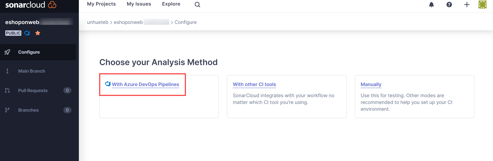

---
lab:
  title: Gestion de la dette technique avec SonarQube et Azure DevOps
  module: 'Module 07: Implement security and validate code bases for compliance'
---

# Gestion de la dette technique avec SonarQube et Azure DevOps

## Manuel de labo de l’étudiant

## Configuration de laboratoire requise

- Ce labo nécessite **Microsoft Edge** ou un [navigateur pris en charge par Azure DevOps](https://docs.microsoft.com/azure/devops/server/compatibility).

- **Configurez une organisation Azure DevOps :** si vous ne disposez pas encore d’une organisation Azure DevOps que vous pouvez utiliser pour ce labo, créez-en une conformément aux instructions disponibles dans [Créer une organisation ou une collection de projets](https://docs.microsoft.com/azure/devops/organizations/accounts/create-organization).

## Présentation du labo

Dans le contexte d’Azure DevOps, le terme de **dette technique** désigne des moyens non optimaux mis en œuvre pour atteindre des objectifs tactiques, ce qui entrave le succès des objectifs stratégiques dans le développement et le déploiement logiciel. La dette technique affecte la productivité, car le code est difficile à comprendre et sujet aux défaillances, les modifications prennent du temps et la validation est complexe. Sans une vue d’ensemble et une gestion appropriées, la dette technique peut s’accumuler au fil du temps et affecter considérablement la qualité générale du logiciel, ainsi que la productivité des équipes de développement à long terme.

[SonarCloud](https://sonarcloud.io/){:target="\_blank"} est un service informatique de sécurité et de qualité du code. Voici quelques fonctionnalités principales de SonarCloud :

- Prise en charge de 23 langages de programmation et de script, notamment Java, JS, C#, C/C++, Objective-C, TypeScript, Python, ABAP, PLSQL et T-SQL.
- Il existe des milliers de règles permettant de suivre les bogues et les problèmes de qualité difficiles à trouver qui se basent sur de puissants analyseurs de code statiques.
- Intégrations basées sur le cloud avec des services CI populaires, notamment Travis, Azure DevOps, BitBucket et AppVeyor.
- Analyse approfondie du code pour explorer tous les fichiers sources dans les branches et les demandes de tirage (pull requests), ce qui permet d’atteindre une porte de qualité verte et de promouvoir la build.
- Vitesse et scalabilité.

Dans ce labo, vous allez découvrir comment intégrer Azure DevOps à SonarCloud.

> **Remarque** : avant d’exécuter ce labo, vérifiez que vous pouvez exécuter Azure Pipelines. En raison du changement apporté aux projets publics en février 2021, l’accès aux pipelines doit être demandé : <https://devblogs.microsoft.com/devops/change-in-azure-pipelines-grant-for-public-projects/>

## Objectifs

À la fin de ce labo, vous serez en mesure d’accomplir les tâches suivantes :

- Configurer un projet Azure DevOps et une build CI pour l’intégrer à SonarCloud.
- Analyser les rapports SonarCloud.
- Intégrer l’analyse statique au processus de demande de tirage (pull request) Azure DevOps.

## Durée estimée : 60 minutes

## Instructions

### Exercice 0 : configurer les prérequis du labo

Dans cet exercice, vous configurerez les prérequis du labo, qui se composent d’un nouveau projet Azure DevOps comprenant un référentiel basé sur [eShopOnWeb](https://github.com/MicrosoftLearning/eShopOnWeb).

#### Tâche 1 : (à ignorer si vous l’avez déjà effectuée) créer et configurer le projet d’équipe

Dans le cadre de cette tâche, vous créerez un projet Azure DevOps **eShopOnWeb** qui sera utilisé dans plusieurs labos.

1. Sur votre ordinateur de labo, ouvrez votre organisation Azure DevOps dans votre navigateur. Cliquez sur **Nouveau projet**. Nommez votre projet **eShopOnWeb** et sélectionnez **Scrum** dans la liste déroulante **Processus d’élément de travail**. Cliquez sur **Créer**.

    

#### Tâche 2 : (à ignorer si vous l’avez déjà effectuée) importer un référentiel Git eShopOnWeb

Dans le cadre de cette tâche, vous importerez le référentiel Git eShopOnWeb qui sera utilisé dans plusieurs labos.

1. Sur votre ordinateur de labo, ouvrez votre organisation Azure DevOps dans votre navigateur ainsi que le projet **eShopOnWeb** que vous venez de créer. Cliquez sur **Repos > Fichiers**, puis sur **Importer**. Dans la fenêtre **Importer un référentiel Git**, collez l’URL https://github.com/MicrosoftLearning/eShopOnWeb.git, puis cliquez sur **Importer** :

    

2. Le référentiel est organisé de la manière suivante :
    - Le dossier **.ado** contient des pipelines YAML Azure DevOps.
    - Conteneur de dossiers **.devcontainer** configuré pour le développement à l’aide de conteneurs (localement dans VS Code ou GitHub Codespaces).
    - Le dossier **.azure** contient l’infrastructure Bicep&ARM en tant que modèles de code utilisés dans certains scénarios de labos.
    - **Définitions de workflow GitHub YAML du conteneur de dossiers .github**.
    - Le dossier **src** contient le site web .NET 7 utilisé dans les scénarios de labo.

### Exercice 1 : configurer l’installation de Sonarcloud

#### Tâche 1 : rendre public votre projet Azure DevOps

Dans le cadre de cette tâche, vous passerez la visibilité de votre projet Azure DevOps sur publique, puisque Sonarcloud est gratuit pour les projets ADO publics.

1. Sur l’ordinateur de labo, dans la fenêtre du navigateur web qui affiche le Portail Azure DevOps, ouvrez votre projet **eShopOnWeb** et cliquez sur **Paramètres du projet** (dans le coin inférieur gauche). Passez le réglage **Visibilité** à **Public**. Cliquez sur **Enregistrer**.


#### Tâche 2 : générer un jeton d’accès personnel Azure DevOps

Dans le cadre de cette tâche, vous générerez un jeton d’accès personnel Azure DevOps qui sera utilisé pour l’authentification à partir de l’application Postman que vous installerez lors de la prochaine tâche de cet exercice.

1. Revenez à la fenêtre du navigateur web qui affiche le Portail Azure DevOps sur l’ordinateur du labo. Dans le coin supérieur droit de la page Azure DevOps, cliquez sur l’icône **Paramètres utilisateur**, puis, dans le menu déroulant qui s’affiche, cliquez sur **Jetons d’accès personnels**. Dans le volet **Jetons d’accès personnels**, sélectionnez **+ Nouveau jeton**.

    

2. Dans le volet **Créer un jeton d’accès personnel**, cliquez sur le lien **Afficher toutes les étendues**. Spécifiez les paramètres suivants, puis cliquez sur **Créer** (ne modifiez pas les autres valeurs par défaut) :

     | Paramètre | Valeur |
     | --- | --- |
     | Nom | **Labo : gestion de la dette technique avec SonarQube et Azure DevOps** |
     | Étendues | **Définition personnalisée** |
     | Étendue | **Code** |
     | Autorisations | **Complète** |

3. Dans le volet **Opération réussie**, copiez la valeur du jeton d’accès personnel dans le presse-papiers.

     > **Remarque** : assurez-vous d’enregistrer la valeur du jeton. Vous ne pourrez plus le récupérer une fois ce volet fermé.

4. Dans le volet **Opération réussie**, cliquez sur **Fermer**.

#### Tâche 3 : installer et configurer l’extension SonarCloud Azure DevOps

Dans le cadre de cette tâche, vous installerez et configurerez l’extension SonarCloud Azure DevOps dans votre projet Azure DevOps.

1. Lancez un navigateur web sur votre ordinateur de labo, puis accédez à la [page de l’extension SonarCloud](https://marketplace.visualstudio.com/items?itemName=SonarSource.sonarcloud) sur la Visual Studio Marketplace. Cliquez sur **Obtenir gratuitement**, vérifiez que le nom de votre organisation Azure DevOps apparaît dans la liste déroulante **Sélectionner une organisation** Azure Devops, puis cliquez sur **Installer**.
2. Une fois l’installation terminée, cliquez sur **Poursuivre vers l’organisation**. Le navigateur rouvre le Portail Azure DevOps et affiche la page d’accueil de votre organisation.

    > **Remarque** : Si vous n’avez pas les autorisations appropriées pour installer une extension à partir de la Place de marché, une requête est envoyée à l’administrateur de compte pour lui demander d’approuver l’installation.

    > **Remarque** : l’extension SonarCloud contient des tâches de génération, des modèles de build et un widget de tableau de bord personnalisé.

3. Dans la fenêtre du navigateur web, accédez à la **page d’accueil de SonarCloud** [https://sonarcloud.io/](https://sonarcloud.io/).
4. Sur la page d’accueil de SonarCloud, cliquez sur **Ouvrir une session**.
5. Sur la page **Ouvrir une session ou s’inscrire à SonarCloud**, sélectionnez l’option **Azure DevOps**.
6. Si le message **Autoriser cette application à accéder à vos informations ?** apparaît à l’écran, cliquez sur **Oui**. Si vous y êtes invité, sélectionnez **Consentement pour le compte de votre organisation**, puis **Accepter**.

    > **Remarque** : vous créerez une organisation dans SonarCloud, et un nouveau projet au sein de celle-ci. L’organisation et le projet que vous avez configurés dans SonarCloud reflètent ceux que vous avez configurés dans Azure DevOps.

7. Cliquez sur **Importer une organisation à partir d’Azure**.

    

8. Dans la zone de texte **Nom de l’organisation Azure DevOps** de la page **Créer une organisation**, saisissez le nom de votre organisation Azure DevOps. Dans la zone de texte **Jeton d’accès personnel**, collez la valeur du jeton Azure DevOps que vous avez copiée lors de la tâche précédente, puis cliquez sur **Continuer**. **Sonarcloud utilisera ce jeton pour analyser votre code hébergé dans Azure DevOps**

9. Dans la zone de texte **Clé** de la section **Importer les détails de l’organisation**, saisissez une chaîne de caractères qui désignera votre organisation Sonarcloud. Donnez-lui le même nom que votre organisation Azure DevOps, puis cliquez sur **Continuer**.

    > **Remarque** : la clé doit être unique dans le système SonarCloud. Assurez-vous qu’une coche verte apparaît à droite de la zone de texte **Clé**. Cela indique que la clé est bien unique au sein du système.

10. Dans la section **Sélectionner un plan**, choisissez le plan que vous envisagez d’utiliser pour ce labo (nous vous conseillons l’option **gratuite**), puis cliquez sur **Créer une organisation**.

    > **Remarque** : vous venez de créer l’organisation SonarCloud qui reflète votre organisation Azure DevOps.

    > **Remarque** : vous créerez ensuite au sein de cette nouvelle organisation un projet SonarCloud qui reflète le projet Azure DevOps **SonarExamples**.

11. Rendez-vous sur la page **Analyser les projets : sélectionner des référentiels**. Dans la liste des projets Azure DevOps, cochez la case en regard de l’entrée **eshoponweb / eshoponweb ** et cliquez sur **Configurer**.
12. Sur la page **Sélectionner une méthode d’analyse**, cliquez sur la vignette **Avec les pipelines Azure DevOps**.

    

    > **Remarque** : vous pouvez ignorer la création de l’extension si vous l’avez déjà installée.

13. Dans la section **Ajouter un nouveau point de terminaison de service Sonarcloud** de la page **Analyser un projet avec Azure Pipelines**, suivez les étapes citées **dans votre projet Azure DevOps**. Nommez la connexion de services **SonarSC**, **cochez** la case activant l’accès à tous les pipelines, puis cliquez sur **Vérifier et enregistrer**.

    

    > **Remarque** : cette étape définit la façon dont votre pipeline Azure communique avec Sonarcloud. Sonarcloud vous fournit un jeton utilisé par vos pipelines pour communiquer avec le service.

14. Sur votre ordinateur de labo, revenez au projet Azure DevOps **eShopOnWeb**. Dans la barre de menus verticale à gauche de l’écran, accédez à la section **Pipelines > Pipelines** et cliquez sur **Créer un pipeline** (ou **Nouveau pipeline**).

15. Dans la fenêtre **Où se trouve votre code ?**, sélectionnez **Azure Repos Git (YAML)** et sélectionnez le **référentiel eShopOnWeb**.

16. Sous la section **Configurer**, choisissez **Fichier YAML Azure Pipelines existant**. Indiquez le chemin d’accès suivant : **/.ado/eshoponweb-sonar-ci.yml**, puis cliquez sur **Continuer**. Passez en revue le pipeline avec les informations citées à l’étape suivante **(certains paramètres doivent être remplacés)**.

17. Revenez au site web de Sonarcloud. Dans la section **Configurer Azure Pipelines** de la page **Analyser un projet avec Azure Pipelines**, cliquez sur **.NET**. Une séquence d’étapes requises pour **préparer la configuration de l’analyse**, **exécuter l’analyse du code** et **publier le résultat de la porte de qualité** s’affiche alors. Vous aurez besoin de ces instructions pour **modifier la tâche « Préparer la configuration de l’analyse » sur le pipeline YAML fourni à l’étape précédente**.

18. Une fois le pipeline modifié, cliquez sur **Exécuter**.

    

19. Vous devrez peut-être repasser la **visibilité** du projet Azure DevOps à **Privé** de manière à ce que les agents puissent exécuter le pipeline (Paramètres du projet > Vue d’ensemble).

20. Dans Azure DevOps : **Pipelines > Pipelines**, cliquez sur le pipeline que vous venez de créer et renommez-le **eshoponweb-sonar-ci**.

    

#### Tâche 3 : vérifier les résultats du pipeline

Dans le cadre de cette tâche, vous vérifierez les résultats du pipeline.

1. Attendez la fin de l’exécution du pipeline, puis examinez le contenu de l’onglet **Résumé**. Cliquez ensuite sur l’en-tête de l’onglet **Extensions**.

    > **Remarque** : vous ne disposez pour le moment d’aucune information sur la porte de qualité (Aucune), car elle n’est pas encore configurée dans Sonarcloud.

2. Dans l’onglet **Extensions**, cliquez sur le **rapport détaillé de SonarCloud**. Le navigateur ouvre automatiquement un autre onglet, qui affiche le rapport sur votre page de projet SonarCloud.

    > **Remarque** : vous pouvez également accéder à votre projet SonarCloud en le recherchant vous-même.

3. Assurez-vous que le rapport n’inclut pas les résultats liés à la porte de qualité et notez la raison de leur absence.

    > **Remarque** : pour consulter les résultats liés à la porte de qualité, vous devez définir une **nouvelle définition de code** après avoir lancé le premier rapport. De cette façon, les exécutions de pipeline ultérieures incluront les résultats liés à la porte de qualité. **La porte de qualité par défaut vérifie qu’il n’existe aucune nouvelle vulnérabilité/aucun nouveau bogue dans le code, et ignore celles et ceux déjà présents. Vous pouvez créer vos propres portes de qualité personnalisées.**

4. Cliquez sur **Configurer la nouvelle définition de code**, puis sélectionnez **Version précédente**.

    

5. Revenez au navigateur web affichant le **Portail Azure DevOps** avec l’exécution de build la plus récente, puis cliquez sur **Nouvelle exécution**. Dans le volet **Exécuter le pipeline**, cliquez sur **Exécuter**.
6. Dans le volet d’exécution du build, examinez le contenu de l’onglet **Résumé**, puis cliquez sur l’en-tête de l’onglet **Extensions**.
7. Dans l’onglet **Extensions**, cliquez sur le **rapport détaillé de SonarCloud**. Le navigateur ouvre automatiquement un autre onglet, qui affiche le rapport sur votre page de projet SonarCloud.
8. Vérifiez que le rapport et l’onglet **Extension** d’Azure DevOps **incluent désormais le résultat lié à la porte de qualité**.

    

### Exercice 2 : analyser les rapports SonarCloud

Dans le cadre de cet exercice, vous analyserez les rapports SonarCloud.

#### Tâche 1 : analyser les rapports SonarCloud

Dans le cadre de cette tâche, vous analyserez les rapports SonarCloud.

1. L’onglet **Vue d’ensemble** du projet SonarCloud contient un résumé du rapport sur l’**évolution de la branche principale**. Cliquez sur l’icône **Branche principale** (colonne gauche), puis sélectionnez **Code général** pour consulter un rapport plus détaillé.

    

    > **Remarque** : cette page présente des indicateurs de performance tels que les **odeurs de code**, la **couverture**, les **duplications** et la **taille** (lignes de code). Le tableau suivant explique brièvement la signification de chacun de ces termes.

    | Conditions | Description |
    | --- | --- |
    | **Bogues** | Problème qui représente une erreur dans le code. Si le code ne dysfonctionne pas encore, il le fera, et probablement au pire moment possible. Ce problème doit être résolu. |
    | **Vulnerabilities** | Problème de sécurité qui constitue une porte dérobée pouvant être utilisée par les attaquants. |
    | **Odeurs de code** | Problème de maintenance du code. S’il n’est pas corrigé, les personnes responsables de la maintenance auront davantage de difficultés pour apporter des modifications ultérieures dans le meilleur des cas. Dans le pire des cas, l’état du code sera tellement perturbant qu’elles ajouteront de plus en plus d’erreurs à mesure qu’elles modifient le code. |
    | **Couverture** | Indication du pourcentage de code en cours de validation par des tests, par exemple, des tests unitaires. Pour apporter une protection efficace contre les bogues, ces tests doivent s’effectuer sur ou « couvrir » une partie importante de votre code. |
    | **Duplications** | La décoration des duplications indique quelles parties du code source sont dupliquées. |
    | **Zone sensible de sécurité** | Code sensible pour la sécurité, qui nécessite un examen manuel pour estimer la présence ou non d’une vulnérabilité. |

2. Cliquez sur le chiffre indiquant le nombre de **bogues**. Le contenu de l’onglet **Problème** s’affiche alors automatiquement.
3. Cliquez à droite de l’onglet **Problèmes** pour ouvrir les bogues. Lisez la description et les informations fournies pour analyser et résoudre le bogue.

4. Survolez les lignes rouges verticales entre le code et les numéros des lignes avec votre curseur pour identifier les lacunes dans la couverture du code.

    > **Remarque** : notre exemple de projet est très petit et ne comporte pas de données historiques. Il existe toutefois des milliers de [projets publics sur SonarCloud](https://sonarcloud.io/explore/projects) dont les résultats sont plus intéressants et plus réalistes.

### Exercice 3 : mettre en œuvre l’intégration des demandes de tirage (pull requests) Azure DevOps avec SonarCloud

Dans le cadre de cet exercice, vous configurerez l’intégration des demandes de tirage (pull request) entre Azure DevOps et SonarCloud.

> **Remarque** : pour configurer l’analyse de SonarCloud de manière à analyser le code inclus dans une demande de tirage (pull request) Azure DevOps, vous devez procéder comme suit :

- Ajoutez un jeton d’accès personnel Azure DevOps à un projet SonarCloud pour lui donner accès aux demandes de tirage (déjà créées dans le cadre de ce labo).
- Configurez une stratégie de branche Azure DevOps qui contrôle un build déclenché par une demande de tirage (pull request).

#### Tâche 1 : configurer l’intégration des demandes de tirage dans SonarCloud

Dans le cadre de cette tâche, vous configurerez l’intégration des demandes de tirage dans SonarCloud en affectant un jeton d’accès personnel Azure DevOps à votre projet SonarCloud.

1. Revenez à la fenêtre du navigateur web qui affiche le projet **eShopOnWeb** dans **SonarCloud**.
2. Sur la page du tableau de bord du projet, cliquez sur l’icône de l’onglet **Administration**. Dans le menu déroulant qui s’affiche, cliquez sur **Paramètres généraux**.
3. Sur la page **Paramètres généraux**, cliquez sur **Demandes de tirage (pull requests)**.
4. Dans la section **Général** des **paramètres des demandes de tirage**, sélectionnez **Services Azure DevOps** dans la liste déroulante **Fournisseur**, puis cliquez sur **Enregistrer**.
5. Dans la section **Intégration aux services Azure DevOps** des paramètres des **Demandes de tirage (pull requests)**, collez le jeton d’accès personnel Azure DevOps que vous venez de générer dans la zone de texte **Jeton d’accès personnel**, puis cliquez sur **Enregistrer**.

    

#### Tâche 2 : configurer une stratégie de branche pour l’intégration à SonarCloud

Dans le cadre de cette tâche, vous configurerez une stratégie de branche Azure DevOps pour l’intégration à SonarCloud.

1. Revenez à la fenêtre du navigateur web qui affiche le projet **eShopOnWeb** sur le **Portail Azure DevOps**.
2. Dans la barre de menus verticale située à l’extrême gauche du Portail Azure DevOps, cliquez sur **Repos**. Dans la section **Repos**, cliquez sur **Branches**.
3. Dans la liste des branches du volet **Branches**, survolez le coin droit de l’entrée de branche **principale** avec votre curseur pour afficher les points de suspension représentant le menu **Plus d’options**. Cliquez dessus, puis sélectionnez **Stratégies de branche** dans le menu contextuel qui apparaît.
4. Dans le volet **principal**, cliquez sur **+** à droite de la section **Contrôle du build**.
5. Dans la liste déroulante **Pipeline de build** du volet **Ajouter une stratégie de build**, sélectionnez le pipeline que vous avez créé plus tôt lors de ce labo. Dans la zone de texte **Nom d’affichage**, saisissez **Analyse SonarCloud**, puis cliquez sur **Enregistrer**.

    > **Remarque** : Azure DevOps est maintenant configuré de manière à déclencher une analyse SonarCloud dès la création d’une demande de tirage (pull request) ciblant la branche **principale**.

#### Tâche 4 : valider l’intégration des demandes de tirage

Dans le cadre de cette tâche, vous validerez l’intégration des demandes de tirage entre Azure DevOps et SonarCloud en créant une demande de tirage (pull request) et en examinant son résultat.

> **Remarque** : vous modifierez un fichier dans le référentiel et créerez une requête pour déclencher l’analyse SonarCloud.

1. Dans la barre de menu verticale sur le côté gauche du Portail Azure DevOps, cliquez sur **Repos**. Le volet **Fichiers** s’affiche.
2. Dans la hiérarchie des dossiers du volet central, retrouvez le fichier **Program.cs** dans le dossier **src/Web/Services/BasketViewModelService.cs**, puis cliquez sur **Modifier**.
3. Dans le volet **BasketViewModelService.cs**, ajoutez la méthode vide suivante au code directement avant le dernier symbole "}" :

    ```csharp
    public void Unused(){

    }
    ```

4. Dans le **volet Program.cs**, cliquez sur **Valider**.
5. Ouvrez le volet **Validation**. Dans la zone de texte **Nom de la branche**, saisissez **branch1**, cochez la case **Créer une demande de tirage (pull request**), puis cliquez sur **Valider**.

    

6. Dans le volet **Nouvelle demande de tirage (pull request)**, sélectionnez **Créer**.
7. Dans l’onglet **Vue d’ensemble** du volet **Program.cs mis à jour**, suivez la progression du processus de génération jusqu’à sa fin.
8. Le pipeline sera réussi, mais une vérification facultative échouera.
9. Sonarcloud décorera également votre demande de tirage (pull request) avec des commentaires pour vos pratiques non recommandées récentes. Vous pouvez aussi consulter le rapport complet dans Sonarcloud pour obtenir plus d’informations.

    Décorateur Sonarcloud ](images/sonar-decorator.png)

#### Tâche 4 : bloquer les demandes de tirage suite à l’échec des vérifications de qualité du code

Dans le cadre de cette tâche, vous configurerez le blocage des demandes de tirage suite à l’échec des vérifications de qualité du code.

> **Remarque** : à ce stade, il est encore possible de terminer la demande de tirage (pull request) et de valider les modifications correspondantes, même en cas d’échec des vérifications de qualité du code. Vous modifierez la configuration d’Azure DevOps de manière à bloquer la validation sauf si les vérifications de qualité du code adéquates sont réussies.

1. Dans le coin inférieur gauche du Portail Azure DevOps, cliquez sur **Paramètres du projet**.
2. Dans la section **Repos** du menu vertical des **paramètres du projet**, cliquez sur **Référentiels**.
3. Dans le volet **Tous les référentiels**, cliquez sur **eShopOnWeb**.
4. Dans le **volet eShopOnWeb**, cliquez sur l’en-tête de l’onglet **Stratégies**.
5. Faites défiler la liste des **stratégies** jusqu’à atteindre la liste des branches, puis cliquez sur l’entrée représentant la **branche principale**.
6. Faites défile le **volet principal** jusqu’à atteindre la section **Vérifications d’état**, puis cliquez sur **+**.
7. Dans la liste déroulante **États à vérifier** du volet **Ajouter une stratégie d’état**, sélectionnez l’entrée **SonarCloud/Porte de qualité**. Assurez-vous que l’option **Exigence relative à la stratégie** est réglée sur **Obligatoire**, puis cliquez sur **Enregistrer**

    > **Remarque** : à ce stade, les utilisateurs **ne seront pas en mesure de fusionner la demande de tirage (pull request) tant que la vérification de la qualité du code n’est pas réussie**. Par conséquent, tous les problèmes identifiés par SonarCloud doivent avoir été résolus ou marqués comme **confirmés** ou **résolus** dans le projet SonarCloud correspondant.

## Révision

Dans ce labo, vous avez découvert comment intégrer les services Azure DevOps à SonarCloud.
